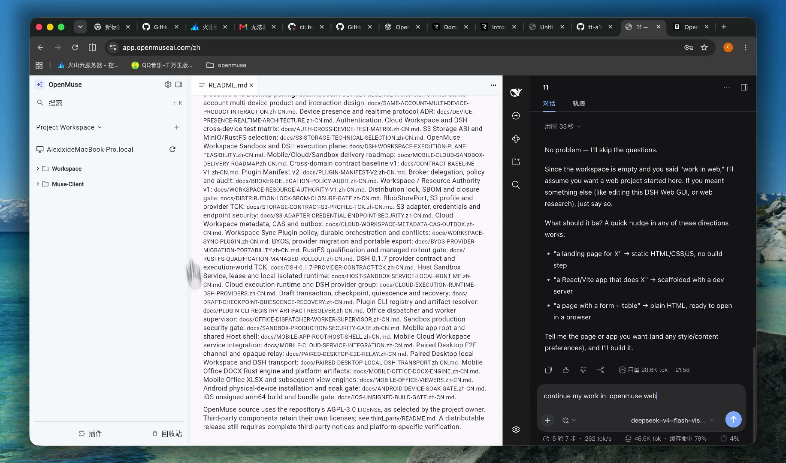
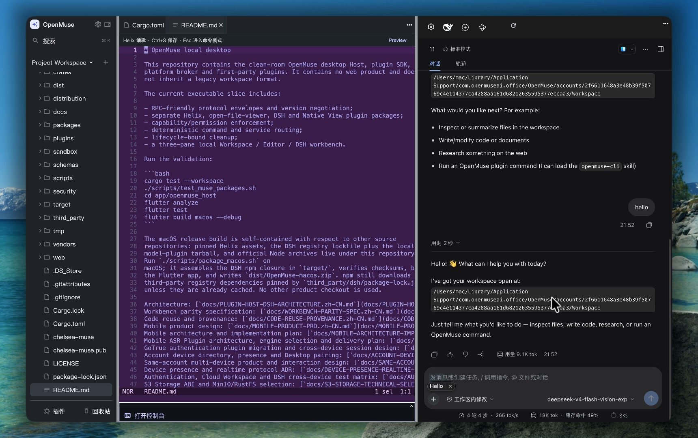
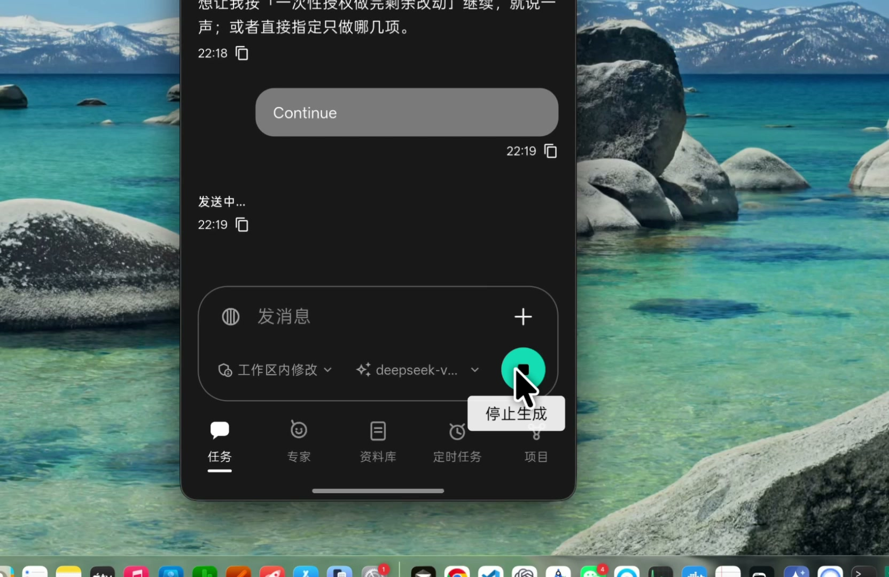
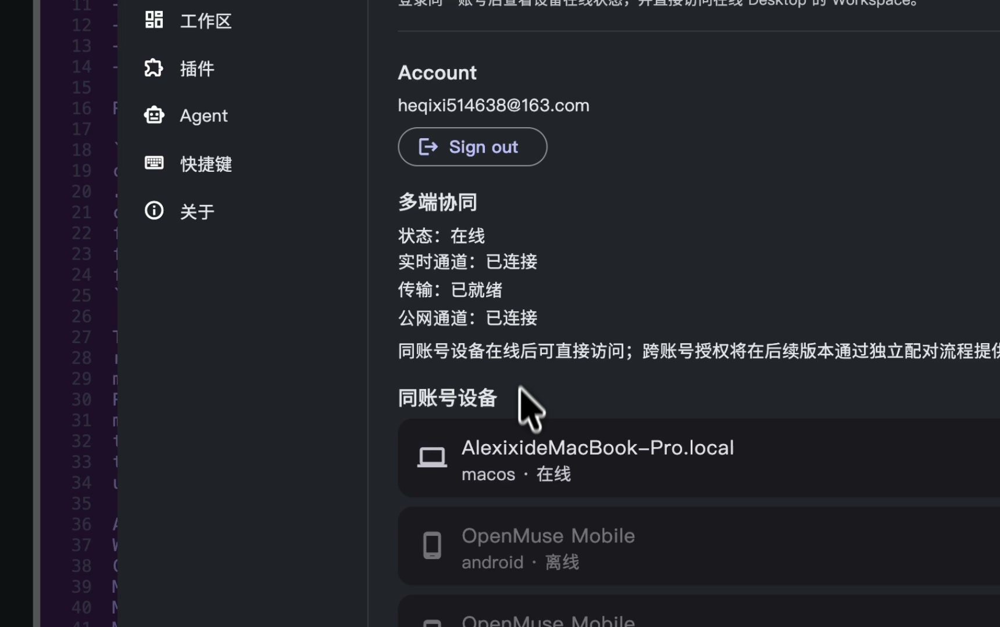

<div align="center">

# OpenMuse

**开源生态，开源可信，完全兼容 DSH。**

一套 DSH，在桌面、浏览器和手机上跑。想马上用，打开 Web App。

[](https://app.openmuseai.com/zh)

### [https://app.openmuseai.com/zh](https://app.openmuseai.com/zh)

**简体中文** · [English](README.en.md)

[](LICENSE)
[](https://app.openmuseai.com/zh)
[](#构建与验证)
[](#手机)

</div>

---

https://github.com/user-attachments/assets/4c98083d-6573-40ee-be89-161ba8c9e5d5

<div align="center">桌面 → 浏览器 → 手机 · 42 秒</div>

## Web 端

最快的体验通道。浏览器打开就能用，登录后是和桌面同一套三区工作台：左侧项目，中间编辑器，右侧 DSH。

<div align="center">

[](https://app.openmuseai.com/zh)

**[https://app.openmuseai.com/zh](https://app.openmuseai.com/zh)**

英文入口 [app.openmuseai.com](https://app.openmuseai.com) · 官网 [openmuseai.com](https://openmuseai.com)

</div>



DSH 官方 Web 客户端挂在页面右侧，和 Host 待在同一个标签里。展开目录时按页读取。

## 桌面

macOS 上是完整工作台。左侧 Project Workspace 管目录、搜索、插件和回收站；中间是 Helix，读写代码和文档，可以开预览和终端；右侧是 DSH，对着当前工作区对话、改文件、换模型。



## 手机

同一条 DSH 接着做。底部是任务、专家、资料库、定时任务和项目；可以对着工作区发消息、换模型，生成过程中可以停下。



设置里能看到这台桌面和手机是否在线、实时通道和公网通道是否就绪。同账号设备在线后可以直接互相看见。



## 功能

| | |
| --- | --- |
| 三区工作台 | 工作区、编辑器、DSH 固定在一个窗口里。桌面、浏览器、手机共用这套结构。 |
| 本地工作区 | 项目树、搜索、插件、回收站。资源以授权引用进出，权限留在 Host。 |
| Helix 编辑器 | 代码与 Markdown、预览、终端。编辑器是独立插件，随 Host 启停。 |
| DSH | 对话、轨迹、模型、工作区内修改、插件命令。三端挂的是钉住版本的 DSH 0.1.7，桌面走 sidecar，浏览器同页挂载 DSH Web 客户端。 |
| 账号与设备 | 一个账号串起桌面和手机。在线状态、实时通道、公网通道在设置里直接可见。 |
| 插件 | Helix、文件查看器、DSH、Native View 分开交付。能力调用经过 Broker，带权限、取消和审计。 |
| 发行 | macOS 安装包在本仓库内闭合构建：Helix、DSH 锁文件、校验和都在这里。第三方组件保留各自许可证。 |

## 三句话

**开源生态。** Host 只管窗口、工作区、插件生命周期和权限。编辑器、查看器和 DSH 都是可组合的插件。协议、清单和 SDK 公开，AGPL-3.0，生态可以在这条边界上往上长。

**开源可信。** 依赖有固定版本、校验和与来源说明。能力调用经过 Broker，权限、取消和审计留在 Host。macOS 发行包对照锁文件校验后再打包，第三方声明单独保留。代码从哪来，写在 [来源与出处](docs/CODE-REUSE-PROVENANCE.zh-CN.md)。

**完全兼容 DSH。** OpenMuse 把 DSH 当作工作台的一员，三端运行同一套 DSH 客户端和同一套账号。工作区绑定、模型、对话和插件命令都走 DSH，升级跟着钉住的 [DSH 0.1.7 契约](docs/DSH-0.1.7-PROVIDER-CONTRACT-TCK.zh-CN.md) 走。

## 构建与验证

```bash
cargo test --workspace
./scripts/test_muse_packages.sh
cd app/openmuse_host
flutter analyze
flutter test
flutter build macos --debug
```

macOS 发行包只使用本仓库里的检出。Helix 资源、DSH 注册表锁文件、本地模型插件包和官方 Node 归档都在这里。在 macOS 上运行 `./scripts/package_macos.sh`，它会在 `target/` 组装 DSH 的 npm 闭包、校验校验和、构建 Flutter 应用，并写出 `dist/OpenMuse-macos.zip`。`third_party/dsh/package-lock.json` 钉住的第三方注册表依赖，本机没有缓存时仍会由 npm 下载。

Web 构建见 [app/openmuse_web/README.md](app/openmuse_web/README.md)。线上地址是 [https://app.openmuseai.com/zh](https://app.openmuseai.com/zh)。

## 许可证

OpenMuse 源码使用仓库中的 AGPL-3.0 [LICENSE](LICENSE)。第三方组件保留各自许可证，见 [third_party/README.md](third_party/README.md)。可分发的发行版仍需要完整的第三方声明，以及各平台自己的校验。

## 设计文档

- 总体架构：[docs/PLUGIN-HOST-DSH-ARCHITECTURE.zh-CN.md](docs/PLUGIN-HOST-DSH-ARCHITECTURE.zh-CN.md)
- 工作台对齐：[docs/WORKBENCH-PARITY-SPEC.zh-CN.md](docs/WORKBENCH-PARITY-SPEC.zh-CN.md)
- 代码来源：[docs/CODE-REUSE-PROVENANCE.zh-CN.md](docs/CODE-REUSE-PROVENANCE.zh-CN.md)
- 账号与多端：[docs/ACCOUNT-DEVICE-PRESENCE-PAIRING.zh-CN.md](docs/ACCOUNT-DEVICE-PRESENCE-PAIRING.zh-CN.md)、[docs/SAME-ACCOUNT-MULTI-DEVICE-PRODUCT-INTERACTION.zh-CN.md](docs/SAME-ACCOUNT-MULTI-DEVICE-PRODUCT-INTERACTION.zh-CN.md)
- 手机：[docs/MOBILE-PRODUCT-PRD.zh-CN.md](docs/MOBILE-PRODUCT-PRD.zh-CN.md)
- Web 工作台验收：[docs/WEB-DESKTOP-WORKBENCH-UI-ACCEPTANCE.zh-CN.md](docs/WEB-DESKTOP-WORKBENCH-UI-ACCEPTANCE.zh-CN.md)
- DSH 契约：[docs/DSH-0.1.7-PROVIDER-CONTRACT-TCK.zh-CN.md](docs/DSH-0.1.7-PROVIDER-CONTRACT-TCK.zh-CN.md)

其余设计文档在 [docs/](docs/)。
