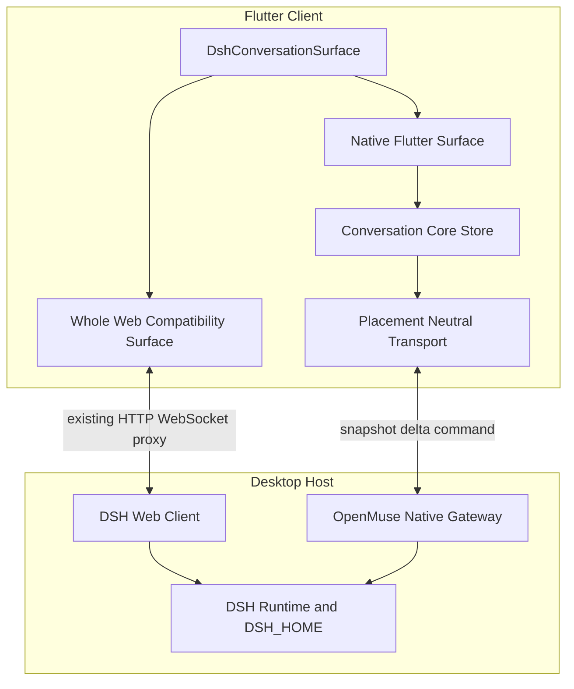

# DSH 原生 Flutter 对话流复刻架构 开发计划与验收矩阵

状态：方案 v3.2，统一 WorkBuddy 原生表面、真实权限/模型控制、元素级插件降级及可恢复会话同步已实现；真实账号 Desktop ↔ Android 产品链路已完成定向回归，完整发布矩阵仍有明确缺口

日期：2026-10-02

目标读者：OpenMuse Client、DSH 适配层、Flutter UI、测试与发布工程团队。

本文定义如何用原生 Flutter 复刻 DSH `0.1.7-rc.1` 的基础对话流，并让 Desktop 与 Flutter 客户端实时展示同一个 DSH Session。本文同时处理 DSH Web 插件对界面的运行时副作用、版本兼容、WebView 兼容路径、开发阶段和发布验收。本文不把现有 [DSH 对话流技术选型](DSH-CONVERSATION-SURFACE-SELECTION.zh-CN.md) 覆盖掉；后者记录了 WebView 优先的早期选择，本文是在“基础对话流必须原生 Flutter”这一新约束下的实施方案。

> **核心结论：** 基础 DSH 对话流使用 Flutter 原生组件；插件优先通过受约束的 `openmuse.nativeConversation@1` Server Driven UI 协议贡献原生 UI；能力不足时先降级为通用原生卡片或元素级“不兼容”提示。未知元素不再自动夺走整条原生会话，用户可从该元素显式进入整面 Web 兼容模式。任意 React、CSS 或脚本不会下发到 Flutter 执行。

## 1 决策摘要

采用“原生主路径、元素级降级、用户可选整面 Web 兼容”的双表面架构。

1. Flutter 原生表面负责 DSH 官方基础对话流，包括会话头、历史分页、用户消息、助手流式内容、Reasoning、工具调用树、命令、失败和重试、审批、用户问题、计划、目标、Todo、Queue 和 Steer、附件、输入框、停止、模型与权限入口。
2. Flutter 与 Desktop 不互相复制聊天记录。两端连接同一个 DSH runtime 和同一份 Session 持久化，DSH 是唯一权威源。
3. 新增版本化的 OpenMuse DSH Native Gateway，把 DSH `0.1.7-rc.1` 的 Session Controller 行为适配成 Flutter 可消费的稳定协议。Flutter 不直接绑定 Typert 的内部生成代码，也不解析 DSH_HOME 的 JSONL 文件。
4. 把 `native-declarative` 升级为正式的 `openmuse.nativeConversation@1` 协议。插件在 manifest 中描述 slot、语义组件、绑定、条件和 command 引用；Gateway 校验和协商；Flutter Component Registry 只构造受支持的原生 Widget。
5. 会话级协商仍保持 wire 兼容的 `native`、`generic`、`web` 三值，但 `web` 不再触发自动跳转。插件级新增 `incompatible` 诊断；Flutter 继续原生渲染其余节点，并在对应元素或插件提示上提供显式 Web 入口。
6. `auto` 的正式默认行为是 Flutter。只有协议 major 或整个 Native Gateway 不可用时才阻止原生打开；单个插件、slot、组件或事件不兼容都必须元素级降级，禁止静默漏 UI，也禁止自动换页。
7. 对话流做成独立库，拆成纯 Dart 状态内核、Flutter renderer、传输适配器、声明式 UI registry 和 Web 兼容表面。WorkBuddy 或 Desktop Host 只依赖统一的 `DshConversationSurface`。

## 2 调研结论与源码边界

### 2.1 `0.1.7-rc.1` 不是一个完整源码目录

`/Users/mac/src/openmuse-io/0.1.7-rc.1` 当前不存在。产品实际使用的 `0.1.7-rc.1` 由多个位置共同构成。

| 位置 | 当前事实 | 可用于什么 | 不能用于什么 |
| --- | --- | --- | --- |
| [`third_party/dsh/package.json`](../third_party/dsh/package.json) 与 [`package-lock.json`](../third_party/dsh/package-lock.json) | 产品 pin 为 `@deepseek-ai/dsh@0.1.7-rc.1` | 确定精确发行闭包与依赖版本 | 不能说明 TypeScript 源码完整存在 |
| `target/dsh-closure-017/node_modules/@deepseek-ai` | 已安装的 `0.1.7-rc.1` 发布闭包，共 251 个 `@deepseek-ai` 包，其中 49 个 `dsh-client-ui-*` 包 | 读取实际发布的 JS、类型声明、README、Web 资产和 composition patch | 它是生成产物，不能作为手工维护源码 |
| `target/dsh-closure-017/node_modules/@deepseek-ai/dsh-client-ui-conversation` | 发布的 `lib/client.js` 与完整 `.d.ts`，版本 `0.1.7-rc.1` | 精确分析 Conversation assembler、输入、Queue、Echo 与 slot 合同 | 包内没有对应 `.ts` 或 `.tsx` 实现源码与 source map |
| `target/dsh-closure-017/node_modules/@deepseek-ai/dsh-client-ui-chat` | 发布的 `lib/client.js` 与完整 `.d.ts`，版本 `0.1.7-rc.1` | 精确分析 Chat node、折叠、滚动、操作与工具分发 | 同样不是可直接演进的源仓库 |
| `target/dsh-closure-017/node_modules/@deepseek-ai/dsh-web-app/cordis.patch.yml` | Web 产品完整 client roster 与 Host/API 装配 | 冻结官方前端插件清单与加载顺序 | 不包含第三方用户插件的最终闭包 |
| [`vendors/deepseek-harness`](../../vendors/deepseek-harness/) | 可读 TypeScript 源码，但当前根版本为 `0.1.5-rc.2`，且工作树已有用户改动 | 理解架构、测试方法与源文件职责 | 不能当成 `0.1.7-rc.1` 的实现真源 |
| [`vendors/dsh-desktop`](../../vendors/dsh-desktop/) | Electron 宿主、patch-package 文件和 Desktop 扩展 | 分析 Desktop 宿主边界和历史 patch | 当前依赖基线同样不是产品的 `0.1.7-rc.1` |
| [`third_party/dsh/plugins`](../third_party/dsh/plugins/) | OpenMuse bridge、Workspace runtime、模型能力插件 | 分析 OpenMuse 自有前后端副作用 | 不能代表所有用户安装的 DSH 插件 |
| [`contracts/dsh/0.1.7-rc.1.contract.json`](../contracts/dsh/0.1.7-rc.1.contract.json) | 已冻结 fs、shell、subprocess、terminal、jobs Provider 合同 | 保护执行面升级 | 当前不覆盖对话事件、slot、样式和 client roster |

因此，“DSH 前端实现是否完全在 `0.1.7-rc.1` 目录”这一问题的答案是否定的。精确产品行为存在于 npm 发布闭包、Web composition、Desktop/OpenMuse 宿主插件和运行时安装插件的组合中；当前仓库还缺一棵与产品完全同版本的 TypeScript 源码树。开始大规模移植前应取得并冻结对应 tag 或 source archive；在此之前，发布 JS、`.d.ts`、README 和黑盒行为共同组成 `0.1.7-rc.1` 的证据基线。

### 2.2 DSH 基础对话流不是一个组件

DSH Web 对话面由以下链路共同组成。

```mermaid
flowchart LR
  A[dsh-web-app composition] --> B[dsh-client-modules]
  B --> C[dsh-client-connection]
  C --> D[dsh-api-remotes]
  D --> E[dsh-api-session-controller]
  E --> F[dsh-client-ui-session]
  F --> G[dsh-client-ui-conversation]
  G --> H[dsh-client-ui-chat]
  H --> I[dsh-client-ui-tool and feature plugins]
  I --> J[dsh-client-ui-renderer]
  J --> K[React Web surface]
```



| 层 | `0.1.7-rc.1` 行为 | Flutter 对应所有者 |
| --- | --- | --- |
| Session transport | list、page、follow、control、projections、prompt、cancel、queue mutation、attachment | `muse_dsh_native_transport` |
| Session stream | 先开 follow 再拉 page；发布 `replace`、`prepend`、`append`、`settle-assistant`；断线或 seq gap 后补 tail | `muse_dsh_conversation_core` 的 journal reconciler |
| Conversation assembler | 以事件 Definition 构造稳定 Context、Turn、Step、Node、Location 与 target snapshot | `muse_dsh_conversation_core` 的 assembler |
| Chat projection | 隐藏系统行、折叠已完成过程、组合 Reasoning、工具、失败、Turn footer 与导航 | `muse_dsh_conversation_core` 的 chat projection |
| Native UI | 列表、卡片、Markdown、图片、工具详情、滚动、输入、Queue、弹层 | `muse_dsh_conversation_flutter` |
| 动态扩展 | slot、Component Factory、按工具名 keyed view、CSS、HMR | native contribution 或整面 Web 兼容模式 |

### 2.3 必须复刻的关键运行语义

以下行为不是视觉细节，Flutter 版本必须按同一状态机实现。

- Session 初始历史和 live follow 之间不能出现空窗。follow 必须在初始 page 之前建立，基线和后续 seq 合并后再发布。
- `assistant/live-chunk` 是 Client-only transient entry。最终 `assistant/message`、`assistant/attempt`、`step/end` 到达时必须按 attempt、Turn、Step 和 chunk index 正确 settlement，不能重复显示流式与最终消息。
- 历史 prepend、gap repair 和 reconnect replacement 必须保留当前 live tail，避免滚动跳动和消息重复。
- 本地发送立即生成 submission echo。权威 Session 记录按相同 `requestId` 到达后原位替换；Prompt acknowledgement 不是执行完成。
- Session running 时，普通发送根据设置进入 Queue 或 Steer；QueueDock 与 Chat 对同一个 request 不得重复展示。
- `loadOlder` 按 Turn 对齐；跳转到未加载 Turn 时用 `loadThrough(seq)` 连续加载且要检测无进展页。
- Chat 的 compact、standard、detailed、verbose 模式只改变过程展示，不得隐藏最终答案或修改记录。
- Scroll follow 只有在用户处于尾部时自动跟随。用户向上阅读时新消息只更新未读提示，不能抢滚动位置。

### 2.4 当前 OpenMuse 已有能力

现有 [Mobile 与 Desktop Local DSH Transport](PAIRED-DESKTOP-LOCAL-DSH-TRANSPORT.zh-CN.md) 已验证 Mobile 与 Desktop 可以连接同一个 Desktop DSH runtime 和 DSH_HOME，并通过完整 Web UI 同步 Session list、history、running 状态和新消息。现有 [`RemoteDshPage`](../app/openmuse_mobile/lib/remote_dsh_page.dart) 是受限 WebView，Paired Desktop gateway 已代理 HTTP、WebSocket、cookie 和 Origin/Referer。

这证明“同一权威源的实时同步”可行，但没有提供 Flutter 原生事件客户端。新方案应复用 placement、grant、generation、同源代理和错误语义，不重新发明第二套 Session 存储。

## 3 插件生态对原生对话流的影响

### 3.1 插件可以产生的前端副作用

DSH client 插件通过 `package.json` 的 `dsh.client` 声明进入 browser roster，加载后注册 slot、Component Factory、locale、样式和副作用。`0.1.7-rc.1` 的对话相关扩展点至少包括下表。

| 扩展点 | 语义 | 典型占用者 | 对 Flutter 的影响 |
| --- | --- | --- | --- |
| `conversation.chat.node` | 按 Chat node kind 选择整行 renderer | Chat、Tool、Goal、Workflow Run | 可增加或替换消息行 |
| `tool.call.toolview` | 按 wire tool name 选择工具卡片 | Tool、Skill、Cordis、Deliverables | 新工具可增加自定义卡片 |
| `conversation.chat.assistant-actions` | 助手消息操作列表 | Message Feedback | 可增加赞、踩或其它操作 |
| `conversation.chat.turnTail` | 已完成 Turn 的尾部 chain | Deliverables、Plan | 可增加产物或计划 UI |
| `conversation.composer` | 临时接管整个 Composer | Approval、User Questions、Subagent | 可替换普通输入框 |
| `conversation.input.*` | Composer 内的 model、permission、plan、dock、overlay、attachments | 多个官方插件 | 可增加按钮、弹层和状态条 |
| `conversation.session.header.*` | Header、actions、utilities、corner、lineage | Jobs、Schedule、Subagent、Open In App | 可增加头部操作或血缘信息 |
| `conversation.message.images` | 图片渲染 single slot | Attachment | 缺失时图片可能不显示 |
| `settings.models.provider-card` | 模型 Provider 设置卡片 keyed slot | `dsh-model-capabilities` | 影响设置面，不直接改变 Chat 行 |
| 全局或模块 CSS | CSS module 或运行时 `<style>` | 第三方 client 插件 | 可能修改插件自身甚至全局样式 |

例如 [`dsh-model-capabilities`](../../vendors/dsh-plugins/dsh-model-capabilities/lib/client.js) 会向 `settings.models.provider-card` 注册 React 组件，并向 `document.head` 注入样式。它当前不直接修改对话行，但已经证明安装插件可以增加元素和样式。其它插件可以占用 `conversation.*` 或 `tool.call.*`，直接改变对话面。

### 3.2 插件兼容分类

每个已启用插件在 Native Gateway handshake 中必须声明或被检测为以下一类。

| 类别 | 条件 | 原生处理 | 是否迫使 Chat 使用 WebView |
| --- | --- | --- | --- |
| `host-only` | 没有 `dsh.client`，只改变事件或工具 | 原生通用节点或已知工具 renderer | 否 |
| `native-known` | 官方或 OpenMuse 已实现同版本 native renderer | 使用版本化 Flutter renderer | 否 |
| `native-declarative` | 插件提供受约束的 `openmuse.nativeConversation` manifest 与声明式节点 | Flutter 解释允许的组件 schema | 否 |
| `web-settings-only` | 只影响设置、插件管理或非 Chat 页面 | Chat 保持原生；进入对应设置时打开 Web 兼容页或原生设置页 | 否 |
| `web-conversation` | 影响 `conversation.*`、`tool.call.*`、全局主题或未知 slot | 对应元素显示不兼容提示；用户可选整面 Web | 否 |
| `incompatible` | 依赖缺失、未知 client graph、native manifest 版本不支持 | 保留原生流并显示明确诊断 | 否 |

不能把 React component 序列化成 Flutter Widget，也不能把任意 CSS 自动翻译为 Flutter Theme。因此纯 Flutter 对未知插件的正确行为是明确协商和降级，而不是猜测、忽略或显示空白。

### 3.3 为什么提示按元素出现，但 Web 兼容仍以整面打开

单节点 WebView 会破坏以下不变量：统一滚动容器、可访问性树、文本选择、键盘焦点、IME、卡片高度测量、Turn 折叠、锚点跳转、手势竞争和大量 Platform View 的性能。React 插件还依赖同一个 Cordis Context、slot registry、React identity 和 CSS cascade，不能安全拆成孤立 iframe。

因此“不兼容提示”的定位单位是元素，真正打开 Web 时的运行单位仍是完整 Conversation surface。WebView 只由用户显式操作打开；关闭后回到同一个 `sessionId` 的原生表面。Header 是否跟随 Web 一起切换由插件影响范围决定。

### 3.4 正式声明式插件协议 `openmuse.nativeConversation@1`

这是一套受约束的 Server Driven UI 协议，不是远程代码执行机制。插件仍可拥有 Host 业务实现和 Web React contribution，但 Mobile contribution 只能描述语义 UI。

```text
DSH plugin package.json
  -> Native Gateway manifest loader
  -> schema + provenance + impact validation
  -> client capability negotiation
  -> validated contribution set
  -> Flutter Component Registry
  -> native Text / Button / Card / Form
```

协议规范位于 [`contracts/openmuse-native-conversation/v1`](../contracts/openmuse-native-conversation/v1/)。`package.json` 使用以下命名空间：

```json
{
  "openmuse": {
    "nativeConversation": {
      "schemaVersion": 1,
      "impact": "conversation",
      "contributions": []
    }
  }
}
```

`impact` 必须显式声明：

| 值 | 含义 | 无 contribution 时的行为 |
| --- | --- | --- |
| `none` | 没有 Client UI | 继续 native |
| `outside-conversation` | 只影响 Settings 等其它页面 | Chat 继续 native |
| `native-covered` | 副作用已由内置 Flutter 行为覆盖 | 继续 native，但纳入版本 TCK |
| `conversation` | 会改变 Conversation | 必须提供可协商 contribution，否则按 fallback 处理 |
| 未声明且存在非官方 `dsh.client` | 影响范围未知 | 插件级 `incompatible`；原生流保留并提供 Web 入口 |

第一版 slot 合同包括 `conversation.chat.node`、`tool.call.toolview`、`conversation.chat.assistant-actions`、`conversation.chat.turnTail`、`conversation.input.dock`、`conversation.input.left/right`、`conversation.session.header.actions` 和受限的 `conversation.composer`。Flutter 必须只上报已经真实实现并通过 TCK 的 slot 和 component，不能为了提高命中率虚报能力。

组件使用语义 token，不接受 CSS、任意 `Container`、绝对定位、任意字体、阴影或全局主题修改。v1 schema 可表达文本、代码、状态、键值、受限表格与媒体、资源链接、按钮、选择控件、disclosure、工具卡、消息附加区、Turn tail、官方表单模板以及受约束的 row、column、section。每个 Flutter 版本只协商它已经实现的子集。

绑定只能读取 `session.*`、`turn.*`、`message.*`、`tool.*` 与 `plugin.state.*`。条件仅支持有界的安全操作；不支持 JavaScript、表达式求值、任意网络、DOM、环境变量或主机文件路径。Gateway 与 Flutter 双重执行结构限制：每插件最多 64 个 contribution、每个 contribution 最多 256 个节点、深度 12、每组最多 64 个子节点，字符串与媒体另有字节上限。

manifest 中的 command 只是引用，不能获得执行权。Host 插件必须独立注册 command、参数 JSON Schema、所需权限和 Session/Workspace scope。Gateway 在执行前验证 plugin ownership、参数、当前用户、Session、Workspace、grant、generation 和幂等 request id；业务结果只通过权威 Session event 或有 revision 的 plugin state 返回。Flutter 默认不做业务状态乐观写入。

协商请求上报 `nativeUiApi`、版本化 component 和 slot。每个 contribution 同时声明 `requires` 与 `fallback`。聚合规则是：全部满足为 `native`；可用 `genericToolCard` 或安全 `omit` 时为 `generic`；声明 `web`、manifest 校验失败或影响范围未知时记录插件级 `incompatible`，会话聚合为 `generic`，由 Flutter 显示元素级诊断。只有协议 major、DSH 固定版本合同或 Gateway 本身不可用时才无法进入 Native。协商发生在首帧前，但不再造成 Native → Web 闪切。

这套协议适合工具卡、状态、结果列表、消息操作、Turn 产物、审批和问题表单；不尝试承载 Canvas/WebGL、任意 React、浏览器 API、复杂富文本编辑器、任意动画或全局布局修改。这些能力需要专用内置 renderer 或完整 Web surface。

### 3.5 官方 DSH 插件兼容计划与当前落地

`openmuse-dsh-bridge@0.1.12` 内置官方 Conversation 插件覆盖表。它只声明语义覆盖等级，不加载 React。Gateway 在 negotiation 中返回 `coverage`，运行时仍以实际 Session event 为准；只有真正出现未覆盖事件时才显示元素级提示，不能因为某个官方插件已安装就在每个会话顶部长期报警。

| 官方插件组 | v3.0 策略 | 已落地 | 下一门禁 |
| --- | --- | --- | --- |
| `ui-conversation`、`ui-chat` | `native-shell` / `native` | WorkBuddy 单一 Scaffold、原生 timeline、history/follow、用户与助手消息 | 历史分页、完整 Markdown、Queue/Steer |
| `ui-tool` | `native-generic-tool` | 通用 Tool call/result 卡、输入输出保留、按 `callId` 合并 | bash/read/write/search 专用 renderer |
| `ui-user-questions` | `native-question` | 原生问题面板与选项展示 | 回答提交 takeover；未完成前交互元素必须提示而非假按钮 |
| `ui-model-selection` | `native-control` | Gateway `modelCatalog/selectModel`、Flutter 模型与思考强度选择 | provider failure 与刷新状态 |
| `ui-permission-presets` | `native-control` | Gateway 目录、官方 `/permission` command、危险权限二次确认 | 权限 command 故障注入与审计事件 |
| `ui-trajectory` | `native-projection` | reasoning、工具、step/turn 与终态失败投影 | detailed/verbose 模式 |
| Approval、Attachment、Deliverables、Goal、Jobs、Plan、Schedule、Subagent、Workflow Run | `element-fallback` | 未知非 ignorable event 转为带事件名的原生不兼容卡；其余消息继续显示；卡片可选 Web | 按 P4 优先级逐个升级为专用 Widget |
| 第三方 `openmuse.nativeConversation@1` | 声明式 Native | schema、binding、通用工具 contribution、组件 registry | command ownership/参数 schema、更多受限组件 |
| 未声明第三方 React/CSS | `incompatible` | negotiation 返回插件级诊断，不自动 Web | 插件作者迁移指南与 conformance CLI |

升级顺序固定为：权限/模型与核心 Tool → Approval/User Questions → Plan/Goal/Todo → Attachment/Deliverables → Jobs/Schedule/Subagent/Workflow。每个插件从 `element-fallback` 升级前必须同时提交事件 fixture、Widget golden、Desktop 语义对照和真实双端记录；只增加 Widget 而没有命令授权与终态回放不得标记为 Native complete。

## 4 技术选型

### 4.1 方案比较

| 方案 | 原生体验 | 基础 DSH 一比一 | 任意 Web 插件兼容 | 版本维护 | 结论 |
| --- | ---: | ---: | ---: | ---: | --- |
| 完全 Flutter，无 WebView | 最佳 | 可以，通过持续复刻 | 不可能自动兼容 | 每个 DSH 和插件变化都需发版 | 不满足插件生态要求 |
| 完全 WebView | 较弱 | 最接近原站 | 最佳 | 跟随闭包升级 | 不满足“原生 Flutter 对话流”目标 |
| Flutter 原生加单节点 WebView | 差 | 容易出现布局和交互裂缝 | 理论有限，实际脆弱 | 最高 | 不采用 |
| Flutter 原生加整面 WebView 兼容 | 好 | 原生核心可精确复刻 | 未知插件可保真回退 | 可控 | 采用 |

### 4.2 一比一的工程定义

跨 Chromium 与 Flutter/Skia 的文字栅格化不能保证每个像素完全相同。本文把“一比一”拆成可验收的四层。

1. **语义一致：** 同一个 Session 事件序列产生相同节点、顺序、折叠状态、操作可用性和错误状态，要求矩阵内 100% 通过。
2. **交互一致：** 发送、停止、Queue、Steer、审批、问题、工具展开、历史分页、跳转、复制、附件和快捷键遵守同一状态机，要求矩阵内 100% 通过。
3. **布局一致：** 核心组件的间距、宽度、圆角、边框、字号、字重、行高和断点使用冻结 token；关键几何差异不超过 1 logical pixel。
4. **视觉一致：** 同平台、同字体、同 DPI 的稳定截图在屏蔽光标、时间和 GPU 抗锯齿噪声后，SSIM 不低于 0.995；超出允许色差的像素面积不超过 0.5%。跨平台只比较 token、几何和功能，不直接比较原始像素。

未知 Web 插件只在 Web 兼容模式下承诺插件 UI 一致。Flutter native 模式的一比一范围必须由 handshake 返回的兼容清单明确限定。

## 5 目标架构



### 5.1 包结构

建议新增以下包，名称可在实现前按仓库命名规范微调。

| 包 | 依赖 | 职责 |
| --- | --- | --- |
| `packages/muse_dsh_conversation_protocol` | 纯 Dart | Native Gateway wire 类型、错误联合、版本协商、序列化 |
| `packages/muse_dsh_conversation_core` | 纯 Dart | journal reconcile、Conversation assembler、Chat projection、command coordinator、不可变 snapshot |
| `packages/muse_dsh_conversation_flutter` | Flutter | 原生 Conversation、Chat、Composer、卡片、滚动、主题、可访问性 |
| `contracts/openmuse-native-conversation/v1` | JSON Schema | 插件 manifest、Client capability、绑定与降级的稳定合同 |
| `packages/muse_dsh_conversation_web` | Flutter 与 WebView adapter | 完整 Web 兼容 surface，不承载核心状态 |
| `packages/muse_dsh_conversation_testing` | Dart 与 Flutter test | 录制 fixture、fake gateway、golden、双客户端 race harness |
| `third_party/dsh/plugins/openmuse-dsh-bridge` 的 Native Gateway 模块 | Node ESM Cordis plugin | 把精确 DSH 版本适配为稳定 Native Gateway，并负责 SDUI 校验与协商；稳定后可独立拆包 |

现有 [`openmuse_mobile_core`](../packages/openmuse_mobile_core/) 保留 placement、session descriptor 和 lifecycle；新库消费它提供的 attachment handle，不把 cloud、paired、local 分支写入 Chat UI。

### 5.2 Native Gateway 协议

协议命名建议为 `openmuse.dsh-conversation@1`。它是 OpenMuse 的稳定适配协议，不宣称是 DSH 公共 API。

握手至少返回：

```text
protocolVersion
dshVersion
sessionFormatVersion
remoteFingerprint
uiContractFingerprint
enabledPlugins[]
conversationImpacts[]
supportedCommands[]
supportedNodeKinds[]
generation
```

握手后、订阅 Session 前必须调用 `POST /openmuse-native/v1/negotiate`。Gateway 读取当前有效插件闭包，验证 `openmuse.nativeConversation@1`，再针对 Flutter 上报的 component/slot 产生 `native`、`generic` 或 `web` 决策和已接受 contribution。插件图变化时废弃旧 negotiation revision，不能继续使用已卸载插件的 action。

数据面包含五类帧：

| 帧 | 用途 | 必须字段 |
| --- | --- | --- |
| `snapshot` | 首次打开或完整 replacement | session、seq range、projections、durable events、active assistant baseline |
| `append` | 连续 durable 或 transient 新事件 | `afterSeq`、events、stream revision |
| `prepend` | Turn 对齐的更早历史 | old first seq、events、hasOlder |
| `settleAssistant` | 结束指定 assistant attempt 的 transient entries | attempt id、settlement、optional durable event |
| `capabilityChanged` | 插件或 runtime graph 变化 | 新 fingerprint、影响范围、是否需要 Web fallback |

命令包含 `prompt`、`cancel`、`updateQueue`、`loadOlder`、`loadThrough`、`rename`、`fork`、`selectModel`、`approval.decide`、`userQuestion.answer` 和附件操作。每个 mutation 必须携带 `sessionId`、`generation`、`requestId` 与可用的 revision fence。相同 `requestId` 重试必须幂等。

Gateway 应调用 DSH service seam，不读取持久化文件，不绕过 Agent/session ownership，不把浏览器内部 React snapshot 当成业务真源。DSH 升级时只替换版本 adapter；Dart 协议在语义不变时保持版本 1。

### 5.3 实时同步算法

原生客户端按以下顺序打开 Session。

1. 取得 placement connector 发出的 opaque conversation handle 和 generation。
2. 完成协议 handshake，检查 DSH、协议、插件影响和 native 支持范围。
3. 先订阅 live journal，同时启动独立的 durable reconciliation。实时 SSE 是低延迟主路径，不是唯一正确性来源。
4. reconciliation 读取 Session list 中的权威 `projections.asOfSeq`，再用 `page(throughSeq)` 取得固定序列边界的 durable snapshot；首次打开立即执行，之后每 2 秒检查一次，pending 或 reconnecting 状态不得停止补洞。
5. 对 snapshot 做完整 assemble，在一个 store transaction 中发布第一帧。页内 `user/message.source.rpcId` 与 live event 使用同一套 local echo retirement，确保半断开的 follow 不会让 Mobile 永久停在“发送中”。
6. 合并 live cut 之后的连续 delta。重复 seq 去重，gap、SSE 静默或连接半开触发 durable page replacement；`page.cursor < store.cursor` 的迟到页必须丢弃，禁止旧页回滚新事件。
7. 按 attempt id 和 chunk index 更新 transient assistant state；settlement 原子撤销 transient 并应用 durable event。
8. Desktop 与 Flutter 的 mutation 都进入同一个 DSH Session。另一个客户端只通过权威 event、projection 或固定序列 page 看见变化，不走设备间 UI 广播。
9. 断线保留最后一份只读 snapshot；重连先换 generation，再用完整 replacement 校准，不把旧 generation 的迟到帧写入新 store。

```text
detached → handshaking → openingFollow → loadingSnapshot → ready
ready → loadingOlder → ready
ready → reconnecting → replacing → ready
任意状态 → incompatible → webCompatibility
任意状态 → closed
```

### 5.4 状态与渲染边界

`ConversationStore` 只发布不可变 snapshot。Flutter Widget 不解析 raw DSH event，也不直接发网络命令。

```text
Raw gateway frame
  → JournalReconciler
  → ConversationAssembler
  → ChatProjector
  → DshConversationSnapshot
  → Flutter selector
  → Widget
```

建议的稳定 identity：

- Session 使用 `sessionId + generation`；
- durable Node 使用 `definitionKey + event identity`；
- tool tree 使用 `callId`；
- local echo 使用 `requestId`；
- Turn 和 Step 使用 DSH 记录的编号与起始 seq；
- transient assistant block 使用 `attemptId + chunkIndex`。

Widget key 不得使用列表索引。prepend、settlement 和折叠不得重建未变化节点，否则滚动位置、选择和展开状态会丢失。

### 5.5 Flutter 渲染策略

- 使用单一可虚拟化滚动面，优先 `CustomScrollView` 与 Sliver，而不是每种节点独立 ScrollView。
- Markdown、代码、表格、diff、图片和工具卡片通过 renderer registry 分发；registry 键是冻结的 semantic node kind 或 tool wire name。
- 表格和代码块只在自身内容确实溢出时横向滚动；不能让整个 Chat 横向滚动。
- Composer 基于 Flutter text input 和 IME，引用 chip 与 slash command 是编辑模型节点，不以正则从最终字符串反推。
- QueueDock、Todo、Approval、User Questions 与普通 Composer 共享一个明确的 takeover 状态机。
- 长会话只保留视窗附近 Widget；assembler 可保留完整轻量 view model，但图片 bytes、代码高亮和 Markdown layout 必须按需缓存并有上限。
- 语义标签、焦点顺序、键盘导航、动态字号和 reduced motion 从第一阶段进入组件合同，不在最后补丁式修复。

### 5.6 设计 token 与基线采集

不能凭肉眼从截图抄样式。P0 应从精确闭包自动采集并冻结：

- light 和 dark CSS variables；
- font family、size、weight、line height；
- content width、gutter、composer width、breakpoint；
- spacing、radius、border、shadow、semantic color；
- 动画时长与 easing；
- 每个核心状态的 DOM 几何与 screenshot。

采集结果写入 `contracts/dsh-ui/0.1.7-rc.1/`，由 generator 生成 Dart token。手工调整必须回写合同来源或记录 OpenMuse 有意差异，不能只改 Widget 常量。

## 6 安全与授权

原生协议不能为了绕开 WebView cookie 而把 DSH bootstrap token 暴露给普通 Flutter Widget。

1. Local、Cloud、Paired Desktop connector 输出短期 opaque conversation handle；transport 层持有，UI 只看到 session identity 和能力。
2. Paired Desktop 对 Native Gateway 使用 workspace、device、session、audience 与 expiry 绑定的短期 capability。现有 grant 和 E2E relay 继续作为外层授权。
3. Gateway 只允许已授权 Session；attachment、file link、workspace path 与 open-in-app 继续经过 Resource Authority 和现有 DSH session authorization。
4. 日志和 telemetry 禁止记录 prompt、assistant 内容、token、cookie、grant、本地绝对路径和附件 bytes。
5. Web 兼容模式继续执行现有同源、导航、新窗口、下载、证书和 bridge allowlist。
6. Unknown protocol major 或 Gateway 合同不匹配必须 fail closed；unknown non-ignorable event、plugin impact 检测失败和单个 slot/component 不匹配必须生成元素级不兼容节点，不能继续猜测其业务语义，也不能自动切 Web。

## 7 DSH 版本兼容与迭代

### 7.1 新增 UI 合同

现有 Provider 合同不覆盖前端。应新增 `contracts/dsh-ui/<version>/contract.json`，至少记录：

- 精确 DSH package version 与 lockfile digest；
- `dsh-web-app` composition digest 和 client roster；
- Conversation、Chat、Tool、Session Controller、Slots 的 artifact digest；
- Remote descriptor fingerprint；
- event type、projection key、snapshot frame 与 command schema；
- Chat node kind、tool view key、对话相关 slot key；
- design token 与稳定 screenshot manifest；
- 官方插件和 OpenMuse 插件的 native 兼容分类。

合同由加载精确发行闭包的脚本生成，不能从 `vendors/deepseek-harness@0.1.5-rc.2` 手抄。

### 7.2 支持策略

| 情况 | 行为 |
| --- | --- |
| 精确测试版本，fingerprint 匹配 | 允许 native |
| 同 patch 或 RC，协议与 UI 合同完全匹配 | 允许 native，并记录实际版本 |
| 版本变化但只有已审查的向后兼容字段新增 | adapter 显式接受后允许 native |
| slot、event、projection、command 或 token 变化 | CI 阻止升级，完成 adapter 和 golden 后再放行 |
| unknown major | 拒绝打开 native，并允许用户进入 Web |
| 不可忽略的未知事件 | 原生流中显示元素级不兼容提示，其余节点继续 |
| 新 `web-conversation` 插件 | 保持原生；对应元素提示原因，用户可选 Web，不丢 Session identity |

至少维护当前正式版本 N 和候选版本 N+1 两条 CI lane。升级流程是“构建闭包、生成合同 diff、审查协议、跑录制回放、跑双客户端 E2E、更新 golden、灰度”，而不是修改一个 npm version 后直接发布。

### 7.3 上游源码同步

建议把与产品 pin 相同的 DSH source tag 或 source archive 放进受 provenance 管理的 vendor 流程。若上游只提供 npm 发布包，则将发布 JS 与 `.d.ts` 作为 adapter 输入，但不要复制和改写 minified Web bundle来实现 Flutter。UI 行为应通过协议 fixture、类型声明、黑盒 DOM/screenshot 和许可允许的参考实现共同验证。

## 8 开发计划

下面的周期以 2 名 Flutter 工程师、1 名 DSH TypeScript 工程师和共享测试支持为估算前提。若只有 1 名主开发，应按 engineer-week 而不是自然周理解。总量预计 18 到 24 engineer-weeks，不包含新增第三方插件 native renderer。

| 阶段 | 预计 | 交付物 | 退出门禁 |
| --- | ---: | --- | --- |
| P0 基线冻结 | 1 到 2 周 | `dsh-ui` 合同生成器、client roster、slot/event/command 清单、token、DOM 和 screenshot fixture | BAS 全部通过，确认精确 source 或记录缺口 |
| P1 Native Gateway 与 SDUI 协商 | 2 到 3 周 | handshake、snapshot、live delta、command、plugin impact、manifest validator、三态 negotiation、auth、paired proxy | 协议与 SDUI TCK、gap/reconnect、双客户端 smoke 通过 |
| P2 纯 Dart 状态内核 | 2 到 3 周 | journal reconciler、assembler、chat projection、echo、Queue/Steer、fixture replay | 同一录制事件序列与 Web semantic oracle 一致 |
| P3 Flutter 基础转录 | 2 到 3 周 | Header、用户和助手消息、Markdown、Reasoning、错误、Turn folding、历史分页、scroll follow | MSG、SCR 与第一批 VIS golden 通过 |
| P4 工具、SDUI Registry 与交互 | 3 到 4 周 | Tool tree、内置卡片、版本化 Component Registry、审批、问题、Plan、Goal、Todo、附件、授权 command | TOOL、NUI、INT、ATT 全部通过 |
| P5 原生 Composer | 2 到 3 周 | IME、slash、reference chip、upload queue、send/stop、Queue/Steer、draft recovery | CMP 全部通过，iOS/Android/Desktop 键盘测试通过 |
| P6 插件与 Web 兼容 | 1 到 2 周 | 动态插件图、negotiation revision、整面切换、诊断页、feature flag、第三方 SDK 示例 | PLG 与 NUI 全部通过，无静默缺失 |
| P7 性能 安全 发布 | 2 周 | 长会话性能、a11y、fault injection、telemetry、灰度与 rollback | PERF、SEC、COMPAT、ROL 全部通过 |

### 8.1 推荐的首个开发切片

第一条纵向切片只覆盖一个真实 Session 的打开、历史、流式助手、发送和停止，但必须同时贯穿 Desktop 与 Paired Mobile。

1. 生成并提交 `0.1.7-rc.1` UI 合同。
2. 新增 Gateway 的 handshake、snapshot、append 与 `prompt/cancel`。
3. 在纯 Dart 中实现 seq、generation、requestId 和 assistant settlement。
4. 用 Flutter 渲染用户消息、助手文本、stream cursor 和 Stop；完整 Markdown 在 P3 门禁内补齐。
5. 在同一 Desktop runtime 上同时打开原 Web UI 与 Flutter，跑 SYNC-01 到 SYNC-06。
6. 用一个 Weather fixture plugin 跑通 `native`、缺组件 `generic` 和未声明副作用 `web` 三条路径。

这条切片不先做全部工具卡片，但不能用轮询或第二份本地消息库代替实时 journal。

### 8.2 当前实施状态

截至 2026-10-02，本次实施已完成统一 WorkBuddy 表面、真实权限/模型控制和元素级插件降级，并已使用正确的 `Muse-Client` Release 构建、线上测试账号、Cloud 设备目录和 ADB 真机完成首轮双端产品验收：

- `openmuse-dsh-bridge@0.1.14` 已提供 `hello`、`negotiate`、Workspace/Session list、Session create、SSE follow、page、prompt、cancel、model catalog/select、permission catalog/select、问题回答、Workspace change summary、单文件产物 preview 与 Desktop open；模型调用 DSH `sessionController.selectModel`，权限调用官方 `/permission` command，没有本地伪造状态。
- Paired Desktop gateway 只在转发 `/openmuse-native/` 时注入 Host 私有 bridge token，Mobile 不能读取或伪造该 token。
- 已创建 `muse_dsh_conversation_protocol`、`muse_dsh_conversation_core` 和 `muse_dsh_conversation_flutter`；Mobile Agent 入口先协商 Native，再选择相同 Desktop Session，失败时复用现有 `RemoteDshPage`。
- 已提交 `openmuse.nativeConversation@1` JSON Schema、三态协商器、Flutter Component Registry，以及声明式工具卡的安全 binding 路径。
- reducer 已覆盖 snapshot、ordered event、surface replacement、assistant live delta、local echo request id retirement与重连；snapshot replacement 与 live event 都会按同一 `rpcId` 清除 optimistic prompt，迟到 snapshot 不得覆盖更高 cursor；unknown required event 现在生成原生不兼容行，不再把整面对话切到 Web。
- Controller 已把 SSE follow 从“唯一同步来源”改为低延迟主路径，并增加基于 `sessions.projections.asOfSeq + session/page(throughSeq)` 的独立 durable reconciliation。该路径在首次打开立即运行，之后周期补洞；即使 Cloud relay 中的长 SSE 静默但未报错，也会把 Desktop 已完成的 turn 拉回 Mobile。
- reducer 已按真实 `0.1.7-rc.1` journal 修正两类语义：`source.kind=runtime-context` 的内部 `user/message` 不进入对话面；`turn/end.reason.error` 的 message 与 code 投影为 DSH 终态失败段。Header 同步 Session title、agent preset、model selection 与 Turn/Step 计数。
- WorkBuddy 是 Mobile 唯一会话 Scaffold：发送、选择历史会话和连接设备都不再 `push` 第二套 NativeDesktopShell；原生时间线直接嵌入第一套 Header/Drawer/TabBar。底部 Composer 保留第一套视觉语言，右侧 `+`，下层为真实 Workspace 权限、模型/思考强度、发送/停止。
- Mobile catalog 刷新会保留仍然有效的 Desktop 与 Workspace 选择，不再因周期刷新跳回 Cloud 或错误工作区。历史会话被选中时，Header 使用该会话的权威 `cwd` 反向定位 Workspace。
- `command/run` 与 `command/done` 已纳入官方控制事件集合。修改模型或 Workspace 权限时，这些生命周期事件继续更新权威 Session，但不会误渲染成“插件不兼容”卡。
- `user-questions/request` 已接入真实 DSH waterfall。只有存在对应 Session 的 Mobile SSE follower 时，Native Gateway 才 claim 问题并保存待回答批次；Mobile 提交结构化答案后由 Gateway 校验问题 id、单选/多选/自定义答案并结算原请求。没有 Mobile follower 时继续委托 Web answerer，避免 Desktop 失去既有交互能力或双端重复结算。
- Assistant 正文已采用只读 Markdown renderer，覆盖标题、粗体、列表、引用、行内代码、代码块和链接。实现参考旧 AppFlowy `AIMarkdownText` 的“原文作为权威数据、解析后只读渲染”分层，但不直接依赖 `/Users/mac/src/appflowy-editor` 的可编辑编辑器内核，避免把 block editor、selection 和 plugin surface 引入会话列表。
- Tool call/result 已改为默认折叠的无边框单行，官方 read/bash/write/edit 等工具显示语义化短标题；展开后才构建输入/输出详情。`workspace/changes` 不再显示不兼容卡，而是原生渲染文件数、增删行、文件列表和“在 Desktop 打开”动作。
- 产物预览已扩展为响应式原生 diff：compact（逻辑宽度 `< 600dp`）默认单栏对比，每行只显示一个与该行语义对应的行号；medium、折叠屏和平板默认左右双栏对比。顶栏可随时切换单栏/双栏，文件标题区提供上一个/下一个产物导航；切换文件时沿用用户当前选择的布局。删除与新增使用主题感知的红/绿语义底色，双栏会把同一变更块的删除/新增行配对显示。
- Android 真机已通过签名 Release APK 的 `adb install -r` 正常覆盖安装，首次安装时间保持不变，冷启动正常。正确的 macOS Release 包来自 `Muse-Client/app/openmuse_host`，两端均已登录同一线上账号；Mobile 已经由 Cloud 设备目录发现 Desktop，并通过公开 relay 打开 Desktop 的 Paired Gateway。
- Dart 客户端不再发送平台含义不确定的 `DateTime.timeZoneName`（Android 中国区会返回歧义的 `CST`）；DSH 的可选 `clientTimeZone` 留空，避免 `session/invalid-time-zone` 拒绝合法 prompt。
- 不再使用旧的 `OPENMUSE_DSH_NATIVE_EXPERIMENTAL=1` 预览开关。发布闭包默认进行 Native 能力协商；插件或事件不兼容只显示元素级提示。`OPENMUSE_DSH_NATIVE_FORCE_WEBVIEW=1` 仅保留为诊断/紧急开关，正常产品路径不会自动进入 Web。

尚未达到“全部 DSH 能力原生等价”的发布门禁。后续必须完成完整 Chat assembler、历史分页、Queue/Steer、附件、Approval takeover、通用授权 command registry、插件图 revision、golden、性能、断网重连和 iOS E2E。User Question 的单选、多选、自定义文本和跳过已进入真实纵向链路，但多问题批次、取消/超时、Desktop 与 Mobile 同时抢答的压力场景仍需补齐。当前 Native 已经是可在真实产品链路使用的纵向切片；完整 WebView 只作为用户显式选择的兼容路径，不能因单个未知元素自动跳转。

### 8.3 本次实施与验收证据

下表只记录本次实际执行过的结果。`通过` 不等于整份发布矩阵已完成；它只证明对应纵向切片或平台门禁。未执行的真实双客户端场景保持未通过状态，不用 fixture 或单元测试代替。

| 验收面 | 结果 | 实际证据 | 结论边界 |
| --- | --- | --- | --- |
| 精确 DSH closure | 通过 | 从锁定依赖重建 `target/dsh-closure-native-v1h`；CLI 报告 `0.1.7-rc.1`；闭包校验 13 个内部链接且无逃逸链接 | 证明发布闭包和 Native Gateway 可装配，不证明完整 Chat 语义 |
| DSH Web 与 Gateway runtime | 通过，确定性本地链路 | 从正式 ZIP 解包的 Desktop 启动 DSH；用本地 OpenAI-compatible 模型模拟器创建 Session，prompt 落盘，SSE 收到 34 个 frame、助手 marker 与 `turn/end` | 绕过账号设备发现，不是产品双端 E2E |
| Gateway 与 SDUI TCK | 通过，v1 子集 | Node 测试 12/12：Workspace/Session create、follow、prompt 委托、元素级协商、官方插件覆盖表、session options、模型/权限路由、Native Question claim/answer/delegate、Workspace changes summary/open、危险 binding/组件和 file URL package 识别 | 通用第三方 command 执行 registry、Mobile 直开资源 handle 尚未实现；条件 DSL 仍需 fuzz |
| 纯 Dart 协议与状态核 | 通过，纵向切片 | 协议测试 6/6；core 测试 10/10；覆盖 snapshot/event、官方控制事件隐藏、未知事件元素级提示、嵌套错误、tool call/result 合并、surface replacement、event/snapshot echo retirement、迟到页防回滚，以及静默 follow 下的 durable page repair | 尚未完成全量 assembler、Queue/Steer 和更早历史 prepend |
| Flutter renderer | 通过，纵向切片 | renderer Widget 测试 11/11；覆盖单层嵌入布局、Markdown、host composer、元素级 Web 入口、声明式卡、工具默认折叠/展开、真实问题提交，以及 Workspace changes 产物/open action、compact 单栏默认、medium 双栏默认、布局切换和多产物前后导航 | 附件、Approval takeover、复杂表格/数学公式与 Markdown 扩展语法未完成 |
| Paired Desktop proxy | 通过 | 完整 gateway suite 通过；短 SSE 首帧测试连续 5 次通过；验证首帧不等待上游结束、私有 bridge token 只由 Host 注入，账号、Workspace 和设备不匹配 fail closed | 尚未跑断网重连与长时间 soak |
| Desktop Host 回归 | 通过 | Host 测试 65/65、1 项既有 skip；`flutter analyze` 无问题。正确 Release app 成功启动并显示 OpenMuse Workbench 与 DSH Web | 不等于所有 Desktop DSH 交互均已做截图自动化 |
| Mobile 回归 | 通过 | `flutter analyze` 无问题；Mobile Widget 测试 23/23；选中 Workspace 保留、统一壳层与 composer 行为均有测试 | 附件按钮、Approval takeover 和多问题批次仍不是完成能力 |
| Android 真机安装、登录与冷启动 | 通过 | PKM110 普通手机与 PGU110 折叠屏；V2 签名 APK 通过 `adb install -r` 覆盖安装且保留数据；两台设备均保持线上账号登录、可经 Cloud 发现同一 Desktop，并正常进入 MainActivity | 当前覆盖 Android compact 与 medium/foldable；尚未覆盖 Android 平板与 iOS |
| iOS Simulator | 阻塞，既有平台问题 | Xcode 编译进入链接阶段后缺少 `openmuse_docx_*`、`openmuse_office_viewers_*`、`openmuse_paired_*` Simulator symbols | 与本次对话流包无关；补齐这些 FFI 的 simulator slice 前不能宣称 iOS 通过 |
| Desktop → Android 实时文本 | 通过 | Desktop 在 Android 正在 follow 的同一会话发送 `DTM-1542`；Android 无刷新显示同一用户消息，并继续实时显示助手最终回复 `DTM-1542` | 本轮证明 text/final settlement；Approval 与并发 Queue/Steer 仍未覆盖 |
| Android → Desktop 建会话与回答 | 通过，含 Desktop 可视 UI | Android 在 Desktop Workspace `Muse-WebSite` 建立会话并完成 READY 与 Mobile E2E turn；Desktop DSH 会话列表即时出现 `User says reply only READY`，打开后可见同一 Markdown、代码块、文件链接和 `+9/−0` 产物卡 | 已证明 Desktop 权威 runtime 和嵌入 DSH Web 可视同步；未验证并发双端发送顺序 |
| Cloud relay 静默 follow 恢复 | 通过，真实故障回归 | 同一 `Reply only READY` 会话中，Mobile 的 20:21 prompt 已在 Desktop 完成到 `asOfSeq=77`，旧 Mobile 却永久显示“发送中”。修复版通过 `page(throughSeq=77)` 自动归并为完整回答与 `README.md +116/−13`；随后 Mobile 新发 `SYNC_OK_20261002`，Desktop 与 Android 均显示同一 prompt/final，权威序列到 85 且无 pending | 证明 SSE 静默/半开时可自动收敛；尚未代替物理断网、Desktop restart 与长时间 soak |
| 历史、Markdown、Tool、Question 与产物原生渲染 | 通过，样本范围 | Android 真机完成一轮 read、bash、真实问题、write、Markdown final 和 `workspace/changes`；问题选择“Continue (Recommended)”并确认后 Agent 继续写文件。Tool 默认单行，展开后显示输入/输出；重新从 Mobile 历史抽屉打开同一会话后，代码块、文件链接、产物与 `DTM-1542` 均恢复 | 未覆盖所有工具专用 renderer、历史分页、复杂 Markdown 扩展和 Approval |
| 产物响应式 diff 与多文件导航 | 通过，两台真机 | 在 Desktop 权威 Session `Reply only READY` 中真实修改 `openmuse-artifact-layout-a.md` 与 `openmuse-artifact-layout-b.md`，生成 `workspace/changes@116`（2 文件，`+4/−4`）。PKM110（约 360dp）默认单栏并仅显示一个行号 gutter；PGU110（约 683dp）默认双栏并显示配对的旧/新内容。两端均实测单栏/双栏按钮互切、下一产物从 `1/2` 到 `2/2`、上一产物返回 `1/2`，并核对按钮禁用状态 | 证明 text diff 与多文件导航；超大文件虚拟化、二进制/图片 diff 和旋转过程中的布局保持仍需独立门禁 |
| 模型与 Workspace 权限 | 通过 | 模型表来自 Desktop catalog；Mobile 选择 `DeepSeek V4 Flash / Low` 后 Desktop DSH composer 同时显示相同选择。权限从“工作区内修改”切为“只读”再恢复，真机 chip 更新且没有虚假的不兼容卡 | 尚未做 provider 故障和危险权限确认的 fault injection |

本次可交付结论是：Native Gateway、DSH Session 协议路径、Flutter 原生渲染、统一 Mobile 壳层和 `openmuse.nativeConversation@1` 的第一批组件已经贯穿真实账号、Cloud 设备发现、Desktop 权威 runtime 与 Android 真机。Workspace 同步、历史样本、Desktop → Mobile 实时文本、Mobile → Desktop 可视 UI、单问题回答、常用 Tool、Markdown 与 Workspace changes 产物均已有产品证据；Approval、多问题/取消竞态、附件、断网重连、性能与 iOS 仍必须保持未通过，不能用当前结果外推。

### 8.4 用户指定的产品 E2E 验收状态

| ID | 必验场景 | 当前状态 | 通过证据要求 |
| --- | --- | --- | --- |
| PROD-E2E-01 | Mobile 同步 Desktop Workspace | **PASS** | 同一线上账号经 Cloud 发现在线 Desktop；Mobile 可选择 `Muse-WebSite`，历史会话选择可反向切到权威 Workspace，例如 `skills` |
| PROD-E2E-02 | Desktop 建会话并发消息，Mobile 原生流实时展示 | **PASS（当前纵向切片）** | 除 `DTM-1542` 实时样本外，已对真实 SSE 静默故障执行 page repair：Desktop `asOfSeq=77` 的完整回答与产物自动替换 Mobile pending。live Approval、Queue/Steer 仍由独立矩阵约束 |
| PROD-E2E-03 | Mobile 选 Desktop Workspace 建会话并获得回答，Desktop 同时显示 | **PASS（当前纵向切片）** | Mobile 在 `Muse-WebSite` 建会话并完成 read/bash/question/write；本次又从同一历史会话发送 `SYNC_OK_20261002`，Desktop Web 与 Android Flutter 同时可见相同 final，权威序列到 85 |
| PROD-E2E-04 | Mobile 加载 Desktop 历史会话 | **PASS（样本范围）** | 从 Mobile 历史抽屉重新打开刚完成的权威 Session，Markdown、代码块、文件链接、`workspace/changes` 与 Desktop 后续 `DTM-1542` 均恢复；分页仍由独立矩阵约束 |

`PASS` 只适用于“实际证据”列所述范围。任何后续出现的 `PARTIAL` 都是发布阻断状态，不得在发布报告中改写成全通过。

## 9 验收矩阵

所有 `P0` 项是切换默认表面前的发布阻断项；`P1` 是同一版本正式发布前必须完成；`P2` 可在兼容 fallback 存在时后续补齐。证据必须保留 fixture、日志摘要、截图或视频，不接受只写“人工看起来一致”。

### 9.1 基线与版本

| ID | 优先级 | 场景 | 验收标准 | 方法 |
| --- | --- | --- | --- | --- |
| BAS-01 | P0 | 精确闭包 | 所有核心包、composition 和 lock digest 与合同一致 | CI contract TCK |
| BAS-02 | P0 | 源码边界 | 报告精确 source tag 或明确标记只有发布 artifact；不得混用 `0.1.5-rc.2` 推断 | provenance 检查 |
| BAS-03 | P0 | Remote 合同 | session command、projection、frame schema fingerprint 一致 | generator diff |
| BAS-04 | P0 | UI 扩展合同 | 对话 slot、node kind、tool key、client roster 完整且无未分类项 | 启动时 registry audit |
| BAS-05 | P1 | 设计基线 | light、dark、desktop、mobile token 和 golden 均可重建 | screenshot manifest |

### 9.2 同步与一致性

| ID | 优先级 | 场景 | 验收标准 | 方法 |
| --- | --- | --- | --- | --- |
| SYNC-01 | P0 | Desktop 发送 | Flutter 在同一 Session 显示相同用户消息和回复；无刷新 | 双客户端 E2E |
| SYNC-02 | P0 | Flutter 发送 | Desktop Web 显示相同消息、running 和最终回复；同一 `requestId` 不重复 | 双客户端 E2E |
| SYNC-03 | P0 | 流式内容 | chunk 顺序一致；最终 message settlement 后无重复 transient block | 录制流回放与真机 |
| SYNC-04 | P0 | 同时发送 | Desktop 与 Flutter 并发发送后 Queue 或 Steer 顺序与 DSH 权威 projection 一致 | race harness |
| SYNC-05 | P0 | seq gap | 丢弃一段 delta 后自动 repair，最终 snapshot digest 与 Web oracle 一致 | fault injection |
| SYNC-06 | P0 | 断网重连 | 保留最后只读帧；重连无丢失、无重复、无旧 generation 污染 | 网络故障测试 |
| SYNC-06A | P0 | SSE 静默/半开 | follow 不结束也不再出帧时，durable reconciliation 在一个轮询周期内按 `asOfSeq` 补页；pending 按 `rpcId` 归并且旧 page 不回滚新 cursor | fake relay 自动测试 + 双端真机 E2E |
| SYNC-07 | P1 | Desktop restart | 同一 DSH_HOME 恢复后 Flutter replacement 到权威历史 | 真实 sidecar restart |
| SYNC-08 | P1 | 冷 Session | 打开历史不意外启动 Agent；发送时按 DSH 规则 resume | Host lifecycle assertion |
| SYNC-09 | P1 | 多设备 | Desktop、Android、iOS 三端只使用一个 Session writer 语义 | 三端 soak |

### 9.3 消息与 Turn

| ID | 优先级 | 场景 | 验收标准 | 方法 |
| --- | --- | --- | --- | --- |
| MSG-01 | P0 | 用户与助手消息 | 文本、Markdown、代码、链接、列表、引用的内容与顺序相同 | fixture plus golden |
| MSG-02 | P0 | Reasoning | live、完成、折叠和 work-details mode 与基线一致 | semantic oracle |
| MSG-03 | P0 | Turn folding | compact、standard、detailed、verbose 不隐藏最终答案，标题与状态一致 | parameterized widget test |
| MSG-04 | P0 | 失败与重试 | intermediate retry、terminal failure、max-token warning 区分正确 | event fixtures |
| MSG-05 | P1 | command rows | 权限行隐藏规则、普通 command、compaction 与失败卡片一致 | fixture plus golden |
| MSG-06 | P1 | token usage | 只有完整且一致的 accounting 才显示；compact 和 detailed 行为一致 | projection tests |
| MSG-07 | P1 | Turn footer | latest action 可见性、hover/focus、deliverables 与 Plan tail 顺序一致 | desktop interaction test |
| MSG-08 | P1 | inherited history | fork history、closing-turn owner、链接 Session identity 正确 | fork E2E |

### 9.4 工具 审批与业务节点

| ID | 优先级 | 场景 | 验收标准 | 方法 |
| --- | --- | --- | --- | --- |
| TOOL-01 | P0 | 工具生命周期 | preparing、start、result、error、interrupted 使用同一 `callId` 原位更新 | fixture replay |
| TOOL-02 | P0 | 工具树 | PTC root 与 subCalls 顺序、缩进、状态和 fallback 一致 | nested tool fixture |
| TOOL-03 | P1 | 内置工具卡片 | bash、read、read image、write/edit、search、web、todo、question 与通用 fallback 可用 | golden suite |
| TOOL-04 | P1 | 文件操作 | path summary、diff、open file 经 Resource Authority，Session 归属正确 | Host integration |
| INT-01 | P0 | Approval takeover | Composer 被审批 UI 接管；决定只提交一次，完成后恢复 draft | E2E |
| INT-02 | P0 | User Questions | 单选、多选、文本和取消状态与 DSH 一致 | E2E |
| INT-03 | P1 | Plan Goal Todo | Plan mode、GoalBar、Todo dock 与记录状态一致 | projection E2E |
| INT-04 | P1 | Feedback Fork Copy | 可用性、目标消息、fork cut 与 clipboard 内容正确 | integration test |

### 9.5 Composer Queue 与附件

| ID | 优先级 | 场景 | 验收标准 | 方法 |
| --- | --- | --- | --- | --- |
| CMP-01 | P0 | 基础输入 | 中英文 IME、emoji、多行、selection、undo、redo 不丢字符 | 真机 keyboard matrix |
| CMP-02 | P0 | 发送与停止 | 空白不可发；local echo 同帧出现；Stop 状态随 running 与 draft 正确切换 | widget plus E2E |
| CMP-03 | P0 | Queue 与 Steer | busy Enter 设置生效；Chat、QueueDock、pending steering 不重复 | race fixtures |
| CMP-04 | P1 | slash 与 reference | Tab、Shift Tab、Escape、命令 claim、`@` chip 和序列化一致 | keyboard test |
| CMP-05 | P1 | draft recovery | 并发失败按提交顺序恢复，用户后续输入不被覆盖 | deterministic failure test |
| ATT-01 | P0 | 图片 | 选择、预览、发送、durable URL、重连和 lightbox 正确 | Android iOS E2E |
| ATT-02 | P1 | 文件 upload queue | 并发上限、进度、取消、Session 导航后继续、重复发送不重读 | transport test |
| ATT-03 | P1 | path reference | Desktop path chip 与 Mobile 远端 ResourceRef 各自走授权路径，不泄漏主机 path | security integration |

### 9.6 滚动 布局与视觉

| ID | 优先级 | 场景 | 验收标准 | 方法 |
| --- | --- | --- | --- | --- |
| SCR-01 | P0 | 尾部跟随 | 在底部时流式跟随；离开底部后不抢位置并显示新内容提示 | scroll harness |
| SCR-02 | P0 | prepend | 加载更早历史前后可见锚点偏差不超过 1 logical pixel | geometry assertion |
| SCR-03 | P1 | Turn jump | 未加载目标会连续 loadThrough；无进展时停止且不死循环 | integration test |
| VIS-01 | P0 | 核心 golden | 三个标准 viewport、light 和 dark 达到本文 SSIM 与像素面积阈值 | golden CI |
| VIS-02 | P0 | 几何 token | 关键组件位置、宽高、间距、字号、行高偏差不超过 1 logical pixel | DOM versus Flutter probe |
| VIS-03 | P1 | 响应式 | 手机窄屏、平板、Desktop resize 无裁切、重叠或不可达操作 | device matrix |
| VIS-04 | P1 | 动态字体 | 1.0、1.3、1.6 scale 可读，功能不丢失；超大字号允许非像素 golden | accessibility test |
| A11Y-01 | P1 | 语义与键盘 | screen reader 标签、focus order、Enter/Space/Escape 与 reduced motion 合格 | platform accessibility audit |

### 9.7 插件与兼容模式

| ID | 优先级 | 场景 | 验收标准 | 方法 |
| --- | --- | --- | --- | --- |
| PLG-01 | P0 | 无 UI 插件 | server-only 新工具产生通用原生工具行，不崩溃 | fixture plugin |
| PLG-02 | P0 | 已知官方插件 | 每个 native-known 插件的 node、action 或 composer seat 与合同一致 | plugin matrix |
| PLG-03 | P0 | 未知 Chat 插件 | `auto` 保持原生；先尝试声明式/通用降级，最终只在对应元素显示不兼容提示，并提供用户可选整面 Web；不得自动跳转或静默遗漏 | dynamic install E2E |
| PLG-04 | P0 | 插件热增删 | capability fingerprint 变化后在安全点切换或提示重开，不丢 Session | HMR lifecycle test |
| PLG-05 | P1 | settings-only 插件 | `dsh-model-capabilities` 不迫使 Chat 切 Web；进入其设置时功能和样式可用 | integration test |
| PLG-06 | P1 | declarative native plugin | schema validation、actions、theme token 和卸载 disposer 正确 | native plugin TCK |
| PLG-07 | P0 | 插件失败 | 加载失败或 impact 未知时显示明确诊断并可切 Web，不能空白 | fault injection |
| NUI-01 | P0 | manifest Schema | 未知字段、任意组件、危险 binding、超深或超大树全部被 Host 拒绝 | schema fuzz |
| NUI-02 | P0 | 能力协商 | 同一插件分别得到 `native`、`generic`、插件级 `incompatible`；会话在首个 Native frame 前得到聚合结果，单元素不兼容不把整面切为 Web | protocol TCK |
| NUI-03 | P0 | 能力真实性 | Flutter 只上报已注册并通过 widget TCK 的 component 与 slot | registry audit |
| NUI-04 | P0 | command authority | 未注册、跨插件、参数不合 Schema、错误 Session/Workspace/grant 的 command 全部拒绝 | security TCK |
| NUI-05 | P1 | 数据绑定 | 缺字段走显式 fallback；插件不能读取未授权根、环境变量、绝对路径或任意 URL | binding fuzz |
| NUI-06 | P1 | 生命周期 | 插件升级、禁用、卸载使 negotiation revision 失效，旧 action 不可继续调用 | lifecycle E2E |
| NUI-07 | P1 | 主题与无障碍 | light、dark、high contrast、动态字号和 screen reader 均使用语义 token | golden plus accessibility audit |
| NUI-08 | P1 | 资源安全 | image、file、resource 只使用 Gateway 授权 handle，不接受任意外链和主机路径 | negative integration |

### 9.8 性能 稳定性与安全

| ID | 优先级 | 场景 | 验收标准 | 方法 |
| --- | --- | --- | --- | --- |
| PERF-01 | P0 | 2,000 节点历史 | 常规滚动 p95 frame 不超过 16.7 ms，页面无整树重建 | profile mode benchmark |
| PERF-02 | P0 | 高速 streaming | 每秒 30 个 chunk 时 UI 可输入，合并后不漏字符，内存有界 | synthetic stream |
| PERF-03 | P1 | 实时延迟 | 同一 LAN 内从 Gateway 发帧到 Flutter store publish 的 p95 不超过 250 ms | timestamped E2E |
| PERF-04 | P1 | soak | 8 小时、200 Turn、反复前后台与网络切换，无持续增长和失联 | device soak |
| SEC-01 | P0 | 授权 | 过期、错误 audience、错误 workspace、旧 generation 全部拒绝 | protocol security TCK |
| SEC-02 | P0 | 数据泄漏 | Flutter 日志、crash、telemetry 无内容、token、grant、cookie、绝对路径 | redaction scan |
| SEC-03 | P0 | attachment | 未被 Session 事件授权的附件无法读取 | negative integration |
| SEC-04 | P1 | Web fallback | 导航、Origin、redirect、download、new window 与 bridge allowlist 保持现有边界 | WebView security suite |
| COMPAT-01 | P0 | 未知协议 | unknown major 和 non-ignorable event fail closed 或 Web fallback | version fuzz |
| COMPAT-02 | P0 | N+1 候选 | 合同 diff 未审查时 CI 阻止 native 声明 | upgrade lane |

### 9.9 发布与回滚

| ID | 优先级 | 场景 | 验收标准 | 方法 |
| --- | --- | --- | --- | --- |
| ROL-01 | P0 | feature flag | `auto`、`native`、`web` 可选；生产 `native` 不兼容时仍不得静默缺功能 | config E2E |
| ROL-02 | P0 | 会话内回退 | Native 失败可带同一 session identity 打开 Web，不创建新会话 | failure E2E |
| ROL-03 | P1 | 灰度 | 按 DSH fingerprint 和平台灰度；指标只含状态与延迟，不含对话内容 | release audit |
| ROL-04 | P1 | 回滚 | 关闭 native flag 后无需迁移聊天数据，因为权威数据始终在 DSH | rollback drill |

## 10 风险与处置

| 风险 | 影响 | 处置 |
| --- | --- | --- |
| 缺少 `0.1.7-rc.1` 同版本源树 | 容易从旧源码误判行为 | P0 获取 source tag；短期以发布 artifact、类型、黑盒 oracle 和 digest 固定 |
| DSH API 为 pre-stable | 直接 Flutter 绑定升级成本高 | 由版本化 Native Gateway 隔离，Dart 只依赖 OpenMuse 协议 |
| 任意插件 UI 无法原生执行 | 可能漏按钮、节点或样式 | impact handshake；声明式/通用 renderer 向下兼容；对应元素明确提示；用户显式选择时才打开整面 Web |
| Flutter 与 Web 文本渲染不同 | 像素完全相同不现实 | 几何、token、语义和阈值 golden 四层验收 |
| 双客户端并发 | echo、Queue、Steer 可能重复或乱序 | DSH 权威 requestId、seq、projection；禁止客户端互相广播 UI 状态 |
| 超长 Session | 内存和布局抖动 | Sliver virtualization、不可变 selector、按需 Markdown 和有界缓存 |
| Web 和 Native 授权不同 | token 可能泄漏或越权 | opaque native handle、短期 scoped capability、transport 层持有 |
| 插件热更新中切表面 | draft 或焦点可能丢失 | 只在安全点切换；先序列化普通 draft；takeover 状态要求用户完成或取消 |

## 11 最终建议

从 P0 和首个纵向切片开始，不先批量画 UI。先冻结 `0.1.7-rc.1` 的对话合同并打通同一 Session 的 snapshot、delta、prompt、cancel 与 settlement，确认 Desktop 和 Flutter 在并发、断线和重连下始终一致；随后再按验收矩阵逐类替换 Web 节点。

正式上线时使用 `auto`：官方基础闭包与已验证插件走 Flutter 原生表面；未知对话 UI 插件先按 `openmuse.nativeConversation@1`、通用 renderer 和元素级不兼容提示逐级降级，不自动切换 WebView。只有协议 major、Gateway 不可用，或用户从不兼容元素明确选择兼容模式时，才以同一个 `sessionId` 打开整面 Web。这个边界既保护原生体验，也不会把插件兼容性伪装成已经解决。
