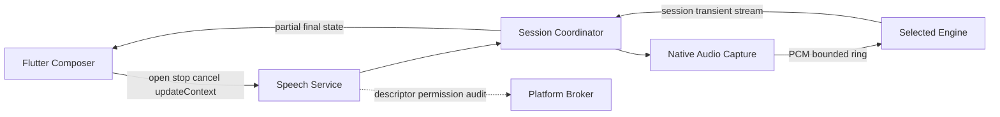

# OpenMuse Mobile ASR Plugin 架构、技术选型与实施计划

状态：架构基线；P0 合同与 Android 本地纵向切片已验证，发布门禁仍按第 15–18 节推进（2026-10-03）

关联文档：[Mobile 产品设计](MOBILE-PRODUCT-PRD.zh-CN.md)、[Mobile 架构与实现计划](MOBILE-ARCHITECTURE-IMPLEMENTATION-PLAN.zh-CN.md)、[Host / Plugin / DSH 总体架构](PLUGIN-HOST-DSH-ARCHITECTURE.zh-CN.md)、[Plugin Manifest v2](PLUGIN-MANIFEST-V2.zh-CN.md)、[DSH 原生 Flutter 对话架构](DSH-NATIVE-FLUTTER-CONVERSATION-ARCHITECTURE-PLAN.zh-CN.md)

## 1. 决策摘要

Mobile 语音输入采用“一个 Speech Plugin、稳定 Service 合同、可替换 Engine、受限音频数据面”的架构：

- 新增受信任的内置插件 `com.openmuse.speech.input`，向 Host Broker 提供 `openmuse.speech.recognition@1` Service；DSH、Writer、Sheet、Slides 或未来 Meeting Plugin 都只依赖该 Service，不依赖模型 SDK。
- Speech Plugin 内部拆分 `AudioCapturePort`、`SpeechEnginePort`、`SpeechSessionCoordinator`、`SpeechModelManager` 与 `SpeechPolicy`。拆分是实现边界，不在 V1 向普通插件公开原始麦克风流。
- V1 默认 Engine 选择 `sherpa-onnx + Streaming Zipformer Transducer INT8`。首发模型候选为中英双语 small Zipformer，但必须经过许可证、来源、哈希、真实 Office 语料 CER、包体、内存、功耗和真机实时率门禁后才能锁定。
- 服务端模型通过同一 `SpeechEnginePort` 接入。Engine 在创建会话时选择，单次 utterance 中不热切换；`local-only`、`remote-only` 和经用户同意的 `prefer-local` 是显式策略，不能在未告知用户时把音频从本地切到云端。
- Mobile 第一阶段采用按住说话：按下开始、边说边在 Composer 中显示临时文本、松开完成识别并把最终文本写入可编辑草稿。默认不自动发送给 Agent，避免误识别直接触发工具、成本或副作用。
- 音频采集、重采样、ring buffer 和推理不能运行在 Flutter UI isolate。PCM 不经过 JSON Broker，也不写入全局 Event 日志；Broker 只处理 session descriptor、权限、取消与审计，partial/final 走有界、会话级 transient stream。
- 同一时刻全局只允许一个 foreground microphone session。模型 Runtime 由 Host/Speech Plugin 复用，不能由每个消费插件各自加载。
- V1 不同时常驻 Zipformer 与 SenseVoice，不引入独立 Silero VAD 作为按住说话的硬依赖。Tap-to-talk、自动 endpoint、二阶段复核和会议长录音在实测后分阶段加入。

最终推荐不是“Flutter 页面直接调用 ASR SDK”，也不是“把 ASR 写进 DSH Plugin”，而是：

```text
WorkBuddy / DSH / Office Plugin
            │
            │ openmuse.speech.recognition@1
            ▼
   com.openmuse.speech.input
            │
      Session Coordinator
       ┌────┴───────────┐
       ▼                ▼
 LocalSherpaEngine   RemoteSpeechEngine
       │                │
       ▼                ▼
 Zipformer INT8     OpenMuse Cloud / BYO provider
```

## 2. 当前仓库事实与方案约束

这份设计以当前代码为基线，而不是假设 Mobile 已经拥有完整 Rust Host。

### 2.1 当前 Mobile 是 Flutter app root + 编译期 Built-in Plugin

[`app/openmuse_mobile/lib/main.dart`](../app/openmuse_mobile/lib/main.dart) 当前直接创建 `OpenMusePluginRegistry`，编译期安装 GoTrue、Cloud Workspace 与 Paired Desktop 三个插件。`OpenMusePluginContext.executeHostCommand` 仍是空实现，说明 Mobile 尚未接通完整 Platform Broker。

[`packages/openmuse_plugin_sdk/lib/openmuse_plugin_sdk.dart`](../packages/openmuse_plugin_sdk/lib/openmuse_plugin_sdk.dart) 中的 Dart `OpenMusePluginDescriptor` 当前只暴露 editor/panel contribution，没有 Dart 侧 service 注册与调用接口。另一方面：

- Manifest v2 schema 已支持 `contributes.services`；
- [`crates/openmuse-plugin-protocol`](../crates/openmuse-plugin-protocol/) 已定义 `CallService`；
- [`crates/openmuse-platform-runtime`](../crates/openmuse-platform-runtime/) 已实现按 version、priority 和 permission 选择 Service provider。

因此 Speech 应以 Service 为目标合同，但第一阶段必须通过 typed Dart port 接入当前 Mobile，再把适配器收敛到 Broker，不能假装现有 Dart Registry 已经具备生产 Service Bus。

### 2.2 当前 Composer 已有正确的接入点

[`app/openmuse_mobile/lib/workbuddy/workbuddy_shell.dart`](../app/openmuse_mobile/lib/workbuddy/workbuddy_shell.dart) 已经有：

- Host-owned `TextEditingController`；
- `wb-input-mode-toggle` 在键盘/语音模式间显式切换，`wb-voice-hold` 只在语音模式下接收长按手势；
- 录音时由 Host 展示不阻塞手势的波形覆盖层，并把上滑动作映射为 cancel；
- Host Composer 通过 `NativeDshSessionHandle.send()` 写入当前 DSH Session；
- 内嵌 Native DSH surface 可以关闭自己的 Composer，避免重复输入区。

因此首个纵向切片不需要修改 DSH wire protocol，也不能让 Speech Plugin 直接调用 `conversation.send()`。Speech 只编辑 Host Composer 草稿，现有 `_submit()` 仍是唯一发送入口。

### 2.3 当前 Native Engine 通过版本化 FFI 进入 Mobile

DOCX 与 Office Viewer 已经证明了可复用模式：Rust crate 提供有界 C ABI，Dart FFI adapter 校验 ABI，平台构建脚本生成 Android arm64 与 iOS XCFramework，并把缺失 artifact 降级为 capability 不可用。

ASR 与 DOCX 的关键差异是 ASR 有持续音频和实时事件：

- DOCX 是 request/response buffer；ASR 是长生命周期 session；
- PCM 是高频 Data Plane，不能每帧进入 Dart UI 或 JSON Broker；
- ASR 还涉及麦克风权限、App lifecycle、音频路由、耳机/蓝牙中断与模型驻留。

因此可以复用 ABI、artifact、capability degradation 和构建门禁，但不能照抄同步 FFI 调用方式。

### 2.4 当前 capability snapshot 只是可用性集合

[`packages/openmuse_host_shell/lib/src/contracts.dart`](../packages/openmuse_host_shell/lib/src/contracts.dart) 的 `CapabilitySnapshotPort` 只返回 `Set<String>`；Mobile composition 也只是枚举 `office.*.engine`、`workspace.*` 与 `dsh.*`。

Speech capability snapshot 应只用于 UI 决定是否显示麦克风、是否显示下载/离线提示。真正调用必须经过 typed port / Service，不能把 capability string 当成可调用接口。

## 3. 目标、非目标与产品语义

### 3.1 V1 目标

- 用户从现有 Mobile Composer 发起语音输入，不再依赖长文本触屏输入；
- 权限已授予且模型 warm 时，按下后立即进入 listening 状态；
- 识别过程持续提供 partial，Flutter 动画与文本输入不掉帧；
- 松开后快速得到 final，结果可继续编辑再发送；
- 本地离线可用；网络可用且用户/组织策略允许时，可选择服务端 Engine；
- DSH 与未来 Office 插件复用同一套 speech session，不重复加载模型；
- 模型、服务端 provider 和音频实现可替换，消费插件合同不变；
- 原始音频、转写内容和上下文词表默认不进入日志、Crash、Metrics 或持久缓存。

### 3.2 V1 非目标

- 会议级后台持续录音、说话人分离与多小时转写；
- 唤醒词、始终监听、锁屏录音；
- TTS、全双工 Voice Agent 与回声消除闭环；
- 在任意第三方进程中直接读取麦克风 PCM；
- 用 LLM 自动改写识别文本；
- 在一次 utterance 中把本地和远端结果混合成不可解释的最终文本；
- 以通用 benchmark 代替 OpenMuse 中文/中英混合 Office 语料验收。

### 3.3 V1 用户交互

默认交互采用 press-to-talk：

1. 用户点击 Composer 左侧输入模式按钮，从键盘模式切换为语音模式；切换后 TextField 失焦且键盘收起。
2. 用户按住中央“按住说话”区域；Host 请求或确认麦克风权限，并显示底部波形面板、取消手势和隐私模式（本地/云端）。
3. partial 作为“临时语音片段”显示在当前插入点；已有草稿不被清空。
4. 用户松开，session 进入 finalizing；最终结果替换临时片段。
5. 文本留在 Composer，用户可编辑或点击发送。
6. 用户按住时上滑进入红色“松手取消”状态，释放后恢复开始识别前的草稿；权限拒绝、来电、App 退后台或音频路由中断同样进入明确终态并展示可行动的错误。
7. 用户点击左侧键盘按钮可回到文本模式并主动拉起键盘；单纯长按文本输入框不再被解释为语音操作。

`release-to-send` 可以作为未来显式偏好，但不能是 V1 默认值。

## 4. 架构决策

### 4.1 ASR 是 Plugin 提供的 Host Service，不是某个页面的 SDK

稳定服务名：

```text
openmuse.speech.recognition@1
```

提供者：

```text
com.openmuse.speech.input
```

消费方只看见 `SpeechRecognitionPort` / Service method 和 `SpeechEvent`，不能拿到：

- sherpa-onnx recognizer pointer；
- ONNX Runtime session；
- 模型本地绝对路径；
- 麦克风 device handle；
- Remote provider API key；
- 原始 PCM ring buffer。

这与 OpenMuse 的 Control Plane / Data Plane 分层一致，也允许未来将同一 Service 提供给 Writer、Sheet、Slides、Search 与 Meeting。

### 4.2 内部拆分 Audio 与 Speech，但 V1 不公开通用 Audio Service

调研稿提出把 Audio 与 ASR 拆成两个 Host Capability，方向在实现层是正确的，但 V1 不应把 `audio.stream` 暴露给所有插件，原因是：

- 麦克风 PCM 是高敏感、高带宽数据；
- 当前 Broker 的 Event 实现会保存事件，不适合 partial transcript，更不适合 PCM；
- 任意订阅者会扩大权限、审计、背压和生命周期表面积；
- 普通语音输入消费方只需要文本，不需要音频。

V1 边界是：

```text
Speech Plugin（受信任）
  ├── AudioCapturePort       # 内部、平台特权
  ├── AudioPreprocessor      # 内部、Data Plane
  ├── SpeechEnginePort       # 内部、可替换
  └── SpeechRecognitionPort  # 对外、文本语义
```

未来 Meeting/Recorder 确实需要音频时，应新增单独评审的 `openmuse.audio.capture@1`，使用带 grant、scope、TTL、foreground indicator 和 bounded stream 的 opaque handle，而不是复用全局 Event topic。

### 4.3 高频流走 Data Plane，Broker 只走 Control Plane



约束：

- PCM 使用 native buffer / FFI data plane，不序列化 JSON；
- UI 只接收节流后的 partial/final/state；
- 每个事件携带 `sessionRef + generation + sequence`；
- stream 是 transient、有界、会话关闭即释放，不进入 Broker 的持久事件数组；
- 控制操作有 deadline、request id、取消和 generation fence；
- overrun 时明确结束 session 并上报 `audio_overrun`，不能无限排队后输出过期文字。

### 4.4 Engine 在 session 边界选择，不在 utterance 中热切换

Engine 切换策略：

| 策略 | 行为 | 适用场景 |
| --- | --- | --- |
| `local-only` | 只允许本地 Engine；模型不可用时失败并提示下载 | 隐私优先、离线、企业策略 |
| `remote-only` | 明确告知音频将上传；只用远端 Engine | 组织统一服务、高准确率模式 |
| `prefer-local` | 本地 probe 通过则本地；创建 session 前可按明确同意回退远端 | 推荐默认策略，但远端回退必须已获同意 |

禁止：

- 本地 session 已收到音频后静默切远端；
- 网络抖动时同时向多个 provider 发送同一段音频；
- 以“效果优化”为名绕过 `local-only`；
- 把 provider key 编译或持久化在 Mobile artifact。

如需切换，先结束旧 generation，再创建新 session。UI 必须告诉用户旧片段是否已提交、是否需要重说。

## 5. 目标组件与仓库落点

建议的包结构：

```text
packages/
  muse_speech_contract/             # 纯 Dart：typed contract、状态、错误、fake
  muse_speech_core/                 # 纯 Dart：session coordinator、policy、draft merge
  openmuse_speech_runtime/          # Dart FFI / platform adapter，不含 Composer UI

plugins/
  speech-input/
    lib/                            # OpenMusePlugin、service adapter、settings/status
    android/                        # AudioRecord、route/interruption、native binding
    ios/                            # AVAudioEngine、AVAudioSession、native binding
    openmuse.plugin.json

crates/
  openmuse-speech-runtime/          # session/ring/engine C ABI；P0 后按 spike 结论启用

contracts/
  openmuse-speech/v1/               # wire schema、fixtures、error/event registry

scripts/
  build_speech_mobile_artifacts.sh
  test_speech_contract.sh
  test_mobile_speech_android.sh
  test_mobile_speech_ios.sh
```

职责：

| 模块 | 职责 | 不拥有 |
| --- | --- | --- |
| `muse_speech_contract` | 稳定类型、状态机、错误与 fake | Flutter、网络、FFI、模型 |
| `muse_speech_core` | 会话仲裁、Engine policy、上下文裁剪、draft 合并 | 平台权限、模型 SDK |
| `openmuse_speech_runtime` | Dart 与 native/FFI 的窄适配 | WorkBuddy UI、DSH Session |
| `speech-input` Plugin | 生命周期、Service 注册、设置、可用性 | 具体对话发送 |
| platform adapter | 麦克风、route、interruption、前后台 | Workspace、Agent |
| Rust/native runtime | ring、重采样、推理线程、Engine session | Flutter Widget、账号 UI |
| Composer integration | 展示状态、写草稿、用户发送 | 模型、麦克风 handle |

### 5.1 为什么保留 Rust/native runtime Spike，而不预先锁死实现

sherpa-onnx 已提供 C、Dart 和 Flutter 支持。P0 需要比较两条实现路径：

1. 官方 Dart/Flutter binding + background isolate；
2. Kotlin/Swift 原生采集直接把 PCM 喂给 Rust/C ABI runtime，Flutter 只收低频事件。

若路径 1 在目标机型上满足 UI、实时率、内存和 soak 门禁，它更短、更容易维护；Rust 不应只为了“架构看起来统一”而增加一层无价值 wrapper。若平台 channel / Dart copy 导致 UI 抖动、内存复制或后台 isolate 限制，则采用路径 2。

无论 Spike 选择哪条，`muse_speech_contract`、Plugin Service 与 Engine port 不变。

## 6. 稳定合同

### 6.1 Dart typed port

建议冻结以下语义；具体字段以 `contracts/openmuse-speech/v1` schema 为真源：

```dart
abstract interface class SpeechRecognitionPort {
  Future<SpeechProbe> probe();

  Future<SpeechSession> open(SpeechStartRequest request);

  Future<void> updateContext(
    SpeechSessionRef session,
    SpeechContext context,
  );

  Future<void> stop(SpeechSessionRef session);

  Future<void> cancel(SpeechSessionRef session);
}

abstract interface class SpeechSession {
  SpeechSessionRef get ref;
  SpeechEngineDescriptor get engine;
  Stream<SpeechEvent> get events;
}
```

`SpeechStartRequest` 至少包含：

```text
requestId
languageHints[]
mode = pressToTalk | endpointed
enginePolicy = localOnly | remoteOnly | preferLocal
context
partialResults = true
punctuation = finalOnly | disabled
maxDuration
```

`SpeechProbe` 返回真实可用性，而不是只看代码是否编译：

```text
permissionState
localEngine: unavailable | needsModel | ready
remoteEngine: unavailable | consentRequired | ready
supportedLanguages[]
supportsPartial
supportsContextBias
supportsEndpoint
activeSessionRef?
```

### 6.2 Session event

```text
SpeechEvent {
  sessionRef,
  generation,
  sequence,
  monotonicTimestamp,
  kind,
  payload
}
```

V1 event kind：

| kind | payload | 语义 |
| --- | --- | --- |
| `state` | phase、engine、route | 权威 session 状态 |
| `speech-start` | audio timestamp | 检测到有效语音；按住说话可选 |
| `partial` | text、revision、stability? | 可覆盖的临时文本，不可直接发送 |
| `final` | text、segment id、language? | 当前 segment 最终文本 |
| `speech-end` | reason | 用户松开、endpoint、中断或时限 |
| `error` | stable code、retryable、safe message | 终态错误 |
| `stats` | 有界性能字段 | 只含延迟/队列/engine，不含音频或文本 |

规则：

- `partial.revision` 单调递增；新 partial 替换同一临时 segment，不做字符串 append；
- `final` 只能提交一次；重复 sequence 去重；
- consumer 丢失 sequence 或 generation 改变时停止写草稿并重新 probe，不能猜测缺失文字；
- stop 表示“停止采集并完成已接收音频”，cancel 表示“丢弃此次临时结果并恢复草稿”；
- session close 后的迟到 callback 必须丢弃。

### 6.3 状态机

```text
idle
  → probing
  → awaiting-permission
  → preparing-engine
  → listening
  → recognizing
  → finalizing
  → completed

任意 active 状态
  → cancelling → cancelled
  → interrupted → completed | failed
  → failed
```

`background`、来电、音频设备切换、模型卸载和 Plugin deactivate 都必须转换成明确终态。禁止只停止 UI 而保留麦克风或 recognizer。

## 7. Composer 集成与草稿一致性

### 7.1 草稿合并

开始识别时记录：

```text
baseText
selectionStart
selectionEnd
composerRevision
speechSegmentId
```

每次 partial 都只替换 `speechSegmentId` 对应范围。如果用户在识别时移动光标或编辑了该范围：

- 不覆盖用户的新修改；
- 冻结当前 partial，并把后续结果作为新的候选 chip / 独立片段；
- UI 提示用户点选插入，或结束当前 session。

cancel 恢复 `baseText + original selection`；final 把片段转为普通文本并保留光标。Composer 不从最终字符串反推临时范围。

### 7.2 与 DSH 的边界

- `Speech Plugin → Composer draft`；
- `Composer submit → NativeDshSessionHandle.send()`；
- Speech Plugin 不持有 `sessionId`、DSH client 或 Agent model；
- 切换 Cloud/Paired Desktop 不改变 Speech Service；
- Speech 失败不影响 DSH attachment，DSH 断线也不需要销毁已提交的本地文本草稿。

这使语音输入可在 Agent 尚未连接时完成，网络恢复后再由用户发送。

## 8. Context 与 Office 词表

Office-aware context 是提高实际效果的关键，但必须有界、显式并与 Engine 能力协商。

```text
SpeechContext {
  localeHints[]
  terms[]          # 名称、缩写、Sheet、字段、命令词
  phraseHints[]    # 有界短语
  commandHints[]   # UI 可执行命令的显示名，不是执行权
  revision
}
```

来源可以包括：

- 当前 Workspace/文档显示名；
- 当前 Sheet 名、列名、选区附近有限实体；
- Agent/Plugin 已注册命令的用户可见 title；
- 用户个人词表。

约束：

- caller 负责构造已授权的最小 context，Speech Plugin 不自行遍历 Workspace；
- 不传完整文档、聊天历史、token、绝对路径或隐藏资源；
- term 数量、单项长度和总字节数有硬上限；
- context 带 revision，旧 generation 更新被拒绝；
- context 不落日志，远端模式必须纳入上传说明；
- Engine 不支持 bias 时必须在 probe/diagnostic 中声明，不能假装已生效。

sherpa-onnx 的 hotword 只支持 transducer，并要求 `modified_beam_search`；这正是优先选择 Zipformer Transducer 而不是 CTC 或 SenseVoice 作为默认本地 Engine 的重要原因。hotword score 必须在 OpenMuse 真实语料上调参，过高会增加误插入。

## 9. Engine 抽象与切换

### 9.1 内部接口

```dart
abstract interface class SpeechEngineProvider {
  SpeechEngineDescriptor get descriptor;

  Future<SpeechEngineProbe> probe();

  Future<SpeechEngineSession> createSession(
    SpeechEngineStartRequest request,
  );
}

abstract interface class SpeechEngineSession {
  Stream<SpeechEngineEvent> get events;
  Future<void> acceptAudio(AudioFrame frame);
  Future<void> updateContext(SpeechContext context);
  Future<void> finish();
  Future<void> cancel();
}
```

native 实现可把 `acceptAudio` 收敛为 opaque data-plane handle，使 PCM 不经过 Dart；接口表达的仍是相同 ownership。

### 9.2 Engine descriptor

每个 Engine 声明：

```text
id / version / locality
languages
streaming / partial / endpoint / contextBias / punctuation
audioFormats
modelId / modelDigest（本地）
privacyClass
```

Policy 只能依据 descriptor 与 probe 选 Engine，不能根据插件名写硬编码分支。

### 9.3 Remote Engine

建议协议：

```text
POST /v1/speech/sessions
  -> scoped sessionRef + websocketUrl + expiresAt + engine descriptor

WebSocket control frames
  start / update-context / finish / cancel

WebSocket binary frames
  16 kHz mono PCM16, ordered by frame sequence

WebSocket result frames
  state / partial / final / error / usage
```

Remote provider：

- 使用现有认证控制器提供的短期 access token；
- 服务端返回 scope 仅限单个 speech session 的短期 capability；
- 不把长期 vendor key 发给 Mobile；
- TLS、origin allowlist、deadline、max duration、max bytes 与 rate limit 是硬门禁；
- 音频默认不持久化；若组织需要留存，必须是独立、可见的策略；
- provider 名称和上传状态在录音 UI 中可见；
- 服务端模型可换成 sherpa streaming、GPU transducer、Paraformer、Whisper 类或托管服务，Mobile contract 不变化。

首个 Remote provider 建议先使用与本地相同的 streaming contract 验证协议和切换语义，再用真实 Office corpus 比较高精度模型；不要在客户端合同中出现 vendor model name。

## 10. 技术选型对比

### 10.1 Runtime / 模型组合

| 方案 | 真流式 partial | 中英混合 | Context bias | Mobile 资源 | 跨 Android/iOS | 主要风险 | 定位 |
| --- | --- | --- | --- | --- | --- | --- | --- |
| sherpa-onnx + Streaming Zipformer Transducer INT8 | 是 | 有双语模型 | 是；transducer + modified beam search | 可选 small/INT8，需真机测 | 官方支持 Flutter、Android、iOS arm64 | 模型许可证/来源逐个审查；beam search 成本 | **V1 默认候选** |
| sherpa-onnx + Streaming Paraformer INT8 | 是 | 有中英模型 | sherpa hotword 不支持该类型 | 中等，需真机测 | 支持 | Office 专有词增强弱于 transducer | 备选实时 Engine |
| sherpa-onnx + SenseVoiceSmall INT8 + VAD | 本质为分段离线 | 多语种/方言覆盖好 | 不支持同等 hotword 路径 | 需整段/端点，首字和 final 行为不同 | 支持 | 不是 V1 press-to-talk partial 的最佳主路径 | 二阶段 final / 方言实验 |
| whisper.cpp | 示例以滑窗反复推理模拟实时 | 多语种 | 无 Zipformer 等价热词路径 | 小模型仍需显著计算，需实测 | Android/iOS 可集成 | 官方 stream 示例也称 naive，每 0.5 秒重跑 | 本地离线批处理或高端机实验 |
| Android/iOS 系统 Speech API | 支持 partial，平台相关 | 随 OS/locale | 平台接口有限且不一致 | App 包体小 | 平台各自实现 | 设备、OS、语言包、联网行为和结果不一致 | 可选 fallback，不作为一致性基线 |
| Remote streaming ASR | 取决于 provider | 可使用更大模型 | 取决于 provider | Mobile 低计算但有网络/流量 | 一套协议可跨端 | 隐私、弱网、费用、服务可用性 | 显式可选的高质量 Engine |

事实依据：

- sherpa-onnx 官方列出 C/Dart/Rust API、Android/iOS 与 Flutter arm64 支持，并提供 streaming ASR、VAD、WebSocket 与移动示例：[项目 README](https://github.com/k2-fsa/sherpa-onnx)、[Flutter streaming 示例](https://github.com/k2-fsa/sherpa-onnx/tree/master/flutter-examples/streaming_asr)。
- sherpa-onnx 的 hotword 文档明确限定 transducer + `modified_beam_search`：[Hotwords 文档](https://k2-fsa.github.io/sherpa/onnx/hotwords/index.html)。
- 官方模型目录列出 Streaming Zipformer、Paraformer、INT8 和中英双语候选：[pretrained models](https://k2-fsa.github.io/sherpa/onnx/pretrained_models/index.html)。
- whisper.cpp 官方实时示例把实现称为 naive，并以 0.5 秒采样窗口反复转写：[stream example](https://github.com/ggml-org/whisper.cpp/tree/master/examples/stream)。
- Android on-device recognizer 需要运行时探测，API 31 才提供 `createOnDeviceSpeechRecognizer`；iOS 也需要检查 `supportsOnDeviceRecognition`，否则识别需要网络：[Android SpeechRecognizer](https://developer.android.com/reference/android/speech/SpeechRecognizer)、[Apple supportsOnDeviceRecognition](https://developer.apple.com/documentation/speech/sfspeechrecognizer/supportsondevicerecognition)。

### 10.2 最终选择

V1 冻结以下组合：

| 层 | 选择 |
| --- | --- |
| Plugin | `com.openmuse.speech.input` Built-in Flutter Plugin |
| 对外合同 | `openmuse.speech.recognition@1` |
| 默认 locality | 本地优先 |
| Runtime | sherpa-onnx，固定版本与 SBOM |
| 模型族 | Streaming Zipformer Transducer INT8 |
| 首发候选 | small bilingual zh-en INT8；通过门禁后锁具体 model id/digest |
| decoding | partial 可先 greedy；需要 Office hotword 时评估 modified beam search；最终配置由基准冻结 |
| 音频 | native capture，mono PCM；runtime 统一到模型要求的 16 kHz |
| VAD | press-to-talk V1 不强依赖独立 VAD；endpointed 模式后续启用 sherpa VAD/endpoint |
| partial | 开启，节流到 UI |
| final punctuation | 可选独立 final-only stage，不修改 partial，不做语义改写 |
| 服务端 | 可选 `RemoteSpeechEngine`，必须显式同意与可见 |
| 并发 | 一个 active foreground mic session，模型 runtime 共享 |

不能直接把某个 sherpa model release 当成可发行资产。sherpa-onnx Runtime 是 Apache-2.0，但模型权重、训练数据、模型卡和访问条款需要分别审查。中英双语候选的 Hugging Face model card 标注 Apache-2.0；仍要把 exact source revision、license file、SHA-256 与 notices 写入 distribution lock。任何模型卡缺失、条款不清或来源不可重现都阻止发布。

## 11. 音频采集与实时线程模型

### 11.1 平台实现

Android：

- 使用 `AudioRecord` 或经 Spike 验证的等价原生采集；
- 运行时请求 `RECORD_AUDIO`；
- V1 只在 Activity 可见时启动，不做后台 microphone foreground service；
- 监听 route、focus、电话、蓝牙和系统 mic toggle；
- App UI 自己也显示持续的录音状态，不能只依赖系统隐私指示器。

iOS：

- `Info.plist` 提供明确 `NSMicrophoneUsageDescription`；
- 使用 `AVAudioSession` + `AVAudioEngine.inputNode` tap；
- 处理 interruption、route change、media services reset；
- 硬件 sample rate/channel 先探测，再在 native/runtime 统一重采样；
- V1 退后台立即结束或取消，不声明不需要的后台 audio mode。

平台依据：[Android microphone foreground-service 限制](https://developer.android.com/develop/background-work/services/fgs/service-types)、[Android 隐私建议](https://developer.android.com/privacy-and-security/about)、[Apple microphone usage description](https://developer.apple.com/documentation/BundleResources/Information-Property-List/NSMicrophoneUsageDescription)、[AVAudioEngine inputNode](https://developer.apple.com/documentation/AVFAudio/AVAudioEngine/inputNode)。

### 11.2 数据与线程

```text
OS audio callback
  → preallocated frame pool
  → bounded SPSC ring
  → resampler / preprocessor
  → engine worker thread
  → result coalescer
  → session event stream
  → Flutter state / composer
```

硬约束：

- audio callback 不分配大对象、不做推理、不写日志、不等待网络；
- ring buffer 有固定上限；
- engine worker 不占 UI isolate；
- partial 只在文本变化且达到最小间隔时发布；
- UI 以最新 revision 覆盖，不渲染积压的旧 partial；
- session dispose 要等待 worker 退出并释放 recognizer、audio tap 与 route listener；
- 模型加载和 warmup 与录音状态分开，Composer 可见时按内存策略预热。

## 12. 模型生命周期与发行

### 12.1 第一版发行策略

为避免扩大 Manifest v2，V1 把经过审核的 Runtime + model inventory 作为每个平台 `runtime-closure` 的一部分：

- Android `aarch64/bionic` 独立 artifact；
- iOS `aarch64/darwin` 独立 XCFramework / bundle artifact；
- 每个 artifact 有 SHA-256、ABI、license 与来源；
- model inventory 额外记录 model id、upstream revision、每个文件 digest、语言和量化方式；
- distribution closure gate 验证 App 内实际文件，不只验证 manifest 声明。

不要在未设计平台中立 artifact 与下载信任链前把模型从匿名 URL 动态下载。若包体要求必须按需下载，P1 先建立 signed model catalog、断点续传、digest/signature、原子激活、磁盘配额、回滚和旧版本清理，再开放生产下载。

### 12.2 Runtime 共享与回收

- 同一 model key 只加载一个 runtime instance；
- foreground session 独占 recognizer stream，但模型权重可共享；
- Composer 活跃时允许 warm；收到 memory pressure 或长期无使用时卸载；
- Plugin deactivate、账号退出不必删除本地公共模型，但必须关闭 session；
- Remote Engine 不应让本地模型常驻，除非策略明确需要快速 fallback；
- 任何“高端机二阶段模型”都必须由 device qualification 决定，不能只看 RAM 数值猜测。

## 13. 权限、安全与隐私

建议权限：

| permission | 谁需要 | 含义 |
| --- | --- | --- |
| `speech.recognition.use` | consumer plugin | 创建文本识别 session |
| `device.microphone.capture` | Speech provider | 访问前台麦克风 |
| `speech.context.provide` | consumer plugin | 提供有界词表/短语 |
| `speech.audio.remote` | Speech provider / policy | 把音频发送到远端 |
| `network.speech` | Remote Engine | 连接批准的 speech endpoint |

授权原则：

- consumer 拿 `speech.recognition.use`，不因此获得 PCM；
- 只有受信任 provider 获得 `device.microphone.capture`；
- remote consent 与 OS microphone permission 分开；同意录音不等于同意上传；
- audit 记录 caller、provider、engine locality、开始/结束、错误码和时长，不记录文本、音频、hotword；
- Crash/analytics 对 transcript、context、endpoint token 和路径做结构化禁止，而不是事后正则脱敏；
- 日志默认只允许 stable code 与 timing bucket；
- session handle 有 caller、generation、foreground scope、TTL，不能转交其它 plugin；
- Plugin deactivate 自动撤销 handle、停止采集、清空 ring。

## 14. Manifest 与当前 SDK 的演进

目标 Manifest 示例（digest 仅为占位，不能用于发行）：

```json
{
  "manifest_version": 2,
  "id": "com.openmuse.speech.input",
  "name": "OpenMuse Speech Input",
  "version": "0.1.0",
  "protocol": { "major": 1, "minor": 0 },
  "ui_runtime": { "kind": "flutter" },
  "execution_connector": { "kind": "host-process", "protocol": "openmuse.speech-runtime/v1" },
  "compatibility": {
    "targets": [
      { "target": { "os": "android", "arch": "aarch64", "libc": "bionic" }, "status": "supported" },
      { "target": { "os": "ios", "arch": "aarch64", "libc": "darwin" }, "status": "supported" }
    ]
  },
  "artifacts": [
    {
      "id": "speech.runtime.android-aarch64",
      "kind": "runtime-closure",
      "target": { "os": "android", "arch": "aarch64", "libc": "bionic" },
      "digest": { "algorithm": "sha256", "value": "1111111111111111111111111111111111111111111111111111111111111111" },
      "license": "Apache-2.0",
      "abi": "openmuse.speech-runtime/v1"
    },
    {
      "id": "speech.runtime.ios-aarch64",
      "kind": "runtime-closure",
      "target": { "os": "ios", "arch": "aarch64", "libc": "darwin" },
      "digest": { "algorithm": "sha256", "value": "2222222222222222222222222222222222222222222222222222222222222222" },
      "license": "Apache-2.0",
      "abi": "openmuse.speech-runtime/v1"
    }
  ],
  "activation_events": ["onStartup", "onCapability:speech.recognition"],
  "requested_permissions": [
    "device.microphone.capture",
    "network.speech"
  ],
  "presentation": { "surfaces": [], "remote_capable": false },
  "contributes": {
    "commands": [],
    "services": [
      {
        "id": "openmuse.speech.recognition",
        "version": 1,
        "priority": 100,
        "required_permissions": ["speech.recognition.use"]
      }
    ],
    "editors": [],
    "panels": [],
    "agent_cli": []
  }
}
```

实施时需要补齐的 SDK seam：

1. Dart `OpenMusePluginDescriptor` 增加 service contribution 的只读描述；
2. `OpenMusePluginContext` 提供 `registerService/callService/openTransientStream`，或提供对 Platform Broker 的窄 adapter；
3. Dart 与 Rust 对 service id/version/permission/provider priority 使用同一 fixture；
4. deactivate 自动注销 service 并关闭全部 speech session；
5. capability snapshot 从手写布尔值改为 provider probe 的投影；
6. 外部插件消费 speech 前，先完成 scoped transient data-plane handle，不允许复用持久 Event 数组。

当前阶段可以把 `SpeechRecognitionPort?` 注入 `OpenMuseHostComposition` / `WorkBuddyShell` 形成首个纵向切片，但它必须被标记为 Broker adapter，不能成为第二套永久合同。

## 15. 性能预算与验收

以下是发布门禁，不是对尚未跑过的模型做性能承诺。所有时间使用 monotonic clock，在 release/profile 构建的真机上采集。

| ID | 场景 | V1 门禁 |
| --- | --- | --- |
| PERF-01 | 已授权、warm start | 按下到 listening indicator p95 ≤ 150 ms |
| PERF-02 | cold start | 用户立即看到 preparing/listening 状态；模型 ready p95 ≤ 1.5 s，否则调整预热/模型 |
| PERF-03 | 首个 partial | 有足够可解码语音后 p95 ≤ 600 ms |
| PERF-04 | partial cadence | 文本变化时 p95 间隔 ≤ 250 ms；UI 不消费过期 revision |
| PERF-05 | release to final | p95 ≤ 800 ms，超时可取消且草稿一致 |
| PERF-06 | 实时率 | 目标机型 RTF p95 < 0.7，持续 overrun 为发布阻断 |
| PERF-07 | Flutter frame | 录音和 streaming 时常规 frame p95 ≤ 16.7 ms，不在 UI isolate 做推理 |
| PERF-08 | 连续使用 | 100 个 utterance、30 分钟反复开始/取消/前后台，无持续内存增长、残留 mic indicator 或失活 session |
| PERF-09 | 热/电 | 10 分钟连续测试无系统热降频导致 RTF ≥ 1；记录能耗基线与回归阈值 |
| PERF-10 | 网络 | Remote 在丢包、切网、半开连接下有 deadline，不能无限卡在 finalizing |

质量门禁：

- 建立至少普通话、中文夹英文产品名、数字/金额/日期、Office 命令、安静/街道/会议室、近讲/耳机的授权 corpus；
- 记录 CER、英文 WER、实体准确率、命令短语准确率、误触发与空结果率；
- 对比 greedy 与 modified beam + hotword；
- 模型选择看端到端用户任务，不只看通用 CER；
- corpus、标注、录音同意、保留期限和访问权限进入独立数据治理门禁。

## 16. 测试矩阵

### 16.1 Contract / Core

- unknown major fail closed；
- partial revision、duplicate、gap、迟到 generation；
- stop/cancel 幂等；
- single-active-session 仲裁；
- Engine probe 与 policy 选择；
- remote consent；
- context limits 与敏感字段拒绝；
- draft selection/用户并发编辑/取消恢复；
- deactivate 回收所有 session。

### 16.2 Platform

- 首次允许、拒绝、永久拒绝、系统设置后恢复；
- 有线/蓝牙/扬声器 route 切换；
- 来电、Siri/Assistant、其它录音 App 抢占；
- 前后台、屏幕旋转、页面切换、App kill；
- 系统麦克风总开关关闭；
- 无模型、模型损坏、digest 不符、磁盘不足；
- Remote 离线、TLS 错误、401 refresh、429、server close、慢 final。

### 16.3 Flutter / 产品

- 现有 `wb-voice` 接入真实 session，而不是只切 `_holdingVoice`；
- partial 不清除已有草稿；
- cancel 恢复 selection；
- final 后仍由现有 `_submit()` 发送；
- DSH 未 ready 时可先完成语音草稿；
- mic disabled 时有可理解的原因与修复入口；
- screen reader 宣读 listening/finalizing/error，动态字号不遮挡取消入口；
- 本地/云端状态与上传说明可见。

### 16.4 安全

- 普通 consumer 无法取得 PCM handle；
- 未授权 caller、旧 generation、过期 handle、后台 caller 全部拒绝；
- transcript/audio/context 不出现在 log、crash、metrics、audit payload；
- Remote endpoint 不能由插件提供任意 URL；
- token scope、audience、TTL 与 sessionRef 绑定；
- artifact/model digest、license、SBOM 与 target arch 门禁。

## 17. 分阶段实施

### P0：合同、Corpus 与 Runtime Spike（1–2 周）

- 新建 `muse_speech_contract` 与 fake session；
- 冻结状态、事件、错误码、draft merge 和单 session 仲裁；
- 用输入模式切换与 `wb-voice-hold` 打通 fake partial/final 到 Composer；
- 同一台中端 Android 与一台 iPhone 对比官方 Flutter binding 路径和 native direct-feed 路径；
- 对候选 Zipformer 模型完成 license/source/digest 初审与 50–100 条内部授权语料基准；
- 输出 CPU、RTF、首次 partial、final、RSS、包体和 10 分钟热稳定数据。

退出条件：可以基于数据选择 runtime integration 与具体模型；不能只凭桌面 demo 进入生产实现。

### P1：本地 press-to-talk Vertical Slice（2–3 周）

- Android/iOS 权限、audio route 与 interruption；
- 本地 sherpa Engine、模型加载、ring、worker、partial/final；
- typed `SpeechRecognitionPort` 注入 Mobile composition；
- WorkBuddy 草稿合并、取消、finalizing、错误恢复；
- profile/golden/integration/soak 门禁；
- feature flag 默认 internal，真实设备灰度。

退出条件：本地离线完成 100 次语音输入，无 UI 卡顿、麦克风泄漏或持续内存增长。

### P2：Plugin Service 与发行闭包（2 周）

- Dart Plugin SDK 增加 service seam，并对齐 Rust Broker fixture；
- `com.openmuse.speech.input` 注册 `openmuse.speech.recognition@1`；
- manifest、target artifact、ABI、distribution lock、SBOM、notices；
- capability snapshot 来自 plugin probe；
- deactivate / uninstall / upgrade lifecycle TCK。

退出条件：WorkBuddy 不直接依赖 concrete engine；替换 fake/local engine 不改 Composer。

### P3：Remote Engine（2–3 周）

- Cloud session endpoint、scoped capability 与 WebSocket data plane；
- consent、local-only policy、弱网、计费/配额、服务端审计；
- Remote provider 通过同一 Engine TCK；
- 本地/远端 A/B 只采集无内容质量反馈和用户明确评分，不上传 transcript telemetry。

退出条件：远端不可用不破坏本地；任何音频上传都可见、可阻止、可审计。

### P4：Office Context 与体验增强（2–4 周）

- bounded context builder；
- modified beam + hotword 调参；
- final-only punctuation；
- tap-to-talk + endpoint/VAD；
- 按 corpus 决定是否加入 SenseVoice/更大服务端模型二阶段，不预设结论。

## 18. 需要冻结的 ADR

P0 结束时必须把以下问题从“建议”升级为数据支持的 ADR：

1. 官方 Dart/Flutter binding 是否通过 UI/复制/soak 门禁，还是采用 native direct-feed + Rust/C ABI；
2. 首发 model id、upstream revision、license、digest 与 bundle/download 策略；
3. greedy 与 modified beam 的准确率/延迟/热差异；
4. Android 最低支持 API 与目标设备等级；
5. iOS 最低版本与 simulator/device artifact；
6. warmup、驻留和 memory pressure 回收策略；
7. Remote consent 的产品文案、组织策略与数据保留；
8. performance/quality gate 的最终阈值。

## 19. 最终方案

OpenMuse Mobile V1 应实现一个编译期装配、运行时可启停的 `speech-input` Built-in Plugin。它提供稳定的 `openmuse.speech.recognition@1` Service，内部通过 `SpeechEnginePort` 选择本地 sherpa-onnx Streaming Zipformer INT8 或显式授权的 Remote Engine。插件独占并管理前台麦克风 session，原始 PCM 只在受限 Data Plane 中流动；消费插件只得到会话级 partial/final 文本事件。

首个产品切片直接接入现有 WorkBuddy Host Composer：左侧按钮显式切换键盘/语音输入，语音模式中央区域承载长按，上滑取消；录音期间显示带动画波形的底部状态层。partial 映射成有 revision 的临时草稿片段，松开后提交 final 到可编辑文本，但仍由用户通过现有 `_submit()` 发给 DSH。这样不需要修改 DSH Session 协议，也不会把 ASR 与某个 Agent/Workspace placement 绑定。

默认本地模型选择 Zipformer Transducer，不是因为它在所有 benchmark 上一定最好，而是它同时覆盖真流式、移动端、INT8、中英模型、跨平台和 Office hotword。SenseVoice、Whisper 或更大的服务端模型保留为可插拔 Engine / final-stage 候选，由 OpenMuse 真实语料和真机门禁决定，而不是在 V1 同时常驻。

这套方案的稳定点是 Speech Service、session 语义、权限与数据面；可变化的是音频实现、Runtime 语言、模型、量化、VAD、标点和服务端 provider。未来替换模型时，WorkBuddy、DSH 与 Office Plugin 都不需要改调用合同。
