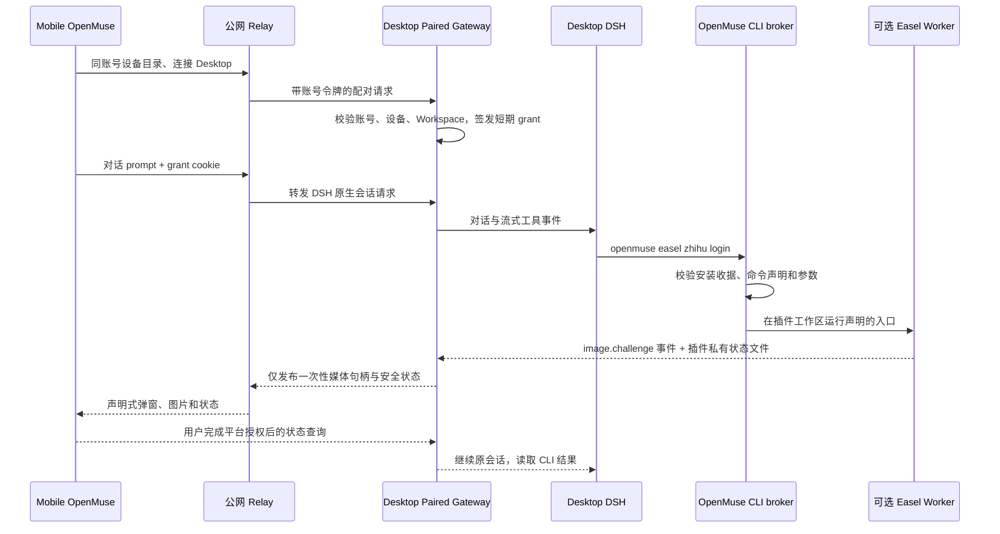

# Mobile 发起的 Desktop 插件任务：窗口归属与交互路由

状态：2026-10-06 真机纵向切片。本文记录已实现的协议与后续生产门槛；完整的 Surface 合同仍以 `MOBILE-REMOTE-PLUGIN-SURFACE-PROTOCOL.zh-CN.md` 为准。

## 1. 目标与边界

Mobile 是用户当前操作窗口。手机在同一 OpenMuse 账号下选择在线 Desktop 和 Workspace，发送普通 DSH 对话；DSH 根据已安装插件的 CLI 元数据选择命令。Desktop 执行素材加工、浏览器授权和发布，Mobile 消费插件发出的二维码、进度、预览与确认。业务插件可以安装、更新、停用，而 Mobile APK 不包含 Easel 业务代码。

Host 只认识 `pluginId`、声明式命令、交互事件、媒体句柄、设备授权和 Job receipt。知乎/抖音选择器、Playwright、浏览器 profile、文章图片上传及平台回读必须留在 Easel 包内。OpenMuse 账号只授予访问已配对 Desktop 的权限，不等于知乎账号发布授权。

## 2. 运行链路

真机已验证从 Mobile 的 DSH 会话启动 `openmuse easel zhihu login`，在 Desktop 插件工作区生成二维码，Mobile 经公网收到并显示原生弹窗；同一手机从相册选择二维码，在知乎 App 确认登录，Desktop Easel `whoami` 返回 `loggedIn: true`。

## 3. 当前协议切片

### 3.1 命令发现与执行

Easel 安装包的 manifest 声明 `group/namespace/command`、参数、输入输出 schema、effects。`openmuse plugin commands --json` 把这些能力提供给 DSH；Host 不包含任何平台命令表。CLI broker 只接受 manifest 中已安装且通过收据校验的贡献，不执行任意 shell；它用 NDJSON 帧返回 stdout、stderr 与退出码。

DSH 的子进程环境会过滤含 `TOKEN` 的变量。OpenMuse DSH bridge 使用 DSH 官方 `shellEnv` 注册表把 broker URL 和进程凭据作为显式、每次执行的 `DSH_OPENMUSE_CLI_BROKER_*` 变量注入，CLI 再转发到 Desktop loopback broker。凭据的暴露面因此是该 Desktop DSH 的模型 shell；上线前应改成会话限定且按 effect 授权的 broker grant，禁止把全局 broker 凭据持久化或写进日志。

### 3.2 交互事件与移动窗口

插件只写 `openmuse.plugin-interaction/v1` 事件：`image.challenge` 带标题、插件私有图片路径和状态路径。DSH 插件先验证安装收据、文件规范化路径位于该插件工作区、事件时效和尺寸。Paired Gateway 将图片转为不含本机路径的句柄，配对 cookie 保护 `GET /openmuse/plugin-interaction/v1` 与 `/media/v1`。Mobile 通用客户端轮询状态并用原生 Flutter 对话框展示，故同一个 APK 可显示其他插件的图片挑战。

此 v1 是通用图片挑战的过渡切片。后续应让同一交互通过 `remote-surface` 的 declarative tree、action 与 receipt 表示，并复用默认安装的 `remote-workbench` 渲染器：二维码、授权状态、作品预览、确认表单、错误修复动作均是组件和事件，不新增 APK 代码。`web-interactive` 不应默认转发 Desktop 本地网页；媒体仍须经受限句柄、TTL 与 Range。

### 3.3 窗口归属

一个 Mobile 发起的 DSH session 应生成 `windowOwner = {account, device, desktop, workspace, session}`。插件交互携带 `jobRef/sessionRef`，Host 仅向该设备 grant 发送。用户同时在 Desktop 看同一任务时，Desktop 是只读镜像；如果 Mobile 断线，挑战保持待处理并在重连后按事件序号恢复。Desktop 自己发起任务时，其本机窗口才是 owner。

当前切片使用最近一次 Mobile prompt 的 grant 和短时有效期来路由；在单设备场景已验证。多设备并发时有错投风险，不能作为生产实现。下一版必须在 CLI broker 创建 job 时绑定 DSH session ID、配对 grant 与 interaction ID，并在每次媒体读取时重新核对；不能用“最后发言的手机”推断 owner。

## 4. 账号、网络与同机扫码

Debug Desktop 本次使用公网 GoTrue、Cloud 和 Relay 运行，Mobile 与 Desktop 登录同一个 OpenMuse 账号。配对网关逐次核对账号，设备 grant 不能跨账号或跨设备复用；Desktop 重启会清除内存 grant，Mobile 显式重选设备及新建会话时强制刷新 grant。

知乎的二维码来自 Desktop 的 Playwright 持久化 profile。只有一部手机时，可以在 Mobile 弹窗截图，然后在知乎 App 的扫一扫中选择相册图片；是否支持相册取决于知乎当前客户端，必须真机核验。若不支持，则应使用 Desktop 显示二维码由手机相机扫描，或平台官方设备授权方式。不能将 OpenMuse 登录态替代知乎登录态，也不能让 Host 读取知乎 cookie。

当前 Debug macOS 运行时的 secure-storage 在缺少 Keychain entitlement 时返回 `-34018`，内存会话有效但重启后要重新登录；发行签名与 entitlement 必须修复并验证。公网切换目前由启动环境变量提供，后续应有可持久的账号与设备配置。

## 5. 发布流水线和确认

目标流水线为 `Workspace 素材 → Easel inspect/process → DraftRef → PreviewRef → Mobile 确认 → Easel publish → 平台 readback → receipt`。Draft/Preview 带版本与指纹，Mobile 修改文章或图片即失效旧确认。外部发布命令须按账号、目标平台、完整图文预览和一次性确认令牌执行；超时后先查 Job ledger 与平台回读，不自动重复点击发布。

Easel `zhihu publish` 上游仅向 Draft.js 写文本。插件新增实验性的 `zhihu publish-article --article ... [--exec]`：解析 Markdown 与本地图片、逐段写入编辑器、逐图上传、发布前核对图数；默认只输出预览。2026-10-06 已用真实知乎编辑器验证四图插入和提交。知乎发布后网页回读命中 `40362` 风控，但手机知乎 App 能打开文章。插件 0.4.5 将重定向后的 URL 和提交前图数写入本地回执，回读失败报告 `submitted/readback: unavailable`，不再把它写成“文章缺图”；同一稿件再次 `--exec` 返回 `already_submitted`，显式 `--force` 才重复提交。Host 不补知乎 DOM 选择器。

## 6. 验收矩阵

| 场景 | 当前证据 | 仍需验证 |
| --- | --- | --- |
| 同账号公网配对 | Desktop 设置显示 Mobile 在线，Mobile 选择 Desktop 后 DSH 会话可用 | 重启后持久登录、跨网络切换 |
| DSH 发现插件 | 手机对话运行 `openmuse` 已安装 Easel 命令 | 动态安装/卸载后会话内重新发现 |
| 沙箱内运行 | CLI broker 补丁后，手机会话启动真实知乎登录且生成 QR | 按 session/effect 授权与取消传播 |
| 插件 UI 上手机 | 真机原生弹窗显示 Desktop Easel 二维码；同机相册扫码并确认成功 | 断线恢复、多设备隔离 |
| 图文发布 | 手机 DSH 会话调用 Easel；四张图在桌面编辑器插入并提交，手机知乎 App 打开文章 | 平台网页回读受 `40362` 限制；完整图数与预览确认仍需独立验收 |
| 插件隔离 | 未安装时命令不可发现，Host 未写平台逻辑 | 运行时停用/升级、故障与资源上限 |

## 7. 实施顺序

1. 修复 DSH shell grant 与 broker 的 session/effect 绑定、取消和持久 Job receipt；把插件交互监听移到插件生命周期，避免隐藏面板时漏事件。
2. 将图片挑战迁移到默认 Mobile `remote-workbench` 的 declarative surface；实现 `jobRef`、设备 owner、事件重放、预览和确认动作。
3. 在已登录知乎测试账号上验证 Easel 富文本图片上传与逐图回读，修正真实选择器，再完成完整图文预览和真发；保持所有平台逻辑在包内。
4. 修复 macOS Keychain entitlement、公网设置持久化、跨设备/断网测试，补签名发行包和真机验收脚本。

## 8. 本次真机结果与操作归属

2026-10-06，唯一已配对 Android 设备在公网连接 Desktop，同账号登录 OpenMuse。手机 OpenMuse 的 DSH 会话启动 Easel 知乎扫码任务；手机知乎 App 从相册读取二维码并确认授权。随后同一手机 DSH 会话发出图文发布请求，Desktop DSH 发现并调用 Easel CLI，生成文章 [OpenMuse 与 DSH：一个是宿主，一个是内核](https://zhuanlan.zhihu.com/p/2090890406376498467)。手机知乎 App 可以打开该文章。DSH 会话中记录了 `plan → inspect → --exec` 的调用与发布地址；平台网页回读受风控限制，因此未能自动独立核验四张发布后图片。

这次不能标为“全程只在手机操作”：扫码和发起对话在手机，文章加工、浏览器和发布进程在 Desktop；调试时还从 Desktop 直接执行 CLI。该调试曾意外产生第二篇重复文章，已在手机知乎 App 删除，保留上述 DSH 会话发布的文章。此次也没有经过独立的 Mobile 图文预览与一次性发布确认 UI；这是协议下一阶段的验收项。Easel 0.4.5 增加内容哈希回执以阻止同稿默认重复提交，但生产幂等仍需要按一次确认生成的 submission ID 和持久 Job ledger。
