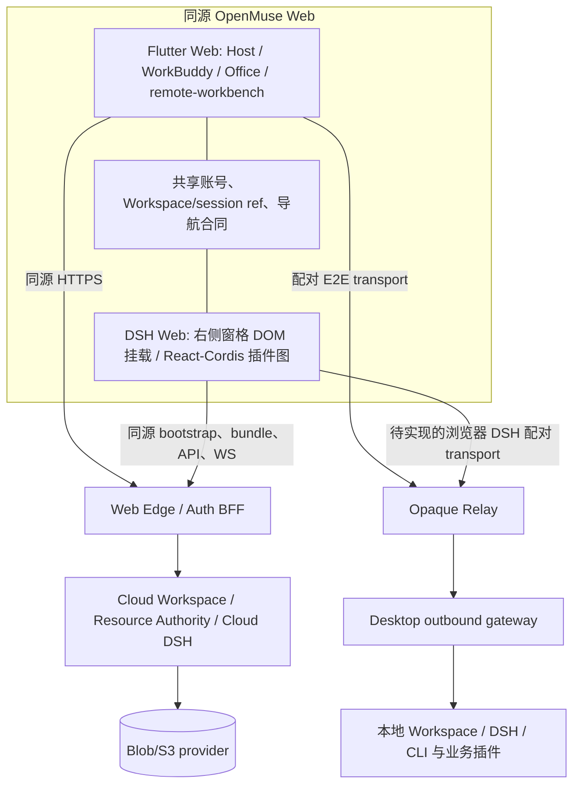

# OpenMuse Web 技术选型、目标架构与开发计划

状态：架构方案，W0 纵向切片实施中（2026-10-07）。执行进度与任务门禁见 [Web 开发计划](WEB-DEVELOPMENT-PLAN.zh-CN.md)。

范围：登录后使用的 OpenMuse 应用、Cloud Workspace、与 Desktop 配对后的 DSH 会话、远程插件表面，以及跨 Mobile/Desktop/Web 复用的 Flutter Office 套件。公开营销站、可搜索的公开文档和完整 Desktop 本地执行环境不属于这一 Web 应用。

相关基线：[Mobile 架构](MOBILE-ARCHITECTURE-IMPLEMENTATION-PLAN.zh-CN.md)、[Mobile ↔ Desktop 真机链路](MOBILE-DESKTOP-PLUGIN-INTERACTION-ROUTING.zh-CN.md)、[DSH 原生对话](DSH-NATIVE-FLUTTER-CONVERSATION-ARCHITECTURE-PLAN.zh-CN.md)、[远程 Surface](MOBILE-REMOTE-PLUGIN-SURFACE-PROTOCOL.zh-CN.md)、[配对 E2E](PAIRED-DESKTOP-E2E-RELAY.zh-CN.md)、[DOCX Engine](MOBILE-OFFICE-DOCX-ENGINE.zh-CN.md)、[Office Viewers](MOBILE-OFFICE-VIEWERS.zh-CN.md)。

## 1. 决策摘要

**采用独立的 `app/openmuse_web` Flutter Web 入口承载 OpenMuse 主界面和未来 Office 套件；DSH 区域在 Desktop 同构的右侧窗格内同页 DOM 挂载 DSH 原有的 Web 前端（React/Cordis 客户端插件图），不使用 iframe，也不在 Flutter 中重写第二套 DSH Web 对话。** Office 的跨端一致性是硬约束：Web Office 不另写 React/DOM 编辑器，不以 PDF 图片或服务端截图替代可交互的 Flutter 文档界面。Web 拥有自己的 composition root、浏览器 transport、会话存储、设备身份、Office Engine 接入与浏览器集成 adapter。Desktop 仍是本地执行和本地资源的权威源；Web 与 Mobile 连接同一个 Cloud/Paired Workspace 和 DSH session，不复制会话真源。

这里的“同一架构和代码”指 **同一产品内核、协议和 Office Flutter 源码；DSH Web 直接复用 DSH 官方 Web 客户端发行包及插件图**，不是强求所有功能都由 Flutter Widget 绘制。Mobile 的 Flutter 原生 DSH 视图仍是移动端实现，Web 不继承其覆盖缺口。独立 Web 入口可在构建时排除 Desktop 和 Mobile 的本机发行闭包，也让浏览器能力边界可审计。优先编译为 Flutter Web 的常规 JS 产物；Wasm 仅在浏览器兼容性、依赖和性能纵向切片通过后作为可选构建。Flutter 官方确认 Web 适合已有 Flutter 应用和交互式 SPA，也明确浏览器不可使用 `dart:io`、原生 FFI，且静态富文本页面更适合 DOM 技术：[Web 支持](https://docs.flutter.dev/platform-integration/web)、[Web FAQ](https://docs.flutter.dev/platform-integration/web/faq)、[Dart FFI](https://dart.dev/interop/c-interop)。

Web V1 的产品范围建议为：同账号登录、Cloud Workspace 浏览和资源预览、DSH 官方 Web 对话及审批、在线 Desktop 发现和配对、同一 DSH session 的实时协同、声明式 remote-workbench 的预览与受控操作，**以及当前已在 Mobile 声明并通过门禁的 Office 能力的 Flutter 同源呈现**。新的完整 Office 编辑能力随套件逐格式上线时，Web 必须与 Mobile/Desktop 共享相同的组件、文档模型、布局语义及对应能力门禁。Desktop 文件系统/Helix/PTY、离线完整 Workspace 不作为 V1 等价承诺；浏览器插件能力按 DSH 客户端与插件自身的平台支持逐项验收。

## 2. 当前实现事实与可复用程度

| 模块 | 仓库事实 | Web 处理方式 |
| --- | --- | --- |
| Host 与领域合同 | `openmuse_host_shell`、`openmuse_mobile_core` 的 `lib` 没有 `dart:io`；Workspace placement、ResourceRef、DSH connector 已有端口 | 直接复用；`OpenMuseHostPlatform` 增加 web，能力由注入的 profile 判定 |
| DSH 原生会话 | Mobile 的 reducer/Flutter renderer 通过 Native Gateway 消费 DSH；其 controller 仍持有 `dart:io` client，且 Mobile 保留 WebView 兼容路径 | Mobile 继续使用这条链；Web 的 DSH 主界面改用 DSH 自带 Web 前端，不以补齐 Mobile 原生 renderer 作为 Web 上线条件。跨端共享 DSH session/权限/资源合同，不强制共享会话 Widget |
| WorkBuddy | `workbuddy_controller.dart`、`workbuddy_models.dart` 主要是产品状态；`workbuddy_shell.dart` 同时引用 Mobile 配对控制器、语音和具体页面；部分本地 task 是 UI 占位状态 | 抽成共享产品组件与端口；服务端 DSH 才是会话真源；Web 使用宽屏导航、深链接、浏览器键盘/历史 adapter |
| Cloud | `openmuse_mobile_cloud` 的两个具体服务使用 `dart:io HttpClient`；领域服务端口在 `openmuse_mobile_core` | 保留合同和语义，新增 fetch/浏览器 HTTP adapter；通过同源入口解决认证和 CORS |
| GoTrue | UI、控制器、认证接口可复用；HTTP/bootstrap 是 `dart:io`，会话存储默认 `flutter_secure_storage` | 复用表单和控制器；Web adapter 使用服务端会话及 HttpOnly cookie，避免把长期 refresh token 放在 Web storage |
| Paired Desktop | `workspace-paired` 的 client、设备目录、gateway 和 outbound relay 在同一 export 中且依赖 `dart:io`；Mobile 的设备密钥由 Android/iOS 原生层和 Rust FFI 管理 | 抽出配对模型/控制器合同；浏览器使用新客户端与密钥适配。Desktop gateway/relay 保持 Desktop 包。现有 HTTP 代理不等同已完成的生产 opaque E2E relay |
| Remote Surface | `muse_remote_surface_contract` 可共用；`muse_remote_surface_core` 的公共 export 混入 host/audit/plugin loader/HTTP `dart:io`；`remote-workbench` 依赖该公共包 | 分成 client core 与 server/desktop core；Web 复用状态机、协议和声明式 Flutter renderer，提供 Web transport 与媒体读取 |
| Office | 当前 `DocxEditorScreen` 和 `OfficeViewerScreen` 是 Flutter Widget；`openmuse_mobile_core` 定义 Office ports、Resource transaction 和 capability gate。`openmuse_office_docx`、`openmuse_office_viewers` 通过 `dart:ffi` 加载 Rust native library。当前 DOCX 是简单段落编辑/导出，XLSX/PPTX/PDF 是只读文本兼容视图，尚非完整视觉布局套件 | 将 Office Widget、文档状态和布局抽到共享 Flutter 包，由 Web 使用同一源码；Rust 解析/导出须经浏览器 Wasm adapter 或经过验证的远端同核执行 adapter。Web 不另造视觉预览作为主实现；每个格式按相同能力与 corpus 门禁开放 |
| DSH 展示 | 当前钉住 `@deepseek-ai/dsh@0.1.7-rc.1`；发行闭包含 `@deepseek-ai/dsh-web-frontend` 的完整 `dist/index.html`、`@deepseek-ai/dsh-web-app` 的静态服务，以及对话、审批、附件等 Web 客户端插件。Mobile 的 `NativeDshPage`/WebView 是另一条平台路径 | Web 在工作台右侧 DSH 窗格的 DOM 容器内加载该客户端插件图；OpenMuse 提供鉴权、启动清单、网关和会话集成。无需把 React/CSS 插件改写成 Flutter contribution，也不继承 Mobile 的 WebView fallback 缺口。浏览器能力和第三方插件仍需验证 |
| 当前 app 入口 | `app/openmuse_mobile/lib/main.dart` 直接导入 `dart:io`、`path_provider`、Office FFI，并在构造时组装移动插件 | 不从 Mobile 的 `main.dart` 生成 Web；抽取共享 application 层后由 Web 入口重新装配 |

上述是源码层判断，**不是已通过 Web 编译或生产联调的结论**。尤其 `openmuse_mobile_core` “能复用”只指其领域库；相邻 package 的传递依赖和测试代码仍要通过实际 `flutter build web` 检验。

## 3. 与旧 AppFlowy Web 的详细比较

本地旧仓库 `../Muse-Clients-Deprecated/frontend/web/package.json` 明确使用 React 18、TypeScript、Vite、Slate、Yjs、Dexie；旧桌面客户端位于另一个项目。它证明旧产品为了复杂 DOM 编辑和浏览器生态维护了独立 Web 前端，但不证明 OpenMuse 当前的 DSH/插件业务必须沿用该边界。旧 Web 工作树有用户改动，本提案只把它当产品行为和迁移风险参考，不直接复制代码；复用需另做 provenance/许可证核验。

| 方案 | Mobile 代码复用 | 浏览器富文本/DOM 生态 | 与当前 DSH/插件合同的维护成本 | 主要风险 | 结论 |
| --- | --- | --- | --- | --- | --- |
| A. 直接 `flutter build web` 编译现有 Mobile app | 表面最高，实际被 native imports 阻断 | Flutter canvas 需要额外处理 HTML/无障碍/输入 | 容易把平台分支塞进应用入口 | `dart:io`、FFI、WebView、Keystore 和依赖闭包 | 不采用 |
| **B. Flutter Web 共源工作台 + DSH 原客户端同页挂载** | **高：Host/WorkBuddy 领域合同、Office Widget/布局、声明式 remote-workbench UI 共源；DSH Web 复用上游完整客户端，DSH Widget 不与 Mobile 共源** | DSH 用其原生 DOM/React 插件图；Office 用同源 Flutter renderer | **一套 DSH runtime/session/插件图，一套 Office 文档与 Flutter 实现，无 iframe** | 同页 mount/dispose、DSH bootstrap/资产、配对链路、Web a11y、Office 性能和体积 | **采用** |
| C. 延续旧 React/Vite/TS Web | Flutter Widget 无法直接复用；Office 要重写第二套渲染和编辑器 | 浏览器 DOM 能力成熟，但双实现难保证 Office 一致 | 需为 DSH、WorkBuddy、remote-workbench 和 Office 重写状态机/renderer/验收 | 违反 Office 同源实现约束，长期语义漂移 | 不满足本产品约束 |
| D. React 外壳嵌整个 Flutter 应用 | 部分 Flutter 可复用 | React shell 可容纳 DOM | 两套路由、状态、焦点、鉴权和部署 | 集成复杂度高，Office 入口受制于外壳 | 不作为基础架构 |

选型与产品形态强相关：OpenMuse 当前 Web 的主任务包括账号、Workspace、Agent 对话、审批、跨设备插件控制和 Flutter Office；公开内容/营销站已经是单独的 Web 项目，无需用 Flutter Web 承担 SEO。Office 的编辑区保持同源 Flutter 实现；若浏览器输入法或无障碍需要 HTML 输入代理，该代理只能处理输入和辅助语义，不能成为第二套文档模型、布局和渲染真源。Flutter 官方也将 SEO/静态文章与应用型 Web 区分：[Web FAQ](https://docs.flutter.dev/platform-integration/web/faq)。

## 4. Web 目标架构



**控制面**：用户登录、设备目录、presence、配对、grant、Workspace catalog、能力协商。**会话面**：同一 DSH runtime/session；Mobile 原生 Gateway 和 Web 原有 DSH 客户端各有自己的展示与 transport，同一服务端会话真源负责跨端更新。**资源面**：ResourceRef + revision、短期 media handle、Range/stream；浏览器不收到本地 path、S3 密钥或 Desktop cookie。**插件面**：DSH 对话使用上游浏览器插件图；OpenMuse remote-workbench 使用现有 versioned contract 与 Flutter 声明式 renderer。业务插件仍在 Desktop/Cloud 执行。Web V1 的 remote-workbench 只协商 `declarative`、`media`、`web-snapshot`，不启用 `web-interactive` iframe 模式。

### 4.1 Office 的同源渲染与编辑边界

完整 Flutter Office 套件尚未开发。当前仓库里的 `DocxEditorScreen` 是 `TextField` 段落列表；XLSX/PPTX/PDF 只显示提取的文本，没有表格单元格布局、幻灯片画布或 PDF 视觉分页。因此现有页面可以作为首个跨端技术切片，却不能冒充未来完整 Office 的一致性证明。新套件从第一天就按 Desktop/Mobile/Web 三端共享来组织：

```text
ResourceRef + revision + 授权 Range
    → OfficeDocumentModel / 编辑命令 / undo-redo / 协作版本（共享）
    → OfficeLayoutPlan：页面、行列、文字、对象、坐标（共享）
    → Flutter Office Widgets / CustomPainter / 选择与交互（共享源码）
    → 平台输入、打印、文件选取和 Engine adapter（分端）
```

“一致”的验收分为四层：同一文件得到相同文档语义与能力判定；相同纸张/画布、字体和布局配置得到相同分页/单元格/对象坐标；相同编辑命令得到相同选区、撤销和导出结果；同条件截图只允许明确记录的栅格化差异。Web 不能用另一套 HTML/CSS 布局计算替换 Office Flutter renderer。固定字体文件、字体 fallback 顺序、字号/行高、缩放和设备像素比规则；系统默认字体会随平台变化，必须显式控制。[Flutter 自定义字体](https://docs.flutter.dev/cookbook/design/fonts)、[平台字体差异](https://docs.flutter.dev/ui/adaptive-responsive/platform-adaptations)。

Rust Office 核心与 Flutter renderer 是两个不同的复用问题。原生 `dart:ffi` 无法在浏览器调用；优先把无文件系统的 Rust 解析/导出核心编译为 WebAssembly，通过窄的版本化 bytes API 和 Web adapter 调用，再用同一份 Flutter 文档/布局/组件代码渲染。**Rust Engine 的 Wasm 模块与 Flutter Web 应用是否采用 Dart Wasm 编译是两个独立选择**；Flutter 应用先按 JS 构建也可以调用 Rust Wasm。若某格式无法可靠在浏览器本地运行，可由 Cloud 或已配对 Desktop **运行相同版本的 Rust engine** 并返回版本化文档模型/操作回执；Web 仍用同一 Flutter renderer。Paired 本地文档不得为了回退而将明文字节送到 Cloud BFF。该路径的延迟、离线与隐私能力须分别标注，不能宣称与本地 Wasm 完全等价。[Dart 原生 FFI 边界](https://dart.dev/interop/c-interop)、[Flutter Web Wasm 构建](https://docs.flutter.dev/platform-integration/web/wasm)。

2026-10-07 的第一轮只读构建探测：`cargo check -p openmuse-office-docx --target wasm32-unknown-unknown` **通过**；`cargo check -p openmuse-office-docx -p openmuse-office-viewers --target wasm32-unknown-unknown` **失败**，阻塞来自 `openmuse-office-viewers → lopdf → getrandom 0.3.4` 未配置浏览器 Wasm 的随机源。此结果仅证明 DOCX Rust crate 可进行 target type-check，不证明已存在 Wasm 导出 ABI、Dart JS interop、运行时安全或格式保真。W0 要解决 viewers 的 target 配置/依赖，并跑浏览器实际调用、边界与 corpus。

Office 的 format adapter 分开注册 Word/Sheet/Slides/PDF 的 `view/edit/export`，每个端的 artifact 和每个文档的动态能力取交集。Web 仅当同一格式的文档模型、Flutter renderer、Engine 和 CAS commit 全链路通过时显示编辑/保存；保留 Mobile 已有的 `ResourceHandle + expectedRevision + idempotencyKey` 事务语义。浏览器 IME、剪贴板、拖拽、上传和打印为可替换的输入/输出 adapter，不拥有第二份文档状态。为首屏控制体积，Office 代码和字体资源按格式/路由延迟加载；延迟加载是构建优化，不是运行时下载第三方插件代码。[Flutter 延迟加载](https://docs.flutter.dev/perf/deferred-components)。

Cloud 路由建议由 Web Edge 提供同源 `/app/...`（Flutter 工作台及 Office）、`/dsh/...`（DSH 同页启动模块及其静态资产、bootstrap、插件 bundle）、`/api/...` 和受控媒体路径，对现有 GoTrue/Cloud/DSH 服务做会话交换与策略检查。此 Edge 是待实现的 Web 部署组件，不应被当作现成服务。它持有 Web session 与 CSRF 校验；浏览器只保存 HttpOnly、Secure、SameSite 的短期 cookie。DSH 页面不能仅把发行包的 `dist/index.html` 放上 CDN：当前服务端在返回 index 时做浏览器鉴权、注入 `window.__DSH_BOOT__` 等启动数据，Web Edge 必须保留等价的认证/bootstrap/资产语义。

Paired Desktop 必须保持“同一账号 + 明确选定 Desktop/Workspace + 有效 grant + 同一个 DSH session”语义。浏览器不能请求 Desktop 的 `127.0.0.1` 或私网地址，也不能把当前 `dart:io` HTTP 反代照搬到浏览器。Web 通过 WSS 连接公开 Relay，Desktop 维持 outbound connection。生产配对数据面应使用已有 `openmuse-paired-relay` 的签名 offer、SAS、递增 sequence、短期 grant 语义，并为浏览器补经审查的密钥实现；Relay 只路由密文。现有局域网/公网 HTTP 代理纵向切片与生产 opaque E2E 不同，不能将它标记为 Web 发布门槛已完成。浏览器 WebSocket API 不允许像 Dart `WebSocket.connect(headers:)` 一样加自定义 Bearer header；应以同源 cookie 或一次性握手票据验证连接，禁止在 URL 放长期 token。[WebSocket 构造接口](https://developer.mozilla.org/en-US/docs/Web/API/WebSocket/WebSocket)。

**配对 DSH 的特殊门槛**：原 DSH Web 客户端会读取服务端注入的启动清单、动态插件 bundle，并访问其 API/WS。现有 opaque Relay 传的是加密数据帧，浏览器页面的原生 `<script>`/模块加载器不能直接执行密文。因此要为 DSH Web 客户端实现可审计的浏览器 transport 与 bundle 加载桥接，并证明资产来源、版本、权限与 CSP；或者另行明确采用终止加密的可信 Web Gateway，并相应修改安全承诺。不能因为 DSH UI 已存在，就把 Cloud 同源直出等同于 Paired Desktop 已完成。

Web 设备身份应是独立的 `deviceKind=web`，不能复制 Mobile Keystore seed。优先验证 WebCrypto 非导出密钥、浏览器持久化和所需 Ed25519/X25519 能力的目标浏览器矩阵；如某浏览器不满足相同密码学合同，则该浏览器不得宣称具备 Paired E2E capability。浏览器密钥即使标记 non-extractable，也无法把同源恶意脚本/XSS 风险等同于手机硬件密钥隔离，因此还要做 CSP、依赖审计、短 grant、吊销、会话结束清理和浏览器安全评审。[Web Crypto CryptoKey](https://developer.mozilla.org/en-US/docs/Web/API/CryptoKey)。

### 4.2 DSH 不使用 iframe：直接运行原有 Web 客户端

DSH **本身就是 Web 前端**。当前钉住的 `0.1.7-rc.1` 发行闭包含 `@deepseek-ai/dsh-web-frontend/dist/index.html`（`#root` 与 JS/CSS 资源）、`@deepseek-ai/dsh-web-app` 和对话/审批/附件客户端插件。`dsh-web-app` 通过 `frontend-static` 提供页面，index 请求先认证，再由 DSH webserver 注入启动信息；源码中还可见 Web 客户端把 UI renderer 挂到传入的 DOM 容器。后者来自本地较旧的 vendor 源码，只说明 DOM 挂载在技术上可行，不能直接当成当前发行版的稳定嵌入 API。

**产品集成：同页 DOM 挂载。** Flutter Web 工作台必须维持 Desktop 相同的左 Workspace / 中间编辑预览 / 右 DSH 与 Cloud 布局。右侧 DSH pane 由 `HtmlElementView` 提供真实 DOM 容器，适配层用钉住的 DSH 客户端 `AppWebEntry(container)` 及其 `dispose()` 加载和回收官方插件图。`0.1.7-rc.1` 的包导出已核实且模块已编译；同源受鉴权页面的启动注入被装入当前文档，浏览器未授权时显示 401 状态。真实认证 boot、全局 CSS/弹层、焦点/中文 IME、history 路由、插件资产、同 session 和升级 smoke test 仍是发布门槛。默认跳转到顶层 `/dsh/` 只曾是早期验证手段，不满足保留中间编辑区的产品要求，不作为发行回退。无 iframe、无 WebView。[Flutter 中的 Web 内容](https://docs.flutter.dev/platform-integration/web/web-content-in-flutter)。

Web 工作台 UI 直接抽取 Desktop 的布局模型、几何求解、画布/分隔条、菜单、侧栏、树行、编辑标签与欢迎区。Desktop 和 Web 的业务/资源端口不同，但窗格动作、图标、文字与设计 tokens 共源；具体 UI、交互和剩余门禁记录在 [共源工作台验收矩阵](WEB-DESKTOP-WORKBENCH-UI-ACCEPTANCE.zh-CN.md)。连接 Desktop 后先获取授权挂载元数据，只在展开某个目录时请求其子项，按 opaque cursor 分页；浏览器不收到本机绝对路径。中间 `editor.primary` 默认保留 `open-file-viewer` Surface 槽位，文件内容由受授权 ResourceRef 的 Viewer/Office adapter 提供。

因此，之前“Web 不支持的 DSH 插件元素只能显示 Flutter 诊断、审批无法执行、不能切 iframe”的推论不成立：那只适用于**选择 Flutter 原生 DSH renderer** 的路径。直接运行 DSH Web 客户端时，历史、审批、附件、重连和客户端插件由其现成实现承担，Web 发布门槛转为 **启动与鉴权、同一 session、Cloud/Paired transport、插件 bundle/权限、浏览器能力和回归测试**。并不自动保证每个第三方插件都支持浏览器，也不自动解决配对网络路径。Mobile 的 [原生对话方案](DSH-NATIVE-FLUTTER-CONVERSATION-ARCHITECTURE-PLAN.zh-CN.md)及其 WebView fallback 保持移动端专用，不作为 Web 兼容规则。

## 5. 建议的代码边界

```text
app/openmuse_web/                    # Flutter Web runner：OpenMuse 主界面与 Office
web/dsh-pane/                       # 钉住 DSH 客户端的同页 mount/dispose 模块
packages/openmuse_workbench_layout/  # Desktop/Web 共源布局、画布、菜单、侧栏、标签与镜像控制器
packages/openmuse_file_viewer_flutter/ # Desktop/Web 共源文件预览体
packages/openmuse_host_shell/        # Desktop/Web 共源设计 tokens 与 UI 字体
services/openmuse_web_edge/         # 会话、授权、Cloud DSH 页面/bootstrap/API 网关
packages/openmuse_app_core/          # 从 Mobile app 抽出的 WorkBuddy models/controller、应用协调
packages/openmuse_app_flutter/       # 共享 WorkBuddy、Host、remote-workbench 展示；响应式布局
packages/muse_dsh_conversation_*/    # 现有 Mobile Flutter Native Gateway 路径，继续保留
web/dsh-paired-transport/            # 配对时 DSH Web 客户端 E2E transport 与 bundle 桥接（待 PoC）
packages/muse_remote_surface_client/ # 从 remote_surface_core 抽出的纯 client/transport/状态机
packages/muse_remote_surface_server/ # Desktop host/audit/loader/HTTP 实现
packages/openmuse_office_core/       # 未来跨端文档模型、命令、布局计划、能力协商
packages/openmuse_office_flutter/    # 未来同源 Word/Sheet/Slides/PDF Flutter 组件
packages/openmuse_office_engine_native/ # 现有 Rust FFI adapter
packages/openmuse_office_engine_web/ # Rust Wasm / 同核远端执行 adapter
packages/openmuse_web_adapters/       # Cloud/GoTrue/paired、browser media/crypto/router
```

上述包名包含已落地和建议中的边界，不要求一次性机械重命名。DSH 集成目录**不复制或 fork 一份独立 DSH UI**，它只固定上游发行版本、启动合同和 OpenMuse 适配。迁移顺序应是让现有 Mobile 继续用原实现、抽离可复用的 WorkBuddy/Office port、让 Web Flutter 入口编译，并完成 DSH 原客户端的同页挂载。共享 Dart 包禁止 import `dart:io`、`dart:ffi`、`path_provider`、`webview_flutter`、平台 MethodChannel。平台选择由入口的构造注入或条件导入完成，避免在业务内到处使用 `kIsWeb`。`package:web` + `dart:js_interop` 是 Dart 当前推荐的浏览器 API 接口。[Dart Web libraries](https://dart.dev/web/libraries)。

Web 页面设计：默认复用 Desktop 工作台的 Workspace / 中间 Viewer/Office / DSH+Cloud 分屏；窄屏使用同一组件的受约束布局，并逐项验收截断与滚动。DSH 客户端始终留在右侧同页 DOM 容器。会话和远程任务按 `accountRef/workspaceRef/sessionRef` 生成可分享的 URL；刷新、后退和多标签打开从服务端权威状态重建。浏览器下载/上传、剪贴板、音频输入、系统通知都通过能力 adapter 显式协商。Office 逐格式按共用 renderer 与当前能力矩阵开放；未完成的具体格式/编辑能力要清楚呈现，但不能切到另一套 Web Office UI 冒充一致。

## 6. 阶段、交付与验收

以下周期按 2 名 Flutter/Dart 工程师、1 名熟悉 DSH Web/TypeScript 的工程师、1 名后端/安全工程师及共享 QA 估算，可并行的任务已折入区间；不是已有进度。阶段通过证据门禁后再扩大功能。

| 阶段 | 预计 | 可审查交付 | 退出门槛 |
| --- | --- | --- | --- |
| W0：依赖与浏览器纵向切片 | 1–2 周 | 依赖图、`app/openmuse_web` 最小入口、共享 Host/现有 Office Widget 的 JS 构建；DSH 官方客户端在工作台右侧同页容器挂载并完成认证 boot、对话/审批 PoC；记录 Rust Wasm 可行性与 viewers `getrandom` 阻塞 | Flutter Web release 构建成功且无 native runtime；Mobile Office 回归通过；DSH 面板无 iframe 启动官方客户端插件图并完成真实操作；中文 IME、焦点和基本无障碍基线可用。Office Web Engine 与真实文档由 WO 验收 |
| W1：共享层抽取 | 2–3 周 | WorkBuddy 状态/UI 包、remote-surface client/server 拆分；抽出现有 Office Widget 与 Engine port；Mobile 调用路径迁移；定义 Flutter ↔ DSH 路由/会话导航合同 | Mobile Android/iOS 和 Desktop 现有测试通过；Office Widget 不再由 Mobile app 独占；DSH 当前发行版可在固定版本下持续构建/加载，不依赖 Mobile Native Gateway renderer |
| W2：Cloud Web MVP | 2–3 周 | Web Auth/Cloud adapter、同源 Edge、Workspace/catalog、DSH 官方 Web 客户端同页挂载及 boot/API/WS 集成、资源预览、深链接 | 真实账号在 Web/Mobile 进入同一个 Cloud session；DSH Web 历史、消息、审批、附件与刷新/重连通过 E2E；无 iframe；退出/权限撤销后不能继续访问 |
| WD：DSH Web 集成闭环 | 1–3 周，可与 W2/W3 并行 | 上游 DSH 版本锁定与升级 smoke test、OpenMuse 导航入口、会话深链接、插件 bundle/启动清单、浏览器 capability 和 CSP 验证；完成同页 DOM 挂载 PoC 和固定 mount/dispose 合同 | 官方 DSH 客户端的启用功能与同 session 跨端行为通过回归；页面、插件资产和权限来源可追踪；不以 Mobile Flutter renderer 的历史/审批覆盖度作为 Web 门槛 |
| WO：Office 当前能力跨端闭环 | 2–4 周，可与 W2/W3 并行 | DOCX 与 XLSX/PPTX/PDF Web Engine adapter、共享 Flutter Office 页面、Cloud Range/CAS、逐格式能力与字体/布局 fixture | 相同资源在 Mobile/Web 得到相同 profile 和文档内容；DOCX simple-text 编辑导出/冲突回执一致；view-only 格式不出现编辑；Web 不用图片/PDF 替代 Flutter 页面 |
| W3：Desktop 配对 Web | 4–7 周，先做传输 PoC 再估算 | Web 设备注册、浏览器配对密钥与握手、WSS opaque relay client、Desktop grant、DSH Web 客户端 transport/bundle 桥接 | Web 与 Desktop 显示同一 DSH session 和插件 UI；Desktop 离线、grant 撤销、乱序/重放、跨设备/Workspace 均拒绝；若承诺 opaque Relay，Relay 不见 DSH 或 Workspace 明文，且浏览器能加载受控插件 bundle |
| W4：远程插件与媒体 | 2–3 周 | Web remote-workbench、受控媒体 Range、snapshot/event/receipt 恢复；只启用声明式/媒体/快照 profile | 只升级 Desktop 业务插件即可在 Web 发现兼容 surface；外部副作用掉响应后只查询 receipt；过期/跨范围媒体 handle 拒绝；没有 iframe 或任意 Web 交互代理 |
| W5：发布门禁 | 2–3 周 | 浏览器矩阵、Office 同源布局/字体/输入报告、无障碍/性能报告、CSP/CSRF/缓存策略、灰度与回滚 | Chrome/Edge/Safari/Firefox 目标版本 E2E；当前 Office 能力跨端矩阵、账号隔离、真实 Relay、重连、弱网、可访问性和故障恢复验收；安全评审通过 |

粗略关键路径：**Cloud Web 纵向切片约 5–8 周；包含生产级 Paired Desktop、DSH 官方 Web 客户端、远程插件及当前 Office 能力的首个 Web 发行约 14–26 周**，取决于 DSH 配对 transport/bundle PoC、WD/WO 并行度及 Rust Web adapter 的实测结果。DSH 官方 Web 前端消除了 Web 重写 Native 对话能力的工作量，但配对传输成为新增关键路径。**未来完整 Flutter Office 套件尚未开发，不包含在该区间**；每增加一种完整格式，要按“共享文档模型/布局/Flutter renderer → native+Web Engine → 编辑/导出 corpus → 跨端视觉和交互矩阵”独立估算与发布。若账号服务、真实 opaque Relay 或浏览器密钥评审未完成，Paired 功能只能保持实验态，Cloud 功能可独立发布。每阶段的时间应在 W0 实测构建体积、网络路径和目标浏览器后更新。

建议自动化门禁：共享 Dart/Flutter unit/widget/contract fixtures；`flutter build web --release`；Playwright 浏览器 E2E（登录、Cloud/Paired 同一 session、刷新/历史、审批、插件 action、Office 打开/编辑/保存）；Desktop + Web 的真实联调；Office 的相同文件/相同命令/相同字体与视口截图矩阵；错误 token/跨域/跨 Workspace/过期 grant 的负例。记录 Web 首次可交互时间、Office 延迟加载体积、长文档滚动、输入延迟、SSE 重连和弱网媒体的基线，再设发布预算。Flutter Web 的 Semantics 需要显式启用并验证；其默认 Web 无障碍层不是自动全开。[Flutter Web 无障碍](https://docs.flutter.dev/ui/accessibility/web-accessibility)。

## 7. 关键风险与选型复核点

1. **Office 输入、布局和无障碍**：浏览器长文档编辑必须测中文 IME、键盘、选区、复制粘贴、撤销、屏幕阅读器、大表格/多页性能。问题应在共享 Flutter Office 套件或浏览器输入 adapter 内修复；不能靠第二套 Web 编辑器绕过一致性要求。
2. **首屏与资源大小**：Office Flutter 组件进入 Web 产品，但按格式/路由延迟加载；语音和 native-only 插件不进入 Web 依赖闭包。JS 与 Wasm 分别实测，不能因 Wasm 可编译就默认生产启用。[Flutter Wasm 支持与要求](https://docs.flutter.dev/platform-integration/web/wasm)。
3. **浏览器信任边界**：Web 的短期 session、CSP 和非导出密钥不能自动提供 Mobile OS Keystore 等级的保护。配对密钥、XSS、第三方插件脚本、撤销和设备替换须经过独立安全门禁。
4. **DSH Web 集成和插件覆盖**：Web 直接运行 DSH 官方浏览器客户端及其插件图，React/CSS 插件无须先改成 Flutter renderer。仍需验证固定发行版的插件 bundle、动态加载、审批命令与回执、第三方浏览器 API 依赖，以及 Cloud/Paired 两条传输路径；不兼容插件要按真实浏览器能力诊断。
5. **真实进度**：Mobile ↔ Desktop 已有真机链路，Remote Surface 也有协议/验收切片，但 Cloud 生产合同、完整 opaque Relay、插件发布安全门禁在现有文档中仍列为待完成；Web 计划不能把这些列为“已复用完成”。

架构复核在 W0 和 WO 各做一次：优先调整共享 Office 模型、Flutter 布局和平台 adapter，以满足一致性。React/DOM 用于已有 DSH Web 客户端及与 Office 无关的页面，但不作为 Office 主界面回退。决策依据应是可运行的 DSH 官方 Web 集成、Cloud/Paired 传输和三端 Office 纵向切片，而不是旧 AppFlowy 的历史选型。
