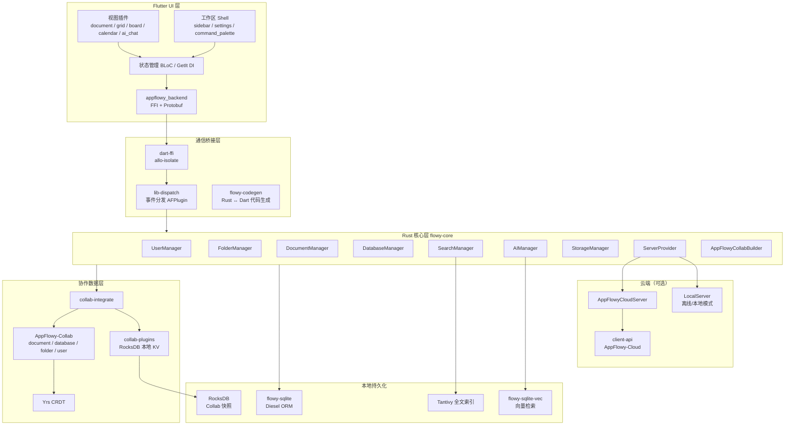
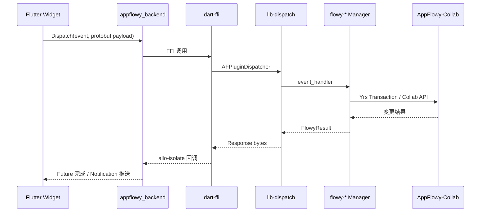
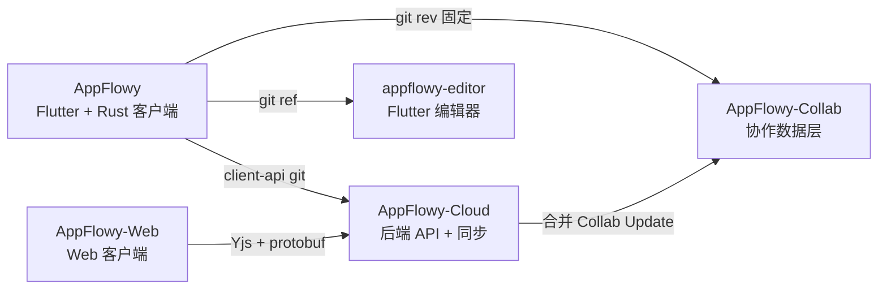
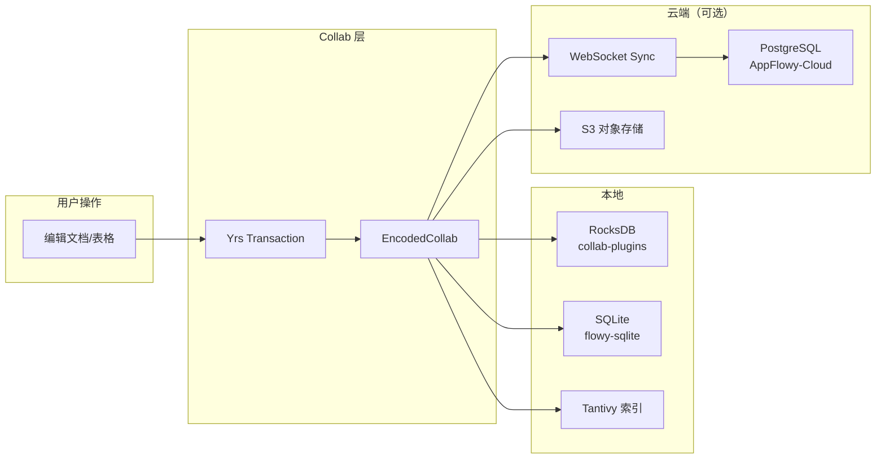

# AppFlowy 技术架构分析

## 1. 项目定位与功能

AppFlowy 是一款 **AI 协作工作区**，定位为 Notion 的开源替代方案，强调：

- **数据隐私优先**：默认本地存储，支持自托管云端
- **跨平台原生体验**：单一代码库覆盖 Desktop（macOS / Windows / Linux）、Mobile（iOS / Android）
- **社区驱动可扩展**：插件化视图、开源编辑器与协作层

### 1.1 核心产品功能

| 功能域 | 说明 |
|--------|------|
| **文档（Document）** | 块编辑器、Slash 命令、富文本、表格、公式、嵌入等 |
| **数据库（Database）** | 多维表格：Grid / Board（看板）/ Calendar（日历）三种视图 |
| **工作区与文件夹** | Workspace、Space、页面树、收藏、回收站 |
| **用户与认证** | 本地模式、AppFlowy Cloud 账号、OAuth、工作区成员 |
| **搜索** | 全文检索（Tantivy）、命令面板 |
| **AI** | AI 写作、AI Chat、本地 AI（Ollama）、云端 AI |
| **文件存储** | 图片/附件上传、本地缓存、云端对象存储 |
| **同步** | 本地模式 / AppFlowy Cloud 实时协作同步 |
| **发布与分享** | 页面发布（Sites）、访客协作（依赖 Cloud） |
| **导入导出** | Notion / Markdown 等（collab-importer） |
| **设置与国际化** | 主题、语言（inlang）、快捷键、更新检查 |

---

## 2. 仓库顶层结构

```
AppFlowy/
├── frontend/
│   ├── appflowy_flutter/     # Flutter 应用（UI、BLoC、插件）
│   │   ├── lib/              # 业务 UI 代码
│   │   └── packages/         # 内部 Flutter 包
│   ├── rust-lib/             # Rust Workspace（核心业务逻辑）
│   ├── resources/            # 翻译、静态资源
│   ├── scripts/              # 构建脚本、Makefile 扩展
│   └── Makefile.toml         # cargo-make 构建编排
├── doc/                      # 文档（含本分析）
├── install.sh                # 环境安装脚本
└── codemagic.yaml            # CI/CD（移动端）
```

**构建链路**：`cargo-make` → 编译 `dart-ffi` 静态库 → Flutter `appflowy_backend` 插件加载 → `flowy-codegen` 生成 Dart Protobuf 绑定。

---

## 3. 整体技术架构

### 3.1 分层架构图



### 3.2 请求处理时序



### 3.3 双模式运行（本地 vs 云端）

`ServerProvider`（`flowy-core/src/server_layer.rs`）根据环境变量 `AUTHENTICATOR_TYPE` 选择：

| 模式 | AuthType | 实现 | 说明 |
|------|----------|------|------|
| 本地 | `Local` | `flowy-server::local_server` | 数据仅存本机，无需登录 |
| 云端 | `AppFlowyCloud` | `flowy-server::af_cloud` | 通过 `client-api` 连接 AppFlowy-Cloud |

云端模式下，`collab-plugins` 的 `SyncPlugin` 负责 WebSocket 实时同步；本地模式使用 RocksDB 插件持久化。

---

## 4. Rust Workspace 模块职责

`frontend/rust-lib/Cargo.toml` 定义了整个 Workspace。

### 4.1 核心与基础设施

| Crate | 路径 | 职责 |
|-------|------|------|
| **flowy-core** | `flowy-core/` | 应用入口，组装所有 Manager，生命周期管理 |
| **dart-ffi** | `dart-ffi/` | Flutter FFI 边界，`allo-isolate` 异步桥接 |
| **lib-dispatch** | `lib-dispatch/` | 插件式事件总线（类似 HTTP Router） |
| **lib-infra** | `lib-infra/` | 通用工具：加密、任务调度、异步 trait |
| **lib-log** | `lib-log/` | 日志与流式日志 |
| **flowy-error** | `flowy-error/` | 统一错误类型与跨层转换 |
| **flowy-notification** | `flowy-notification/` | Rust → Dart 推送通知 |
| **collab-integrate** | `collab-integrate/` | 构建 Collab 实例、索引数据写入 |
| **flowy-codegen** | `build-tool/flowy-codegen/` | 从 Rust 生成 Dart Protobuf / FFI 绑定 |
| **flowy-derive** | `build-tool/flowy-derive/` | 过程宏（事件映射等） |

### 4.2 业务域 Crate（`*` = 含 `-pub` 公共接口 crate）

| Crate | 职责 |
|-------|------|
| **flowy-user** | 用户配置、认证、工作区、迁移 |
| **flowy-folder** | 文件夹/视图树、发布、分享 |
| **flowy-document** | 文档 CRUD、解析、提醒 |
| **flowy-database2** | 数据库/表格逻辑、字段类型、计算 |
| **flowy-date** | 日期提醒服务 |
| **flowy-search** | Tantivy 全文搜索 |
| **flowy-ai** | AI Chat、补全、本地 AI、Embedding |
| **flowy-storage** | 文件上传/缓存 |
| **flowy-server** | 云端/本地 Server 抽象与实现 |
| **flowy-sqlite** | SQLite 连接池与迁移（Diesel） |
| **flowy-sqlite-vec** | 向量存储（AI RAG） |

每个业务 crate 遵循统一模式：

```
event_map.rs   → 注册 AFPlugin 路由
event_handler.rs → 处理具体事件
manager.rs     → 业务状态机
entities/      → 领域实体
protobuf/      → 与 Dart 通信的消息定义
notification/  → 变更推送
```

---

## 5. Flutter 应用架构

### 5.1 目录结构

```
lib/
├── startup/           # 启动流程、插件注册、依赖注入
├── workspace/         # 主界面：侧边栏、标签页、设置
├── user/              # 登录、注册、用户资料
├── plugins/           # 各视图类型 UI 实现
│   ├── document/      # 文档编辑器
│   ├── database/      # Grid / Board / Calendar
│   ├── ai_chat/       # AI 对话
│   ├── trash/         # 回收站
│   └── ...
├── features/          # 横切功能：分享、权限、工作区管理
├── ai/                # AI UI 组件
├── mobile/            # 移动端适配
├── core/              # 配置、通知
└── shared/            # 通用 UI 组件
```

### 5.2 插件系统

`PluginType` 枚举（`startup/plugin/plugin.dart`）定义支持的视图类型：

| PluginType | 布局 | 注册位置 |
|------------|------|----------|
| `document` | Document | `plugins/document/` |
| `grid` | Grid | `plugins/database/grid/` |
| `board` | Board | `plugins/database/board/` |
| `calendar` | Calendar | `plugins/database/calendar/` |
| `databaseDocument` | 行内文档 | `plugins/database_document/` |
| `chat` | AI Chat | `plugins/ai_chat/` |
| `trash` | 回收站 | `plugins/trash/` |
| `blank` | 占位 | `plugins/blank/` |

启动时 `PluginLoadTask` 注册所有插件；侧边栏根据 `ViewLayoutPB` 选择对应 `PluginBuilder`。

### 5.3 内部 Flutter 包

| 包 | 路径 | 职责 |
|----|------|------|
| **appflowy_backend** | `packages/appflowy_backend/` | FFI 绑定、Protobuf、Rust 初始化 |
| **appflowy_ui** | `packages/appflowy_ui/` | 设计系统组件 |
| **flowy_infra** | `packages/flowy_infra/` | 基础设施（主题、尺寸等） |
| **flowy_infra_ui** | `packages/flowy_infra_ui/` | 跨平台 UI 工具 |
| **flowy_svg** | `packages/flowy_svg/` | SVG 图标 |
| **appflowy_popover** | `packages/appflowy_popover/` | 弹出层 |
| **appflowy_result** | `packages/appflowy_result/` | Result 类型 |

### 5.4 外部 Git 依赖（UI 关键）

| 包 | 仓库 | 用途 |
|----|------|------|
| **appflowy_editor** | AppFlowy-IO/appflowy-editor | 块编辑器核心 |
| **appflowy_board** | AppFlowy-IO/appflowy-board | 看板拖拽 UI |
| **appflowy_editor_plugins** | AppFlowy-IO/AppFlowy-plugins | 编辑器扩展插件 |

---

## 6. 生态仓库关系



| 仓库 | 许可证 | 与 AppFlowy 关系 |
|------|--------|------------------|
| AppFlowy | AGPL-3.0 | 本仓库 |
| AppFlowy-Collab | AGPL-3.0 | Rust 源码依赖（`[patch.crates-io]`） |
| AppFlowy-Cloud | AGPL-3.0（开源部分） | `client-api` git 依赖 |
| appflowy-editor | Apache-2.0 | Flutter git 依赖 |
| AppFlowy-Web | 开源 | 独立 Web 端，协议互通 |

---

## 7. 构建与部署

| 工具 | 文件 | 说明 |
|------|------|------|
| cargo-make | `frontend/Makefile.toml` | 统一构建入口 |
| protobuf | `scripts/makefile/protobuf.toml` | 生成跨语言绑定 |
| Flutter | `scripts/makefile/flutter.toml` | 打包各平台 |
| install.sh | 根目录 | 安装 Rust / Flutter / protoc |
| codemagic.yaml | 根目录 | iOS / Android CI |

典型开发命令（见官方文档）：

```bash
cd frontend
cargo make appflowy-dev    # Desktop 开发构建
cargo make appflowy-ios    # iOS
```

---

## 8. 数据流与存储



---

## 9. 开源 vs 闭源边界

| 类别 | 组件 | 说明 |
|------|------|------|
| **完全开源** | AppFlowy 客户端、AppFlowy-Collab、appflowy-editor、AppFlowy-Web | AGPL / Apache，可自由使用 |
| **开源核心 + 商业扩展** | AppFlowy-Cloud | 本仓库为开源核心；**托管云与商业自托管**为闭源 fork + 商业许可 |
| **可选 SaaS** | `appflowy.com` 托管实例 | 用户可选官方云服务，非代码依赖 |
| **本地 AI** | Ollama | 开源，用户自部署 |
| **云端 AI** | AppFlowy Cloud AI API | 依赖 Cloud 服务，自托管需配置 |

> AppFlowy-Cloud README 明确采用 **open-core** 模型：Flutter / Web 保持开源，商业自托管版本含专有代码（[SELF_HOST_LICENSE_AGREEMENT](https://github.com/AppFlowy-IO/AppFlowy-SelfHost-Commercial)）。

---

## 10. 版本与 Revision 锁定

客户端通过固定 git revision 锁定生态版本（`frontend/rust-lib/Cargo.toml`）：

| 依赖 | 仓库 | 当前 rev（示例） |
|------|------|------------------|
| collab-* | AppFlowy-Collab | `4dfccef` |
| client-api | AppFlowy-Cloud | `592f644` |
| langchain-rust | appflowy/langchain-rust | branch `af` |

更新脚本：`scripts/tool/update_collab_rev.sh`、`update_client_api_rev.sh`。
