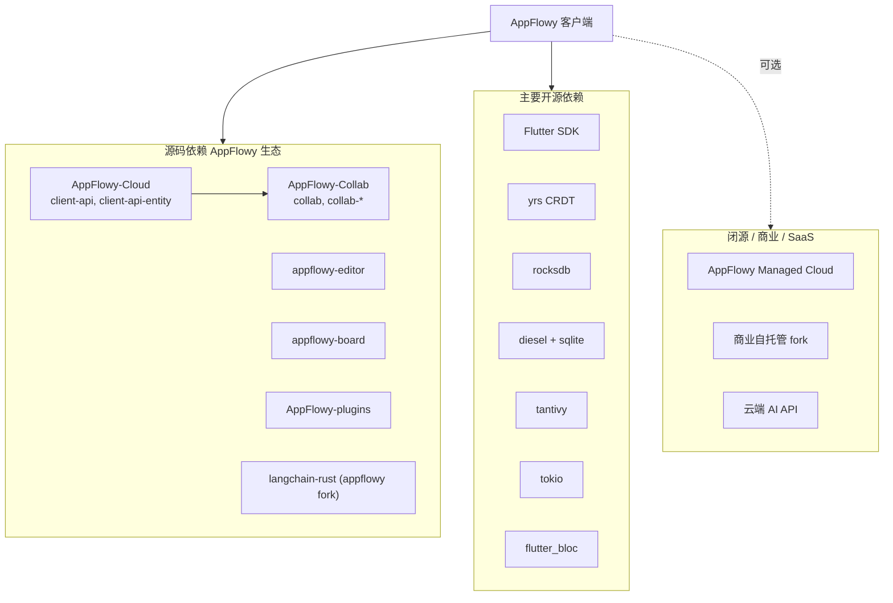

# AppFlowy 依赖分析

本文档将依赖分为三类：**源码依赖**（AppFlowy 生态 git/path）、**开源依赖**（crates.io / pub.dev / 第三方 git）、**闭源/商业依赖**（SaaS 或商业许可组件）。

---

## 1. 依赖关系总览



---

## 2. 源码依赖（AppFlowy 生态）

通过 **git revision 固定** 或 **path 本地引用**，与上游仓库强耦合。

### 2.1 Rust 源码依赖

定义于 `frontend/rust-lib/Cargo.toml`：

| Crate 名 | 来源仓库 | 引用方式 | 用途 |
|----------|----------|----------|------|
| `collab` | AppFlowy-Collab | `[patch.crates-io]` git rev `4dfccef` | CRDT 核心 |
| `collab-entity` | 同上 | 同上 | 协作对象类型 |
| `collab-document` | 同上 | 同上 | 文档模型 |
| `collab-database` | 同上 | 同上 | 数据库模型 |
| `collab-folder` | 同上 | 同上 | 文件夹模型 |
| `collab-user` | 同上 | 同上 | 用户/提醒 |
| `collab-plugins` | 同上 | 同上 | RocksDB 持久化插件 |
| `collab-importer` | 同上 | 同上 | 导入器 |
| `client-api` | AppFlowy-Cloud | git rev `592f644` | 云端 API 客户端 |
| `client-api-entity` | 同上 | 同上 | API 实体定义 |
| `workspace-template` | 同上 | 同上 | 工作区模板 |
| `langchain-rust` | appflowy/langchain-rust | branch `af` | AI 链式调用 |
| `rocksdb` | rust-rocksdb | git rev（内存对齐修复） | Collab 本地 KV |

**本地 path 依赖**（Workspace 内部，共 30+ crate）：

```
lib-dispatch, lib-log, lib-infra, flowy-core, dart-ffi,
flowy-user, flowy-folder, flowy-document, flowy-database2,
flowy-search, flowy-ai, flowy-storage, flowy-server, flowy-sqlite,
collab-integrate, flowy-codegen, flowy-derive, ...
```

### 2.2 Flutter 源码依赖

定义于 `frontend/appflowy_flutter/pubspec.yaml`：

| 包名 | 来源 | 引用方式 |
|------|------|----------|
| `appflowy_backend` | 本地 | `path: packages/appflowy_backend` |
| `appflowy_ui` | 本地 | path |
| `flowy_infra` / `flowy_infra_ui` / `flowy_svg` | 本地 | path |
| `appflowy_editor` | AppFlowy-IO/appflowy-editor | git ref `470c4e7` |
| `appflowy_board` | AppFlowy-IO/appflowy-board | git ref `e8317c0` |
| `appflowy_editor_plugins` | AppFlowy-IO/AppFlowy-plugins | git path |
| `calendar_view` | Xazin/flutter_calendar_view | git |
| `window_manager` | leanflutter/window_manager | git fork |
| `auto_updater` | LucasXu0/auto_updater | git fork |
| `permission_handler` | LucasXu0/flutter-permission-handler | git fork |
| 等 | 多个维护者 fork | git（修复平台问题） |

---

## 3. 开源依赖

### 3.1 Rust 核心开源依赖（Workspace 级）

| 依赖 | 版本 | 用途 |
|------|------|------|
| **yrs** | 0.21.0 | Yjs Rust 实现，CRDT 引擎 |
| **tokio** | 1.38 | 异步运行时 |
| **diesel** | 2.1 | SQLite ORM |
| **tantivy** | 0.24.1 | 全文搜索引擎 |
| **serde / serde_json** | 1.x | 序列化 |
| **protobuf** | 2.28 | 跨语言消息 |
| **tracing** | 0.1 | 日志 |
| **reqwest** | 0.11 | HTTP 客户端 |
| **ollama-rs** | 0.3 | 本地 Ollama AI |
| **uuid / chrono / anyhow / futures** | — | 通用工具 |
| **allo-isolate** | 0.1 | Dart FFI 隔离端口 |
| **zip / csv / validator / dashmap** | — | 各业务模块 |

完整列表见 `frontend/rust-lib/Cargo.lock`。

### 3.2 Flutter 主要开源依赖

| 依赖 | 用途 |
|------|------|
| **flutter_bloc / bloc** | 状态管理 |
| **get_it** | 依赖注入 |
| **go_router** | 路由 |
| **easy_localization** | i18n |
| **freezed / json_serializable** | 代码生成 |
| **protobuf** | 与 Rust 通信 |
| **cached_network_image** | 网络图片 |
| **hive_flutter** | 轻量 KV |
| **connectivity_plus** | 网络状态 |
| **window_manager / bitsdojo_window** | 桌面窗口 |
| **super_clipboard / desktop_drop** | 剪贴板与拖放 |
| **flutter_chat_ui** | AI Chat UI |
| **google_fonts** | 字体 |
| **unsplash_client** | 封面图 API |

完整列表见 `pubspec.yaml` 与 `pubspec.lock`。

### 3.3 AppFlowy-Cloud 主要开源依赖（关联参考）

| 依赖 | 用途 |
|------|------|
| **actix-web** | HTTP 服务 |
| **redis** | 会话/缓存 |
| **aws-sdk-s3** | 对象存储 |
| **sqlx / diesel** | PostgreSQL |
| **gotrue** | 认证（自研 crate） |

---

## 4. 闭源 / 商业 / SaaS 依赖

| 组件 | 类型 | 说明 |
|------|------|------|
| **AppFlowy Managed Cloud** | SaaS | 官方 AWS 托管，闭源运维配置 |
| **AppFlowy 商业自托管** | 商业许可 | 开源 Cloud 的闭源 fork + [SELF_HOST_LICENSE](https://github.com/AppFlowy-IO/AppFlowy-SelfHost-Commercial) |
| **云端 AI 服务** | SaaS / 自托管 | `ChatCloudService`、`DatabaseAIService` 等 trait 的实现依赖 Cloud 部署 |
| **Unsplash API** | 第三方 SaaS | 封面图（可用 git fork 客户端） |
| **Apple App Store / Google Play** | 分发渠道 | 非代码依赖 |

> **重要**：AppFlowy **客户端本身**（本仓库）为 **AGPL-3.0** 完全开源；闭源边界在 **云端托管服务** 与 **商业自托管版本**，而非客户端核心代码。

---

## 5. 按功能域汇总依赖

| 功能 | 源码依赖 | 开源依赖 | 闭源/SaaS |
|------|----------|----------|-----------|
| 文档编辑 | collab-document, appflowy_editor | yrs, indexmap | — |
| 数据库 | collab-database, appflowy_board | rust_decimal, csv, moka | — |
| 文件夹/工作区 | collab-folder, client-api | regex | Cloud 发布/分享 API |
| 用户认证 | client-api, collab-user | diesel, openssl | GoTrue（Cloud 开源） |
| 搜索 | collab-folder | **tantivy** | — |
| AI | langchain-rust, flowy-ai-pub | ollama-rs, text-splitter | 云端 AI API |
| 存储 | flowy-storage-pub | reqwest, mime_guess | S3（Cloud 侧） |
| 同步 | client-api, collab-plugins | rocksdb, tokio | 托管云可选 |
| 本地持久化 | collab-plugins | rocksdb, diesel, libsqlite3-sys | — |
| 向量检索 | flowy-sqlite-vec | sqlite vec 扩展 | — |

---

## 6. 构建工具链依赖

| 工具 | 类型 | 说明 |
|------|------|------|
| Rust toolchain | 开源 | `frontend/rust-toolchain.toml` 锁定版本 |
| Flutter SDK | 开源 | `>=3.27.4` |
| cargo-make | 开源 | `Makefile.toml` 构建编排 |
| protoc | 开源 | Protobuf 编译 |
| inlang | 开源 | 翻译管理 |
| Codemagic | SaaS | 移动端 CI（`codemagic.yaml`） |

---

## 7. 依赖更新机制

| 脚本 | 路径 | 作用 |
|------|------|------|
| `update_collab_rev.sh` | `frontend/scripts/tool/` | 更新 AppFlowy-Collab git rev |
| `update_collab_source.sh` | 同上 | 切换为本地 path 依赖 |
| `update_client_api_rev.sh` | 同上 | 更新 AppFlowy-Cloud client-api rev |

本地联调 AppFlowy-Collab 时：

```bash
cd frontend
./scripts/tool/update_collab_source.sh   # 使用本地 ../AppFlowy-Collab
```

---

## 8. 许可证一览

| 组件 | 许可证 |
|------|--------|
| AppFlowy 客户端 | AGPL-3.0 |
| AppFlowy-Collab | AGPL-3.0 |
| AppFlowy-Cloud（开源仓库） | AGPL-3.0 |
| appflowy-editor | Apache-2.0 |
| 多数 crates.io 依赖 | MIT / Apache-2.0 |

使用 AGPL 代码部署网络服务时需注意 AGPL 传染性条款；商业自托管需单独购买许可。
