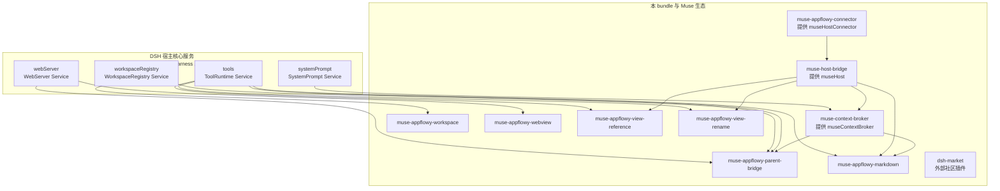

# muse-dsh-appflowy — cordis.patch.yml 插件依赖拓扑与职责详解

> 本文档逐一解读 `packages/plugins/dsh-appflowy/cordis.patch.yml` 的 10 个装配条目：
> 每个插件/服务的依赖声明（`inject`）、提供的服务（`provide`/`super(ctx, name)`）、
> 运行原理、功能与职责。所有结论均来自对应源码，最后更新 2026-08-27。

## 1. 装配清单原文

```yaml
- insert:
    - id: muse-appflowy-connector
      name: '@muse/dsh-appflowy/connector'

    - id: muse-appflowy-workspace
      name: '@muse/plugin-appflowy-workspace'
      inject: [workspaceRegistry]

    - id: muse-appflowy-webview
      name: '@muse/dsh-appflowy/webview'
      inject: [webServer]

    - id: muse-host-bridge
      name: '@muse/host-bridge/dsh'
      inject: [museHostConnector]
      config:
        autoStart: true

    - id: muse-context-broker
      name: '@muse/context-broker/dsh'
      inject: [museHost, systemPrompt]

    - id: muse-appflowy-parent-bridge
      name: '@muse/dsh-appflowy/parent-bridge'
      inject: [webServer, workspaceRegistry, museContextBroker, tools]

    - id: muse-appflowy-workspace-tools
      name: '@muse/plugin-appflowy-workspace/dsh'
      inject: [museHost, tools, systemPrompt]

    - id: muse-appflowy-view-reference
      name: '@muse/plugin-appflowy-view-reference/dsh'
      inject: [museHost, tools]

    - id: muse-appflowy-markdown
      name: '@muse/plugin-appflowy-markdown/dsh'
      inject: [museHost, tools, museContextBroker]

    - id: muse-appflowy-view-rename
      name: '@muse/plugin-appflowy-view-rename/dsh'

    # Community plugin market (https://github.com/dsh-market/dsh-market).
    - id: dsh-market
      name: dshmarket
      config:
        allowRestart: false
```

## 2. 依赖拓扑总览



依赖方向：箭头从**提供者 → 消费者（inject 方）**。全部依赖就绪后消费者插件才 `apply`。

### 关键拓扑事实

- **两条注入链**：
  - 宿主链：`webServer` / `workspaceRegistry` / `tools` / `systemPrompt` 由 DSH 宿主在容器启动时注册（不在 patch 内）。
  - Muse 链：`museHostConnector`(connector) → `museHost`(host-bridge) → `museContextBroker`(context-broker)。
- **`museHost` 是枢轴**：3 个能力插件（view-reference / markdown / view-rename）全部经由它读写 Muse Host；context-broker 与 markdown 又额外消费 `museContextBroker`。
- **`muse-appflowy-view-rename` 未在 patch 中写 `inject`**：其依赖由源码导出（`export const inject = loaderPlugin.inject`，即 `["museHost", "tools"]`，来自 `createMusePlugin`）。patch 中不写 = 以源码声明为准。
- **`dsh-market` 无依赖声明**：独立的外部插件，装配只为安装它（并禁止重启，见 §12.5）。

## 3. 服务提供者汇总表

| 服务名 | 提供类 | 定义文件 | patch 内提供者 |
|---|---|---|---|
| `museHostConnector` | `MuseHostConnectorService`（抽象）/ `AppFlowyConnector`（实现） | `muse-host-bridge/src/dsh/connector.ts` / `muse-dsh-appflowy/src/connector.ts` | muse-appflowy-connector |
| `museHost` | `MuseHostService`（`static inject = ["museHostConnector"]`） | `muse-host-bridge/src/dsh/service.ts:153` | muse-host-bridge |
| `museContextBroker` | `MuseContextBrokerService`（`static inject = ["museHost","systemPrompt"]`） | `muse-context-broker/src/dsh.ts:16` | muse-context-broker |
| `webServer` | `WebServer` | `agent/deepseek-harness/packages/host/webserver/src/index.ts`（DSH 宿主） | — |
| `workspaceRegistry` | `WorkspaceRegistry` | `agent/deepseek-harness/packages/workspace/workspace/src/index.ts`（DSH 宿主） | — |
| `tools` | `ToolRuntime` | `agent/deepseek-harness/packages/core/tools/src/index.ts`（DSH 宿主） | — |
| `systemPrompt` | `SystemPrompt` | `@deepseek-ai/dsh-system-prompt`（DSH 宿主） | — |
| `dshmarket` | 外部插件 | dsh-market 仓库（社区） | dsh-market |

Cordis 服务注册机制（见 docs/README.md §依赖机制）：服务 = `Service` 子类实例，`super(ctx, name)` 完成注册；消费者通过 `inject` 声明依赖，Cordis 的 epoch 调度保证**依赖全部就绪才 apply、依赖消失则卸载**。

## 4. muse-appflowy-connector — 连接器（宿主装载点）

- **patch 条目**：`name: '@muse/dsh-appflowy/connector'`（无 inject、无 config）
- **实现**：`muse-dsh-appflowy/src/connector.ts` 默认导出 `AppFlowyConnector extends MuseHostConnectorService`；抽象基类在 `muse-host-bridge/src/dsh/connector.ts`（`super(ctx, "museHostConnector")`）。
- **提供**：`museHostConnector` —— 平台启动器抽象，"native host owns endpoint/nonce acquisition"。
- **原理**：`MuseHostConnectorService` 是 `Service` 子类，patch 加载即注册服务实现，无别的依赖；真正的连接逻辑在 `AppFlowyConnector.open()`：
  - `MUSE_DOCUMENT_CLOUD_URL` 已设置 → 返回 `InProcessMuseHostTransport` + Cloud 组合 handler；
  - 否则读取 AppFlowy Core 私有 launch descriptor（`$TMPDIR/appflowy-muse-host-<uid>.json`，0600/属主强校验）→ 返回 `DesktopMuseHostTransport`（UDS）；
  - 构造时调用 `setMuseApprovalProofRequester(ctx, createHostHmacApprovalRequester())` 注册审批证明器。
- **功能**：决定 DSH 以何身份、连接哪一种 Muse Host，并向 host-bridge 提供开箱即用的连接器实例。
- **职责**：平台适配边界——所有"Host 在哪、凭据在哪、审批证明怎么出"的部署知识集中于此；能力插件不感知。

## 5. muse-host-bridge — Muse Host 客户端会话（枢轴服务）

- **patch 条目**：`name: '@muse/host-bridge/dsh'`，`inject: [museHostConnector]`，`config: { autoStart: true }`
- **实现**：`muse-host-bridge/src/dsh/service.ts:153`，`MuseHostService extends Service`，`static inject = ["museHostConnector"]`，`super(ctx, "museHost")`。
- **提供**：`museHost`（DSH 侧唯一的 Muse Host 客户端 API）；同时发布事件 `museHost/state`、`museHost/event`、`museHost/binding-invalidated`、`museHost/command-status`、`museHost/approval-resolved`（`declare module` 扩展现声明的 Events）。
- **原理**：`Service.init` 中若 `autoStart` 为 true 立即启动 `runEventPump()`（事件泵）；
  - `connect()` → 通过注入的 `museHostConnector.open()` 拿到 transport + proof → 握手（hello）获得 `NegotiatedProtocol` 与会话；
  - `request(kind, payload, options)`：8 种请求类型（discover/bind/invoke/subscribe/policy.evaluate/policy.finalize/cancel/status），带 deadline、请求 ID、响应校验（`assertResponseMatches` + 解码）；
  - `invoke(payload, source)`：包装 `invoke.request`，附加 `clientCorrelationFromDsh(source)` 客户端关联；
  - 状态机 `disconnected → connecting → ready`，绑定失效（`UNAUTHENTICATED`/`HOST_GENERATION_STALE`/`UNAVAILABLE`/协议违例）自动重连（默认 1s），订阅泵常驻。
- **功能**：对上层插件提供统一、免鉴权的宿主调用面：连接生命周期、超时/重试/重连、消息编解码与协议校验、事件分发。
- **职责**：把"一条加密/鉴权的本地信道"收敛成一个可注入的服务——它是所有能力插件读写 AppFlowy 文档/视图的枢纽。

## 6. muse-context-broker — 上下文代理

- **patch 条目**：`name: '@muse/context-broker/dsh'`，`inject: [museHost, systemPrompt]`
- **实现**：`muse-context-broker/src/dsh.ts:16`，`MuseContextBrokerService extends Service`，`static inject = ["museHost", "systemPrompt"]`，`super(ctx, "museContextBroker")`；默认导出。
- **提供**：`museContextBroker`（`ingestContribution` / `ingest` / `registerProjection` / `pinSurface` / `removeSurface` / `inventory`）。
- **原理**（构造与激活）：
  - `Service.init` 里挂两个订阅：`ctx.on("museHost/event")` → 宿主事件直接 `ingest` 进 broker；`ctx.systemPrompt.context({ name: "muse:surface-context", order: 80, text: () => broker.render() })` → 把 broker 渲染的上下文合入 DSH 系统提示词。
  - 各插件调 `registerProjection` 注册"投影"（contextType + schemaDigest + priority + maxTokens + render），broker 在收到对应 envelope 时由匹配投影渲染成文本片段。
- **功能**：统一的**上下文汇聚点**——AppFlowy-Web 上行的工作区/文档/选区信息、Host 事件，都被收纳并按投影渲染进 system prompt，供 agent 感知 UI 状态。
- **职责**：上下文不与具体插件耦合：谁注册投影谁渲染；用 priority 排序、maxTokens 限长，避免上下文爆炸。

## 7. muse-appflowy-workspace — 工作区绑定

- **patch 条目**：`name: '@muse/plugin-appflowy-workspace'`，`inject: [workspaceRegistry]`
- **实现**：`packages/plugins/appflowy-workspace/src/identity.ts`（`export const name/inject/apply`）。
- **原理**：apply 时：
  1. `applyHintFile()`：读取 `$DSH_HOME/bindings/current-appflowy-workspace.json`（Flutter 壳写入），`applyWorkspaceHint` 在 `workspaceDirForId()` 建 DSH workspace；
  2. `watchAppFlowyWorkspaceHint()`：监听 hint 目录（50ms debounce），文件名命中即重新绑定；
  3. 每个绑定目录 `pinPath()`：monkey-patch `registry.delete`，删除被 pin 的 workspace 抛 `AppFlowyWorkspacePinnedError`。
- **功能**：把 AppFlowy 当前工作区映射为 DSH workspace（创建/置顶/改名对齐/防删除），并暴露 `getLastWorkspaceHint()` 供 connector / parent-bridge 读取当前绑定。
- **职责**：维持"AppFlowy 工作区 ↔ DSH cwd"的单一事实来源。列页面 Tool 在同包 `./dsh`（`muse-appflowy-workspace-tools`）。

## 8. muse-appflowy-webview — WKWebView 兼容补丁

- **patch 条目**：`name: '@muse/dsh-appflowy/webview'`，`inject: [webServer]`
- **实现**：`muse-dsh-appflowy/src/webview.ts`。
- **原理**：apply 时对 `webServer.tapIndex` 注册 `encodeScopedPluginUrls`（HTML 变换：`/plugins/@` → `/plugins/%40` + 注入内联脚本拦截 `HTMLScriptElement.src` / `setAttribute("src")` / 重写 `__DSH_BOOT__.entries`）。WKWebView 把 `@` 当 userinfo 分隔符导致 `/plugins/@scope` 解析失败，编码后兼容。
- **功能**：确保 WebView 形态下 scoped 插件脚本能正常加载。
- **职责**：浏览器差异适配层——纯胶水，无业务状态。

## 9. muse-appflowy-parent-bridge — 父桥（iframe ⇄ DSH）

- **patch 条目**：`name: '@muse/dsh-appflowy/parent-bridge'`，`inject: [webServer, workspaceRegistry, museContextBroker, tools]`
- **实现**：`muse-dsh-appflowy/src/parent-bridge.ts`（`export const name/inject/apply`）。
- **原理**（apply 注册 5 类 effect）：
  1. `tapIndex(injectParentBridgeScript)`：把桥接脚本注入 `<head>`；
  2. `register({ path: "/muse/v1/parent-bridge" })`：POST 入站（workspace.bind / context.contribute / surface.closed / intent.receipt，校验大小 ≤32KB、禁用凭据字段、source）；
  3. `register({ path: "/muse/v1/parent-bridge/events" })`：GET SSE 下行（intent.dispatch 推送）；
  4. `register({ path: "/muse/v1/parent-bridge/intents" })`：POST 意图直提；
  5. `museContextBroker.registerProjection`×2（workspace.focus priority 110 / workspace.tree.ui priority 40）+ `tools.register(muse_appflowy_present)`。
- **功能**：AppFlowy-Web（iframe）与 DSH 双向桥：上行收工作区/文档焦点/设备凭据，下行推呈现意图；把 Web 端 UI 状态渲染进 agent 上下文。
- **职责**：网页 iframe 运输（体积/来源校验、HTTP、SSE）。Desktop 已有 hint + UDS，`apply()` 无 `MUSE_DOCUMENT_CLOUD_URL` 时直接返回。bind / 列树实现在 workspace Plugin，device token 在 `session.ts`。

## 10. muse-appflowy-view-reference — 视图引用能力

- **patch 条目**：`name: '@muse/plugin-appflowy-view-reference/dsh'`，`inject: [museHost, tools]`
- **实现**：`muse-plugin-appflowy-view-reference/src/dsh.ts` → `createMusePlugin(appFlowyViewReferenceDefinition, { scopeHint: CURRENT_VIEW_SCOPE })`；definition 在 `index.ts`。
- **原理**：`createMusePlugin`（`muse-plugin-kit/src/dsh/runtime.ts`）统一 `inject: ["museHost", "tools"]`；scope hint 固定 `{ refs: { "appflowy.selection": "current" } }`（仅限当前视图）；插件 apply 时把定义里的工具注册到 `tools`，操作经 `museHost.invoke` 下发 Host。
- **工具**：`muse_appflowy_get_view_reference` —— 获取当前视图的引用（供 agent 在回答中点名具体文档/视图）。
- **职责**：只读的视图引用能力；无写操作。

## 11. muse-appflowy-markdown — 文档读写能力（核心插件）

- **patch 条目**：`name: '@muse/plugin-appflowy-markdown/dsh'`，`inject: [museHost, tools, museContextBroker]`
- **实现**：`muse-plugin-appflowy-markdown/src/dsh.ts`：`createAppFlowyMarkdownPlugin` + `loaderPlugin.apply(ctx)` 之后**额外注册 3 个投影**；`export const inject = [...loaderPlugin.inject, "museContextBroker"]`。
- **原理**：
  - 工具层：read/propose/apply（`muse_document_read_current` / `muse_document_propose_markdown_edit` / `muse_document_apply_approved_edit`），approval 由 connector 注册的 HMAC requester 出具证明（测试可替换）；
  - 操作层：`museHost.invoke` 把 `muse.document@2` 契约操作发给 Host（connector 在 Cloud 模式下转发到 `/api/muse/document/*`）；
  - 投影层：`markdown.surface`（priority 100 / 120 tokens，当前文档标题/模式）、`markdown.selection`（priority 90 / 540 tokens，选中文本）、`markdown.viewport`（priority 50 / 160 tokens，可见块与标题）——把编辑器状态送进上下文。
- **功能**：agent 读写 AppFlowy 当前文档的核心路径（快照 → 提案 → 审批 → 应用 → 回执），并感知编辑器的选区/视口。
- **职责**：文档域的全部能力与上下文呈现；依赖比 view-reference 多一层 `museContextBroker`（因为要上报选区）。

## 12. muse-appflowy-view-rename — 视图重命名能力

- **patch 条目**：`name: '@muse/plugin-appflowy-view-rename/dsh'`（patch 未写 inject；以源码 `export const inject = loaderPlugin.inject` 即 `["museHost", "tools"]` 为准）
- **实现**：`muse-plugin-appflowy-view-rename/src/dsh.ts` → `createMusePlugin(appFlowyViewRenameDefinition, { scopeHint: CURRENT_VIEW_SCOPE })`。
- **原理**：propose/apply 两段式（提案 + 应用），`MUSE_PLUGIN_DIAGNOSTICS=1` 时可输出诊断。
- **工具**：`muse_appflowy_propose_view_rename` / `muse_appflowy_apply_view_rename`。
- **职责**：视图重命名（写操作，经审批流程）；与 markdown 同一套 plugin-kit 机制，只是域不同。

## 13. dsh-market — 社区插件市场

- **patch 条目**：`name: dshmarket`，`config: { allowRestart: false }`
- **实现**：外部社区插件（https://github.com/dsh-market/dsh-market），本地无源码；通过名称从市场加载。
- **原理**（patch 注释原文要点）：
  - "Inserted here — not via dsh.profile.bundles — so the package's own bundle patch cannot double-insert id dsh-market"：本 bundle 选择在清单里直接插入，避免市场插件自带 bundle patch 造成的重复插入；
  - "Flutter owns the sidecar process, so restart must stay off"：`allowRestart: false` —— 插件重启会杀掉/重启 sidecar 进程，而进程所有权在 Flutter 壳，因此禁止。
- **功能**：向当前 DSH 安装/更新社区插件。
- **职责**：市场安装器；与 Muse 能力链无依赖关系，独立装配。

## 14. 启动时序（一次典型装配）

```
① DSH 宿主启动：注册 webServer / workspaceRegistry / tools / systemPrompt（不依赖 patch）
② patch 逐条插入：
   - muse-appflowy-connector   （无依赖）         → 注册 museHostConnector
   - muse-host-bridge          [museHostConnector] → 注册 museHost，autoStart 启动事件泵
   - muse-context-broker       [museHost, systemPrompt] → 注册 museContextBroker + 挂系统提示投影
   - muse-appflowy-workspace   [workspaceRegistry] → 绑定/监听 AppFlowy 工作区 hint
   - muse-appflowy-webview     [webServer]         → 注入 WKWebView 编码补丁
   - muse-appflowy-parent-bridge [webServer, workspaceRegistry, museContextBroker, tools]
                                                    → 挂 HTTP/SSE 路由、投影、present 工具
   - muse-appflowy-view-reference [museHost, tools] → 注册视图引用工具
   - muse-appflowy-markdown    [museHost, tools, museContextBroker] → 注册文档工具 + 3 投影
   - muse-appflowy-view-rename [museHost, tools]    → 注册重命名工具
   - dsh-market                                    → 安装市场
```

任一依赖缺失（例如宿主未提供 `tools`）时，对应插件静默不启动；配置/依赖错误会在启动日志中呈现为对应 fiber 的失败。

## 15. 关键设计点

1. **依赖即契约**：patch 的 `inject` 与源码 `export const inject` 共同构成装配契约；patch 优先显式声明，缺省以源码为准（view-rename 是典型例子）。
2. **宿主与生态分界清晰**：4 个核心服务（webServer/workspaceRegistry/tools/systemPrompt）由宿主提供，本 bundle 只携带 Muse 链（connector → host-bridge → context-broker）与 AppFlowy 能力插件。
3. **`autoStart: true` 只给 host-bridge**：事件泵要常驻才能把 Host 事件灌进 context-broker；其余插件按需 apply。
4. **权限与审批**：所有写操作（apply/rename）都走 policy.evaluate → approval → policy.finalize 证明链；connector 持有部署方 HMAC。
5. **禁止重启的市场插件**：DSH sidecar 进程归 Flutter 壳拥有，`allowRestart: false` 防插件重启导致 sidecar 被误杀。
6. **scope 收敛**：所有能力插件固定 `CURRENT_VIEW_SCOPE`（`refs: { "appflowy.selection": "current" }`），防止 agent 跨视图/跨工作区误操作。