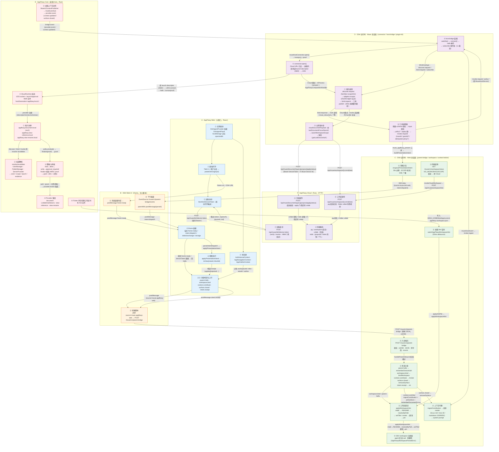

# @muse/dsh-appflowy 领域泳道图（AppFlowy-Web × Muse Plugins × AppFlowy Host）

> 全平台命名、两个 Host 的区分、数据权威与分端泳道：[`docs/platforms/DOMAIN_MAP.zh-CN.md`](../../../docs/platforms/DOMAIN_MAP.zh-CN.md)。  
> 下文是 **Web 入站包** 的细化泳道（6 条实现泳道），不是第二套领域划分。

> 自上而下的泳道图：6 条泳道（参与方），节点按时间阶段从上往下排，箭头标注接口交互。
> 起点：应用启动 —— A 泳道「AppFlowy-Web 应用启动」与 D/E 泳道「DSH sidecar 装配」并行发生。
> 关联文档：[web-workspace-ingress.md](./web-workspace-ingress.md)（Web 入站链路 §13–§16）、
> [cordis-patch-topology.md](./cordis-patch-topology.md)（插桩拓扑）。最后更新 2026-08-28。

## 1. 泳道图

## 2. 泳道说明

| 泳道 | 参与方 | 扮演角色 |
|---|---|---|
| A | AppFlowy-Web 父窗口 | 状态源 + 消息构造 + 意图执行（**不直接触碰 Host**） |
| B | DSH Web UI iframe | 无业务逻辑的透明桥：postMessage ↔ HTTP、SSE ↔ postMessage |
| C | DSH 运行时·Web 会话面 | 入站校验 / 绑定落盘 / 上下文投影 / 意图入队 |
| D | DSH 运行时·Muse 会话面 | 契约发现与工具发布、Bridge 协议客户端、云转发补全 |
| E | AppFlowy Core（桌面 Host） | 权威、策略、provider 落库、UI 上下文发布 |
| F | AppFlowy-Cloud | 设备 token、文档/工作区 Cloud 操作、存储 |

## 3. 时间阶段

- **① 启动（并行）**：A 泳道 Web 应用挂载面板并换取设备身份（直接调 Cloud，绕过 DSH）；D/E 泳道 DSH sidecar 装配，host-bridge 握手，connector 决定 UDS/Cloud 双模式，plugin-kit 完成 discover→bind→工具发布。桌面侧 Core 同时建 UDS 服务并注册 3 个 provider。
- **② Web⇄DSH 握手与绑定**：`frame-ready` → `parent-hello`（带设备 token 与 workspace）→ 注入脚本转 HTTP → `rememberDeviceAuth` + `bindWorkspace` → workspace 注册表 pin 落盘。
- **③ 稳态上行与工具调用**：4 类上下文 envelope 周期性上行进 broker 投影；agent 工具经 plugin-kit → host-bridge →（桌面 UDS / 云 HTTP）→ Host；写操作夹带审批链（evaluate → HMAC proof → finalize → grant）。
- **④ 意图下行**：`muse_appflowy_present` → SSE → iframe → `postMessage` → `applyPresentationIntent` → `toView()` → receipt 回传。
- **⑤ 运行中切换**：Web 换工作区重发 `workspace.bind`（先 `surface.closed`）；桌面换工作区由 Flutter 壳写 hint 文件驱动重绑。

## 4. 交互要点

1. **设备 token 是 Web 直连 Cloud 获取**（`POST /api/muse/dsh/device-token`），不经 DSH；DSH 侧只在 `parent-hello` 的 `rememberDeviceAuth` 处记忆，供 Cloud 转发鉴权。
2. **Cloud 路径的审批链是过渡形态**：`AppFlowyCompositionHandler` 对 `policy.evaluate/finalize` 返回固定 e2e 响应（`policy.e2e`/`grant.e2e`，不做真实 proof 校验），真实审批语义只在桌面 Core Host；Cloud 写操作依赖两端门控（DSH `MUSE_DOCUMENT_CLOUD_APPLY_ENABLED` + Cloud `muse_document_cloud_apply_enabled`）兜底。
3. **同一份上下文 envelope 双路汇合**：Web 走 `ingestContribution`（伪造 `subscription.parent-bridge` 的 provider.event），桌面走真实 `provider.event`，在 broker 汇合后按同一套 digest/priority/TTL/去重规则渲染进 system prompt。