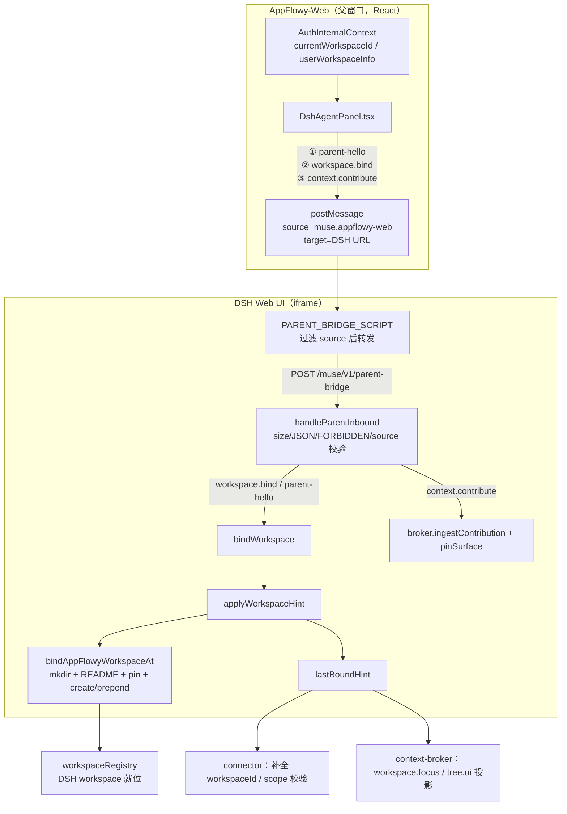

# Web 形态下 AppFlowy workspace 如何进入 DSH

> 完整链路梳理：AppFlowy-Web（React）→ postMessage → DSH 注入脚本 → parent-bridge HTTP →
> `applyWorkspaceHint` → DSH workspace 注册表。所有结论基于两端源码（AppFlowy-Web 与
> `packages/plugins/dsh-appflowy`）逐步验证。§13–§16 补充领域分析、领域模型、关键数据结构与接口。
> 最后更新 2026-08-28。

## 1. 一句话概括

Web 形态下，AppFlowy 当前工作区的 id/标题从 **React 状态**（`AuthInternalContext.currentWorkspaceId`）出发，
经 **iframe `postMessage` → DSH 侧注入脚本 → `POST /muse/v1/parent-bridge`** 进入 DSH，
由 **parent-bridge 的 `bindWorkspace()`** 调用 `applyWorkspaceHint()` 在 DSH workspace 注册表中
创建/对齐一个真实 workspace（cwd = `$DSH_HOME/appflowy-workspaces/<sanitized-id>`），
同时把绑定记入 `lastBoundHint` 并被 connector / scope / context-broker 三个面消费。

## 2. 整体链路图



## 3. 源头：AppFlowy-Web 的 React 状态

`src/components/dsh-agent/dsh-app-state.ts` —— workspace 数据的唯一来源：

```ts
export function useDshWorkspaceId(): string | undefined {
  return useContext(AuthInternalContext)?.currentWorkspaceId;   // 后端工作区 UUID
}

export function useDshWorkspaceTitle(): string | undefined {
  const auth = useContext(AuthInternalContext);
  const id = auth?.currentWorkspaceId;
  const info = auth?.userWorkspaceInfo;
  if (!id) return info?.selectedWorkspace?.name;
  return info?.workspaces.find((item) => item.id === id)?.name ?? info?.selectedWorkspace?.name;
}
```

要点：`workspaceId` 是 AppFlowy 后端（PostgreSQL）里的工作区 UUID，DSH 侧**不重新发明名字**，
只把它映射成本地目录名（`sanitizeWorkspaceId` 清洗后最多 128 字符）。

## 4. 发送：DshAgentPanel 的消息与触发时机

`src/components/dsh-agent/DshAgentPanel.tsx` 中三类上行 effect：

| 消息类型 | 触发时机 | 门控 |
|---|---|---|
| `parent-hello` | 收到 DSH 的 `frame-ready` 后，或 deviceToken 就绪后 | `MUSE_WEB_WORKSPACE_BIND`（携带 workspace 时）|
| `workspace.bind` | `workspaceId / workspaceTitle / url / iframeKey` 变化 | `MUSE_WEB_WORKSPACE_BIND` |
| `context.contribute`（×4 envelope） | 打开后 200ms 定时 + `selectionchange`（200ms debounce）+ 侧边栏展开变化 | `MUSE_WEB_CONTEXT_UPLINK` |

`context.contribute` 上行的 4 类 envelope（`dsh-hybrid.ts`）：

| contextType | schemaDigest 常量 | 内容 |
|---|---|---|
| `workspace.focus` | `WORKSPACE_FOCUS_DIGEST` | 工作区 id / 标题 / 当前视图 |
| `workspace.tree.ui` | `WORKSPACE_TREE_UI_DIGEST` | 侧边栏展开视图 id 列表（≤64） |
| `markdown.surface` | `MARKDOWN_SURFACE_DIGEST` | 当前文档标题 / 模式 / 只读态 |
| `markdown.selection` | `MARKDOWN_SELECTION_DIGEST` | 选中文本（≤2048）/ 是否折叠 |

另有表面切换消息 `surface.closed`（换工作区/文档时先关旧 surface）。

## 5. 消息协议（dsh-origin.ts 定义）

Web 侧定义的消息契约（DSH 端 parent-bridge 按同样结构解析）：

```ts
// 上行（Web → DSH）
parent-hello:    { source: "muse.appflowy-web", type: "parent-hello", deviceToken?, kid?,
                   expiresAt?, deviceId?, workspaceRef?, workspaceTitle? }
workspace.bind:  { source: "muse.appflowy-web", type: "workspace.bind", workspaceRef, workspaceTitle? }
context.contribute: { source, type: "context.contribute", envelope: Record<string, unknown> }
surface.closed:  { source, type: "surface.closed", surfaceInstanceRef }

// 下行（DSH → Web）
intent.dispatch: { source: "muse.dsh-web", type: "intent.dispatch", intent: MusePresentationIntent }
```

关键约束（两端对称实现）：
- `workspaceRef`：trim 后 1..128 字符，否则消息被弃（`parseWorkspaceBind` / `bindWorkspace` 双重校验）；
- 消息 ≤ 32KB（`MAX_DSH_POSTMESSAGE_BYTES`）；
- 禁止字段：`/access_token|refresh_token|api[_-]?key/i`（`FORBIDDEN_POSTMESSAGE` / `jsonLooksForbidden`）。

## 6. 桥接：DSH 侧注入脚本（PARENT_BRIDGE_SCRIPT）

`src/parent-bridge.ts` 的 `injectParentBridgeScript` 经 `webServer.tapIndex` 注入 `<head>`：

```js
window.addEventListener("message", function (ev) {
  var data = ev.data;
  if (!data || data.source !== "muse.appflowy-web") return;   // 只收父窗口
  parentOrigin = ev.origin; parentWin = ev.source;
  postHost("/muse/v1/parent-bridge", data);                    // 转 HTTP
});
// 下行：EventSource /muse/v1/parent-bridge/events → parentWin.postMessage
```

即：iframe 内的 DSH Web UI 不直接调用 Cordis 内部 API，**postMessage 原样转发到 HTTP 端点**，
再由 parent-bridge 校验与分发。

## 7. 入站处理（parent-bridge.ts handleParentInbound）

校验链：`byteLength ≤ 32KB` → JSON 可序列化 → `jsonLooksForbidden` → `asRecord` → `source === "muse.appflowy-web"` → type 分发：

| type | 处理 |
|---|---|
| `parent-hello` | `rememberDeviceAuth`（deviceToken 两段式 JWT 且非 sk- 前缀）+ `bindWorkspace`（若带 workspaceRef）|
| `workspace.bind` | `bindWorkspace` |
| `context.contribute` | `broker.ingestContribution(envelope)` + `rememberDocumentFocus` + `pinSurface`（workspace.focus 时）|
| `surface.closed` | `broker.removeSurface(ref)` |
| `intent.receipt` | 直接 ok（下行回执确认）|

`bindWorkspace()` 细节：

```ts
workspaceRef = rec.workspaceRef.trim()            // 1..128
title = rec.workspaceTitle ?? rec.title ?? APPFLOWY_WORKSPACE_TITLE
await applyWorkspaceHint(deps.registry, { appflowyWorkspaceId, title, updatedAt: Date.now() })
// surface 切换：换 workspace 时 removeSurface(旧 surface) + removeSurface(lastWorkspaceSurface)
// pin 新 surface：surface.appflowy.workspace.<workspaceRef>
```

门控：`MUSE_WEB_WORKSPACE_BIND`（默认开；`0/false/off` 关闭）。关闭时 `workspace.bind` 静默 no-op。

## 8. 绑定落地（workspace.ts）

`applyWorkspaceHint → bindAppFlowyWorkspaceAt(registry, { directory, title, appflowyWorkspaceId })`：

```
① mkdir(directory, {recursive})，realpath 规范化
② 写 README.md（flag:"wx" 幂等）：说明"文档走 Muse 工具，不是目录文件"
③ pinPath：WeakMap 记录 canonical，monkey-patch registry.delete 抛 AppFlowyWorkspacePinnedError
④ resolveByPath：已存在 → setTitle 对齐标题 + insertBefore 置顶
                不存在 → registry.create + pin + insertBefore 置顶
⑤ lastBoundHint = hint（getLastWorkspaceHint() 立即可读）
```

目录：`$DSH_HOME/appflowy-workspaces/<sanitizeWorkspaceId(workspaceId)>`，可被 `MUSE_APPFLOWY_DSH_WORKSPACE_ROOT` 与 `MUSE_APPFLOWY_DSH_WORKSPACE` 覆盖。

## 9. workspace 进入 DSH 后的三个消费面

| 消费面 | 代码位置 | 作用 |
|---|---|---|
| DSH workspace 注册表 | `workspaceRegistry.create/setTitle/prepend` | agent 有真实会话 cwd；列表置顶、改名对齐、禁止删除 |
| `lastBoundHint`（getLastWorkspaceHint） | `connector.ts` / `scope.ts` / `parent-bridge.ts` | ① invoke 时 `cloudDocumentPayload` 为缺失的 `workspaceId` 补默认值；② `assertWorkspaceScope` 校验请求工作区 == 绑定工作区（防跨工作区）；③ `buildPresentationIntent` 用其作默认 `workspaceId`、`presentTool` 的 SCOPE_MISMATCH 判定 |
| `museContextBroker` 投影 | `parent-bridge.ts` 注册 2 个投影 | `workspace.focus`（priority 110）与 `workspace.tree.ui`（priority 40）渲染进 system prompt，agent 感知 UI 状态 |

## 10. 与桌面端（Flutter）路径对比

| 维度 | Web | Desktop |
|---|---|---|
| 写入方式 | React → postMessage → parent-bridge HTTP（**实时消息**） | Flutter 壳写 hint 文件（**磁盘快照**） |
| 入口 | `handleParentInbound` → `bindWorkspace` | `watchAppFlowyWorkspaceHint`（目录监听，50ms debounce）→ `applyHintFile` |
| 文件 | 不经 hint 文件，`lastBoundHint` 内存同步更新 | `$DSH_HOME/bindings/current-appflowy-workspace.json` |
| 汇聚点 | `applyWorkspaceHint` | `applyWorkspaceHint`（同左）|
| 语义 | 绑定即实时，与 Web 端 React 状态一致 | 绑定随文件变化，可被外部写入驱动重绑 |

两条路径最终都收敛到 `bindAppFlowyWorkspaceAt()`，绑定语义完全一致。

## 11. 门控与安全设计

1. **三个功能门控**（Web 端 `webHybridFlagOn` 与 DSH 端 `envFlagEnabled` 同名判断，需两端一致）：
   - `MUSE_WEB_WORKSPACE_BIND`：工作区绑定
   - `MUSE_WEB_CONTEXT_UPLINK`：上下文上行
   - `MUSE_WEB_INTENT_DOWNLINK`：意图下行
2. **双向长度/敏感字段校验**：`workspaceRef` 1..128；消息 ≤32KB；`access_token` 类字段在上行方向一律拒绝——即使 iframe 被注入恶意脚本也无法外泄凭据（token 经独立通道 `parent-hello.deviceToken` 走设备 token，非明文 API key）。
3. **surface 生命周期**：换工作区/文档先 `surface.closed` 关旧、再 pin 新，broker 里不会堆积陈旧 surface。
4. **防误删**：绑定后的 DSH workspace 被 pin，agent/用户无法从 DSH 侧删除 AppFlowy 工作区目录。

## 12. 关键代码索引

| 环节 | 文件 |
|---|---|
| workspace 状态源头 | `AppFlowy-Web/src/components/dsh-agent/dsh-app-state.ts` |
| 面板/收发主逻辑 | `AppFlowy-Web/src/components/dsh-agent/DshAgentPanel.tsx` |
| 消息构造/校验 | `AppFlowy-Web/src/components/dsh-agent/dsh-origin.ts` |
| envelope 构造 | `AppFlowy-Web/src/components/dsh-agent/dsh-hybrid.ts` |
| 注入脚本 + 入站 + 绑定 | `packages/plugins/dsh-appflowy/src/parent-bridge.ts` |
| hint 解析 + 目录 + pin | `packages/plugins/dsh-appflowy/src/workspace.ts` |
| 消费（补全/校验/意图）| `packages/plugins/dsh-appflowy/src/connector.ts`、`scope.ts`、`parent-bridge.ts` |

---

# 第二部分：领域分析、领域模型、数据结构与接口

> 本部分把 §1–§12 的链路梳理提升到领域层：先做领域分析（边界、统一语言、子域、规则、事件），
> 再给出领域模型（实体关系与生命周期），随后落到关键数据结构的逐字段定义，最后汇总全部接口契约。

## 13. 领域分析

### 13.1 领域边界（Bounded Context）

Web 形态下，工作区进入 DSH 的链路跨越 **5 个边界**，每个边界有明确的职责与对外接口：

| 边界 | 角色 | 域内职责 | 对外接口 |
|---|---|---|---|
| **AppFlowy-Web**（浏览器父窗口，React） | 工作区真实状态的持有者 | 从 `AuthInternalContext` 派生 `workspaceId/title`、当前视图、侧边栏展开态、选区；持有设备 token | `postMessage`（上行 4 类消息）、接收 `intent.dispatch` |
| **DSH Web UI**（iframe，deepseek-harness 前端） | 透明转发层 | 注入脚本仅做 `postMessage → HTTP` 转发与 `EventSource → postMessage` 推送，不含业务逻辑 | `postMessage`、`POST /muse/v1/parent-bridge`、SSE |
| **DSH Host**（sidecar，Cordis 容器） | 校验、分发与状态权威 | `handleParentInbound` 校验→`bindWorkspace`/`ingestContribution`；workspace 注册表；上下文投影；意图队列 | `parent-bridge.ts` 4 个 HTTP/SSE 端点、`workspaceRegistry`、`museContextBroker`、`tools` |
| **AppFlowy-Cloud**（collab 服务） | 文档与工作区数据的远端真源 | 签发设备 token；`/api/muse/document/*`、`/api/muse/workspace/*` Cloud 操作 | HTTP JSON（Bearer + `X-Muse-Device-Id`） |
| **AppFlowy Core**（桌面原生 Rust Host） | 原生文档读写（本 Web 链路不经过） | 经 launch descriptor 暴露 UDS 端点，接收 Muse Host 操作 | UDS（`DesktopMuseHostTransport`） |

### 13.2 统一语言（术语表）

| 术语 | 含义 | 出处 |
|---|---|---|
| `workspaceRef` / `workspaceId` | AppFlowy 后端工作区 UUID（Web 端 `currentWorkspaceId` 的同一值） | `dsh-app-state.ts` / `dsh-origin.ts` |
| `workspaceTitle` | 工作区显示名，DSH 侧仅用于 `setTitle` 对齐，不重新发明 | `dsh-app-state.ts` |
| 绑定（bind） | 把 AppFlowy 工作区"对齐"为 DSH workspace 的过程，收敛于 `applyWorkspaceHint` | `workspace.ts` |
| `lastBoundHint` | 最近一次成功绑定的工作区（内存态，Web 是实时同步） | `workspace.ts` |
| hint 文件 | 桌面形态的绑定事实来源 JSON（`current-appflowy-workspace.json`） | `workspace.ts` |
| `surfaceInstanceRef` | 表面实例引用：`surface.appflowy.workspace.<id>` / `surface.appflowy.doc.<viewId>` | `dsh-hybrid.ts` / `parent-bridge.ts` |
| `surfaceKind` | `appflowy.workspace` / `appflowy.markdown` | `dsh-hybrid.ts` |
| envelope | 上下文贡献载荷（`muse.context-contribution/v1`），含 contextType/schemaDigest/payload | `buildContextEnvelope` / facets |
| `contextType` | `workspace.focus`、`workspace.tree.ui`、`markdown.surface`、`markdown.selection` | `dsh-hybrid.ts` |
| 投影（projection） | broker 上按 contextType+schemaDigest 匹配、把 envelope 渲染成 prompt 文本的插件 | `parent-bridge.ts` |
| `intent.dispatch` | 下行呈现意图，`surface.open` / `surface.revealRange`，30s 过期 | `dsh-origin.ts` / `parent-bridge.ts` |
| `intent.receipt` | 上行回执，7 种状态枚举（applied/rejected/stale/…/timed-out） | `dsh-hybrid.ts` |
| `deviceToken`/`deviceId`/`kid` | 设备身份（两段式 JWT，非 sk- 前缀），`parent-hello` 携带 | `dsh-device-token.ts` / `parent-bridge.ts` |
| `lastDocumentFocus` / `lastDeviceAuth` | DSH 侧记忆：最近文档焦点 / 最近设备凭据 | `parent-bridge.ts` |
| `sanitizeWorkspaceId` | 工作区 UUID → 本地目录名（非 `[A-Za-z0-9._-]` → `_`，≤128） | `workspace.ts` |
| pin | 防删除标记：monkey-patch `registry.delete`，被 pin 目录删除抛 `AppFlowyWorkspacePinnedError` | `workspace.ts` |
| schemaDigest | 契约 schema 的 sha256，双端对账（envelope/意图/操作） | 各 `*_DIGEST` 常量 |
| 门控 | `MUSE_WEB_WORKSPACE_BIND` / `MUSE_WEB_CONTEXT_UPLINK` / `MUSE_WEB_INTENT_DOWNLINK`（Web 端 `webHybridFlagOn` 与 DSH 端 `envFlagEnabled` 同语义） | 两端同名判断 |

### 13.3 子域划分

| 子域 | 类型 | 关键对象 | 边界内逻辑 |
|---|---|---|---|
| 工作区绑定 | **核心域** | `Workspace`、`BoundWorkspace`、`DshWorkspace` | hint → mkdir/README → resolveByPath/ create → setTitle/置顶 → pin → `lastBoundHint` |
| 上下文上行 | 支撑域 | `Envelope`、`Surface`、`Projection` | 4 类 envelope → broker 收纳 → 按投影渲染进 system prompt |
| 意图下行 | 支撑域 | `PresentationIntent`、`PresentationIntentResult` | 工具/HTTP 入队 → SSE 广播 → iframe 执行 → 回执 |
| 文档读写 | 核心域（接入点） | `provider.appflowy-markdown`、Cloud 适配器 | markdown 4 operation → Host/Cloud（fail-closed） |
| 设备身份 | 支撑域 | `DeviceAuth` | Web 端签发/存 `localStorage`；DSH 端 `rememberDeviceAuth` 记忆 |

### 13.4 核心业务规则与不变量

1. **对称校验**：`workspaceRef` trim 后 1..128、消息 ≤32KB、禁字段正则
   `/access_token|refresh_token|api[_-]?key/i` —— Web 端 `parseWorkspaceBind` 与 DSH 端 `bindWorkspace`
   各校验一遍，两侧规则必须一致。
2. **绑定幂等且唯一**：`resolveByPath` 命中即 `setTitle` 对齐标题并 `insertBefore` 置顶；未命中才 `create`。
3. **绑定即不可删**：pin 后 `registry.delete` 抛 `AppFlowyWorkspacePinnedError`，agent/用户无法从 DSH 侧删除。
4. **作用域一致**：invoke（`assertWorkspaceScope`）、views 查询、呈现意图三方都要求请求的
   `workspaceId` 与绑定工作区一致（两边都存在时）；不一致 → `SCOPE_MISMATCH`。
5. **写回执 fail-closed**：`data.status === "applied"` 但 `MUSE_DOCUMENT_CLOUD_APPLY_ENABLED !== "1"`
   视为伪造回执 → `UNAVAILABLE`，绝不让 DSH 把未落库的写操作报告成功。
6. **surface 生命周期**：换工作区/文档先 `surface.closed` 关旧表面，再 pin 新表面，broker 不堆积陈旧 surface。
7. **凭据不落明文**：上行禁 access_token/api key 字段；下行 `<` 转义 `\u003c` 防注入。
8. **时效性**：呈现意图 `expiresAt = requestedAt + 30s`；context envelope 各自 TTL
   （focus/tree 120s、markdown.surface 90s、selection 30s）；bind 有效期 300s。

### 13.5 领域事件清单

| 事件 | 方向 | 载荷要点 | 触发时机 |
|---|---|---|---|
| `frame-ready` | DSH → Web | 仅 source+type | DSH 页面装载完成 |
| `parent-hello` | Web → DSH | theme/locale/deviceToken/kid/expiresAt/deviceId/workspaceRef/workspaceTitle | 收到 `frame-ready` 或 deviceToken 就绪 |
| `workspace.bind` | Web → DSH | workspaceRef + workspaceTitle? | workspaceId/title/url/iframeKey 任一变化 |
| `context.contribute` | Web → DSH | envelope（4 类 contextType） | 打开 200ms 定时 / selectionchange 200ms debounce / 展开态变更 |
| `surface.closed` | Web → DSH | surfaceInstanceRef | 换工作区或换文档前 |
| `intent.dispatch` | DSH → Web | intent（surface.open/revealRange） | `muse_appflowy_present` 或 `POST /intents` |
| `intent.receipt` | Web → DSH | result（7 状态枚举） | iframe 执行意图后回传 |
| hint 文件变化 | Flutter 壳 → DSH | `{appflowyWorkspaceId,title,updatedAt?}` | 桌面形态工作区切换（50ms debounce） |
| `museHost/state`、`museHost/binding-invalidated` 等 | Host → DSH 服务 | 连接状态/绑定失效 | host-bridge 事件泵 |

## 14. 领域模型

### 14.1 实体关系图

```mermaid
classDiagram
    class DshAgentPanel {
        +workspaceId: string
        +workspaceTitle: string
        +viewId: string
        +deviceToken: DshDeviceToken
        +postToFrame(data)
    }
    class Message {
        +source: "muse.appflowy-web" | "muse.dsh-web"
        +type: string
    }
    class ContextEnvelope {
        +protocol: "muse.context-contribution/v1"
        +contextType: string
        +schemaDigest: string
        +surfaceInstanceRef: string
        +scopeRef: string
        +lane: "control" | "state"
        +expiresAt: number
        +payload: object
    }
    class ParentBridge {
        +handleParentInbound(raw, deps)
        +bindWorkspace(rec, deps)
        +buildPresentationIntent(input)
        +enqueuePresentationIntent(envelope)
    }
    class ContextBroker {
        +ingestContribution(payload)
        +pinSurface(ref)
        +removeSurface(ref)
        +registerProjection(projection)
    }
    class Projection {
        +contextType: string
        +schemaDigest: string
        +priority: number
        +render(envelope): string
    }
    class SystemPrompt {
        +context(input): dispose
    }
    class BoundWorkspace {
        +appflowyWorkspaceId: string
        +title: string
        +updatedAt?: number
    }
    class DshWorkspace {
        +id: string
        +path: string
        +title: string
        +setTitle?(title)
    }
    class PresentationIntent {
        +protocol: "muse.presentation-intent/v1"
        +intentType: string
        +intentRef: string
        +requestedAt: number
        +expiresAt: number
        +payload: {viewId, workspaceId, blockId?}
    }
    class IntentResult {
        +protocol: "muse.presentation-intent-result/v1"
        +intentRef: string
        +status: applied|rejected|stale|not-found|not-supported|surface-closed|timed-out
        +reasonCode?: string
    }
    class Connector {
        +open(): transport + proof
        +invoke(request)
    }
    class DeviceAuth {
        +token: string
        +deviceId: string
    }
    class DocumentFocus {
        +workspaceId: string
        +viewId: string
    }
    DshAgentPanel --> Message : parent-hello / workspace.bind / surface.closed
    DshAgentPanel --> ContextEnvelope : build*Envelope → context.contribute
    Message --> ParentBridge : 注入脚本转 POST /muse/v1/parent-bridge
    ParentBridge --> ContextEnvelope : context.contribute 解析
    ContextEnvelope --> ContextBroker : ingestContribution
    ContextBroker --> Projection : 按 contextType+schemaDigest 匹配投影
    Projection ..> SystemPrompt : render() 输出文本片段
    ParentBridge --> BoundWorkspace : applyWorkspaceHint（写 lastBoundHint）
    BoundWorkspace --> DshWorkspace : bindAppFlowyWorkspaceAt（mkdir/README/setTitle/pin/置顶）
    ParentBridge --> PresentationIntent : buildPresentationIntent（30s 过期）
    PresentationIntent --> DshAgentPanel : intent.dispatch（SSE → postMessage）
    DshAgentPanel --> IntentResult : applyPresentationIntent → intent.receipt
    Connector --> BoundWorkspace : getLastWorkspaceHint() 补全/校验
    Connector --> DeviceAuth : getLastDeviceAuth() 鉴权
    Connector --> DocumentFocus : getLastDocumentFocus() 补 viewId
```

### 14.2 对象生命周期

| 对象 | 生命周期 |
|---|---|
| **绑定工作区** | `workspace.bind`/hint → `bindAppFlowyWorkspaceAt`（mkdir → README → resolveByPath：存在则 setTitle+置顶，否则 create+置顶）→ pin（不可删）→ `lastBoundHint` 更新。换绑时旧 surface 关闭，**DSH workspace 本身保留**（不删除） |
| **surface** | 打开时 pin → 换工作区/文档时先 `surface.closed` 再 pin 新 ref；`lastWorkspaceSurface` 追踪最近 workspace 表面 |
| **context envelope** | `capturedAt`/`expiresAt` 标注 → broker 按投影立即渲染 → TTL 过期（focus/tree 120s、surface 90s、selection 30s） |
| **呈现意图** | `requestedAt` → 30s 内有效；iframe 执行后回 `intent.receipt`（applied/rejected/not-supported/timed-out 等），`expiresAt` 已过直接 `timed-out:EXPIRED` |
| **hint** | Web 形态：内存态实时同步（不经文件）；桌面形态：文件写入/变化驱动重绑 |

### 14.3 模型 → 代码映射

| 领域对象 | 代码符号 | 文件 |
|---|---|---|
| 工作区实体 | `AuthInternalContext.currentWorkspaceId` / `userWorkspaceInfo` | `AppFlowy-Web/src/components/dsh-agent/dsh-app-state.ts` |
| 消息（上行/下行） | `MuseDsh*` 类型族 | `dsh-origin.ts` |
| 上下文贡献 | `buildContextEnvelope` + 4 个 `build*Envelope` | `dsh-hybrid.ts` |
| 表面引用 | `workspaceSurfaceRef` / `documentSurfaceRef` | `dsh-hybrid.ts`（DSH 侧 `parent-bridge.ts` 同步实现） |
| 父桥（入站/绑定/意图） | `ParentBridgeDeps` / `handleParentInbound` / `bindWorkspace` | `parent-bridge.ts` |
| 绑定/提示 | `AppFlowyWorkspaceHint` / `applyWorkspaceHint` / `bindAppFlowyWorkspaceAt` | `workspace.ts` |
| DSH workspace | `DshWorkspace` / `DshWorkspaceRegistry` | `workspace.ts` |
| 投影 | `WORKSPACE_FOCUS_DIGEST` / `WORKSPACE_TREE_UI_DIGEST` 两个 `registerProjection` | `parent-bridge.ts` |
| 意图对象 | `MusePresentationIntent` / `PresentationIntentEnvelopeV1` | `dsh-origin.ts` / `@muse/plugin-facets` |
| 设备身份 | `DshDeviceToken` / `fetchDshDeviceToken` / `rememberDeviceAuth` | `dsh-device-token.ts` / `parent-bridge.ts` |
| 作用域校验 | `assertWorkspaceScope` / `WorkspaceScopeResult` | `scope.ts` |

## 15. 关键数据结构

### 15.1 上行消息（Web → DSH，postMessage 载荷，dsh-origin.ts）

```ts
type MuseDshParentHello = {
  source: "muse.appflowy-web";
  type: "parent-hello";
  theme?: string; locale?: string;
  deviceToken?: string; deviceId?: string; kid?: string; expiresAt?: number;
  workspaceRef?: string; workspaceTitle?: string;
};

type MuseDshWorkspaceBind = {
  source: "muse.appflowy-web";
  type: "workspace.bind";
  workspaceRef: string;          // trim 后 1..128，非法整条弃用
  workspaceTitle?: string;       // ≤256
};

type MuseDshContextContribute = {
  source: "muse.appflowy-web";
  type: "context.contribute";
  envelope: Record<string, unknown>;   // 见 §15.2
};

type MuseDshSurfaceClosed = {
  source: "muse.appflowy-web";
  type: "surface.closed";
  surfaceInstanceRef: string;
};

type MuseDshIntentReceipt = {
  source: "muse.appflowy-web";
  type: "intent.receipt";
  result: MusePresentationIntentResult;   // 见 §15.3
};
```

约束：整条消息 ≤ `MAX_DSH_POSTMESSAGE_BYTES / MAX_PARENT_MESSAGE_BYTES = 32KB`；
`JSON` 中出现 `/access_token|refresh_token|api[_-]?key/i` 字段即以 `FORBIDDEN_FIELD` 拒绝。

### 15.2 context.contribute 的 envelope（muse.context-contribution/v1）

通用外壳（`buildContextEnvelope`，与 facets `ContextContributionEnvelopeV1` 一致）：

```ts
{
  protocol: "muse.context-contribution/v1",
  pluginId: string,               // muse.appflowy.workspace | muse.appflowy.markdown
  pluginVersion: string,
  facetInstanceRef: string,       // facet.<pluginId>
  surfaceInstanceRef: string,     // surface.appflowy.workspace.<id> | surface.appflowy.doc.<viewId>
  surfaceKind: string,            // appflowy.workspace | appflowy.markdown
  scopeRef: string,               // workspace.<workspaceId>
  contextType: string,
  contextSchemaDigest: string,    // 见 §15.6 常量表
  contextRevision: string,        // 数字自增序列化
  epochRef: string,               // epoch.<workspaceId> | epoch.<workspaceId>.<viewId>
  lane: "control" | "state",      // Web 上行的 4 类全为 control
  capturedAt: number,
  expiresAt: number,              // capturedAt + ttlMs
  payload: { ... }
}
```

4 类 payload（`buildWorkspaceFocusEnvelope` / `buildTreeUiEnvelope` / `buildMarkdownSurfaceEnvelope` / `buildMarkdownSelectionEnvelope`）：

| contextType | payload | 上限 | ttlMs |
|---|---|---|---|
| `workspace.focus` | `{ workspaceId, title?, viewId? }` | title ≤256（清洗 `<>\u0000-\u001f`） | 120_000 |
| `workspace.tree.ui` | `{ workspaceId, expandedViewIds }` | expandedViewIds 取前 ≤64 个，每个 1..128 | 120_000 |
| `markdown.surface` | `{ title, mode, readOnly }` | title 默认 `Untitled`，≤256 | 90_000 |
| `markdown.selection` | `{ selectedText, collapsed }` | selectedText ≤2048 | 30_000 |

### 15.3 下行消息（DSH → Web）

```ts
type MuseDshIntentDispatch = {
  source: "muse.dsh-web";
  type: "intent.dispatch";
  intent: {
    protocol: "muse.presentation-intent/v1";
    pluginId: string;              // muse.appflowy.workspace
    scopeRef: string;              // workspace.<workspaceId>（含未绑定时 "workspace.unbound"）
    intentType: "surface.open" | "surface.revealRange";
    intentSchemaDigest: string;    // SURFACE_OPEN_DIGEST | SURFACE_REVEAL_DIGEST
    intentRef: string;             // intent.<uuid>
    requestedAt: number;
    expiresAt: number;             // +30_000
    payload: { viewId: string; workspaceId: string; blockId?: string };
  };
};

type MusePresentationIntentResult = {
  protocol: "muse.presentation-intent-result/v1";
  intentRef: string;
  status: "applied" | "rejected" | "stale" | "not-found"
        | "not-supported" | "surface-closed" | "timed-out";
  completedAt: number;
  reasonCode?: string;             // EXPIRED / SCOPE_MISMATCH / VIEW_ID_REQUIRED /
                                   // NAVIGATION_UNAVAILABLE / NAVIGATION_FAILED / UNKNOWN_INTENT
  appliedSurfaceInstanceRef?: string;  // 成功时为 surface.appflowy.doc.<viewId>
};
```

`intent.dispatch` 经 SSE `data:` 帧下发，注入脚本 `EventSource` 收到后
`parentWin.postMessage(parsed, parentOrigin)`；`<` 一律转义 `\u003c`。

### 15.4 DSH 侧内存状态与入站结果

| 状态 | 类型 | 写入时机 | 消费方 |
|---|---|---|---|
| `lastBoundHint` | `AppFlowyWorkspaceHint` | `applyWorkspaceHint` 成功 | connector（补全/校验）、scope、parent-bridge（意图/views） |
| `lastDeviceAuth` | `{ token, deviceId }` | `parent-hello` 中 deviceToken 为两段式 JWT 且非 `sk-`/`..` | connector Cloud 鉴权（Cloud accessToken 优先） |
| `lastDocumentFocus` | `{ workspaceId, viewId }` | contextType ∈ {workspace.focus, markdown.surface, markdown.selection} 且两者齐备 | connector 补全文档 payload |
| `lastWorkspaceSurface` | `string` | `bindWorkspace` | 换绑时清理旧 surface |

```ts
type ParentInboundResult =
  | { ok: true; bound?: string }
  | { ok: false; error: "PAYLOAD_TOO_LARGE" | "FORBIDDEN_FIELD" | "INVALID_MESSAGE"
      | "INVALID_SOURCE" | "INVALID_FACET_CONTRACT" | "INVALID_JSON" | ... };
```

错误对应 HTTP：`PAYLOAD_TOO_LARGE → 413`，其余 → `400`。

### 15.5 hint 文件与 DSH workspace 注册表形状

```ts
// hint 文件（$DSH_HOME/bindings/current-appflowy-workspace.json，桌面形态）
{ "appflowyWorkspaceId": "...", "title": "...", "updatedAt": 1720000000000 }
// parseHint：id trim 后非空；title 空则 APPFLOWY_WORKSPACE_TITLE（"AppFlowy"）

interface DshWorkspace { id: string; path: string; title: string; setTitle?(title: string): Promise<void> }
interface DshWorkspaceRegistry {
  create(path: string, title?: string): Promise<DshWorkspace>;
  resolveByPath(path: string): Promise<DshWorkspace | undefined>;
  get(id: string): DshWorkspace | undefined;
  delete(id: string): Promise<boolean>;   // 被 pin 的 path 抛 AppFlowyWorkspacePinnedError
  list(): DshWorkspace[];
  insertBefore?(id: string, beforeId?: string): Promise<readonly string[]>;
}
```

目录规则：`$DSH_HOME/appflowy-workspaces/<sanitizeWorkspaceId(id)>`；
`sanitizeWorkspaceId`：非 `[A-Za-z0-9._-]` → `_`，去首尾 `_`，空 → `workspace`，总长 ≤128。
目录内唯一的 `README.md`（`flag:"wx"` 幂等）声明"文档走 Muse 工具，不是目录文件"。

### 15.6 schemaDigest 常量表

| 常量 | 值 | 用途 |
|---|---|---|
| `WORKSPACE_FOCUS_DIGEST` | `sha256:4c3a6bf1…66043b7` | `workspace.focus` envelope 对账（DSH/Web 双方硬编码一致） |
| `WORKSPACE_TREE_UI_DIGEST` | `sha256:c0381f40…524389edbda` | `workspace.tree.ui` envelope |
| `MARKDOWN_SURFACE_DIGEST` | `sha256:780a1eed…f458c7b92` | `markdown.surface` envelope |
| `MARKDOWN_SELECTION_DIGEST` | `sha256:39caf711…e7255946c0` | `markdown.selection` envelope |
| `SURFACE_OPEN_DIGEST` | `sha256:c6337b45…8c34905f0` | intent `surface.open` |
| `SURFACE_REVEAL_DIGEST` | `sha256:f50404c3…e85eabd8b` | intent `surface.revealRange` |

### 15.7 Cloud 工作区/文档操作的数据结构

工作区 tree（`workspace.tree.query`，`muse.workspace/tree/v1`）：

```ts
// 输入（可裁剪字段）：workspaceId(1..128) parentViewId(1..128) cursor(1..128)
//                     limit(1..64) depth(1..4)
// 输出：
{
  protocol: "muse.workspace/tree/v1",
  workspaceId: string, rootViewId: string, truncated: boolean, nextCursor?: string,
  items: Array<{   // ≤64 条
    viewId: string, parentViewId: string | null, title: string /* ≤256 */,
    layout: "document" | "grid" | "board" | "calendar" | "chat",
    isSpace: boolean, depth: 0..4
  }>
}
```

文档操作（markdown 4 个 operation，`muse.document` family）的 Cloud 请求/响应外壳：

```http
POST {baseUrl}/api/muse/document/{query|propose|apply|status}
Content-Type: application/json
Authorization: Bearer <accessToken>      # 可选
X-Muse-Device-Id: <deviceId>             # 可选
body: { "operation": <operationId>, ...payload }
# 响应：{ code?: number, message?: string, data?: any }
# code !== 0 → 失败（CLOUD_FEATURE_NOT_AVAILABLE = 1067 亦属之）
# apply 时 data.status === "applied" 但 MUSE_DOCUMENT_CLOUD_APPLY_ENABLED !== "1" → 伪造回执，UNAVAILABLE
```

## 16. 接口

### 16.1 接口面总览

| # | 接口面 | 方向 | 载体 | 定义处 |
|---|---|---|---|---|
| 1 | postMessage 消息协议 | Web ⇄ DSH iframe | `window.postMessage` | `dsh-origin.ts`（双端对称） |
| 2 | DSH Host HTTP/SSE 端点 | iframe → Host / Host → iframe | HTTP + SSE | `parent-bridge.ts` |
| 3 | Cloud HTTP API | DSH Host → AppFlowy-Cloud | HTTP JSON | `@muse/plugin-appflowy-markdown/cloud` / `@muse/plugin-appflowy-workspace/cloud` |
| 4 | Muse Host 操作契约 | DSH agent 侧 ↔ Host | `WireEnvelope`（UDS/进程内） | `composition-host.ts` 多路复用 Plugin `host` providers |
| 5 | DSH 工具接口 | agent 调用 | `tools` 注册 | markdown / workspace Plugin `dsh`；`parent-bridge` 仅 Web present |
| 6 | Node 导出接口 | 外部装配方 | ESM exports | `package.json`/`connector.ts` 等 |
| 7 | 配置接口 | 部署方 | 环境变量/门控 | 各模块 `envFlagEnabled` |

### 16.2 DSH Host HTTP/SSE 端点（parent-bridge）

| 端点 | 方法 | 请求 | 响应 |
|---|---|---|---|
| `/muse/v1/parent-bridge` | POST | 原样转发自 postMessage 的 JSON（≤32KB） | `200 {ok:true, bound?}`；`400 {ok:false, error}`；`413 {ok:false, error:"PAYLOAD_TOO_LARGE"}`；`405` |
| `/muse/v1/parent-bridge/events` | GET | —（SSE） | `text/event-stream`；`retry: 2000`；事件 `data: {"source":"muse.dsh-web","type":"intent.dispatch","intent":…}` |
| `/muse/v1/parent-bridge/intents` | POST | `{ intentType?, viewId, workspaceId?, blockId? }` | `200 {ok:true, intentRef, status:"queued"}`；`409 {ok:false, intentRef, status:"rejected"}`（门控关/过期/超长）；`400 {ok:false, error:"VIEW_ID_REQUIRED"/"INVALID_JSON"}` |
| `/muse/v1/workspace/views` | GET | query：`workspaceId? parentViewId? cursor? limit(1..64) depth(1..4)` | `200 {ok:true, source:"cloud.folder", cwdNote, tree}`；`409 NO_WORKSPACE`；`403 SCOPE_MISMATCH`；`401 NO_DEVICE_TOKEN`；`503 CLOUD_UNAVAILABLE`；`502` |

`/views` 语义：列绑定工作区的 **Cloud folder 视图**（不做 DSH cwd 文件列表、永不返回 deviceToken）。

### 16.3 Cloud HTTP API（AppFlowy-Cloud）

| 路径 | operation | 说明 |
|---|---|---|
| `POST /api/muse/document/query` | `document.current.query` | 读当前文档快照（markdown） |
| `POST /api/muse/document/propose` | `document.current.propose` | 提案 |
| `POST /api/muse/document/apply` | `document.current.apply` | 应用（幂等，回执受 `APPLY_ENABLED` 门控） |
| `POST /api/muse/document/status` | `document.command.status` | 命令状态 |
| `POST /api/muse/workspace/current` | `workspace.current.query` | 当前工作区 `{workspaceId,title,role?}` |
| `POST /api/muse/workspace/tree` | `workspace.tree.query` | 视图树（§15.7） |

共用约定：`Authorization: Bearer`（Cloud env token 优先，否则 `lastDeviceAuth.token`）、
`X-Muse-Device-Id`；响应 `{code, message?, data?}`，`code !== 0` 即失败（fail-closed）。
Web 侧还调用 `POST /api/muse/dsh/device-token`（Authorized 的账号 token）换取设备 token。

### 16.4 Muse Host 操作契约（connector / host-bridge）

进程内/桌面 Host 经 `WireEnvelope` 交互，`AppFlowyCompositionHandler.unary()` 处理 6 类请求：

| kind | 请求 | 关键响应字段 |
|---|---|---|
| `hello.request` | — | `selectedVersion 1.0`、`HARD_LIMITS`、`hostSessionId`、`hostGeneration`("appflowy.e2e.1")、时钟容差 1000ms |
| `discover.request` | — | `registryRevision` + 2 个 descriptor：`appflowy.document.local`（rev3，`muse.document` v2.0，4 op）、`appflowy.workspace.cloud`（rev1，`muse.workspace` v1.0，2 op） |
| `bind.request` | `{descriptorId?, operationIds?}` | `bindingId`（`binding.appflowy-markdown` / `binding.appflowy-workspace`）、`scopeRef`、`expiresAt +300s`、operations（含 input/output schemaDigest） |
| `policy.evaluate.request` | — | `approval_required` + `approvalId`（60s） |
| `policy.finalize.request` | — | `approved` + `grantId`（60s） |
| `invoke.request` | `{traceId, bindingId, operationId, input}` | `value`（快照/提案/回执/树）+ `receipt{receiptId, requestId, traceId, hostSessionId, hostGeneration, bindingId, operationId, policyDecision:"allow", status:"applied_local", issuedAt}` |

invoke 的 Cloud 分支在转发前做：payload 补全（缺 workspaceId/viewId 取 `lastDocumentFocus`/`lastBoundHint`）→ `assertWorkspaceScope` → 鉴权 → `invokeCloudDocument/Workspace`；错误映射 `{kind:"bridge", code, retryable:false}`。

### 16.5 DSH 工具接口

| 工具 | 参数 | 输出 | 语义 |
|---|---|---|---|
| `muse_appflowy_present` | `intentType`(req, open/revealRange) `viewId`(req) `workspaceId?` `blockId?` | `{intentRef, status}`，status ∈ queued/rejected/SCOPE_MISMATCH | 请求 Web UI 打开视图/滚动块；与绑定工作区不一致 → `SCOPE_MISMATCH`（intentRef="")；不写文档 |
| `muse_workspace_list_views` | `workspaceId? parentViewId? cursor? limit?(8/16/32/64, 默认32) depth?(1..4, 默认3)` | `muse.workspace/tree/v1`（§15.7） | 列绑定工作区的 Cloud folder 视图；不再 glob DSH cwd（系统提示词 `WORKSPACE_LIST_PROMPT` 显式告知模型） |

### 16.6 Node 导出接口（包导出面）

| 导出路径 | 内容 |
|---|---|
| `@muse/dsh-appflowy/connector` | `AppFlowyConnector`（默认）、`InProcessAppFlowyConnector` |
| `@muse/plugin-appflowy-workspace` | identity `apply` + hint / cwd pin；`./dsh` 为 `muse_workspace_list_views`；`./host` 为 E2E/Cloud provider |
| `@muse/dsh-appflowy/webview` | `apply` 插件（WKWebView `/plugins/%40` 编码） |
| `@muse/dsh-appflowy/parent-bridge` | `apply` 插件 + `PARENT_BRIDGE_PATH`/`PARENT_BRIDGE_EVENTS_PATH`/`PARENT_BRIDGE_INTENTS_PATH`/`PARENT_BRIDGE_VIEWS_PATH`、`handleParentInbound`、`buildPresentationIntent`、`enqueuePresentationIntent`、`getLastDeviceAuth`/`getLastDocumentFocus`、5 个 `*_DIGEST` 常量、`ParentInboundResult`/`ParentBridgeDeps`/`WorkspaceViewsQuery` 类型 |

连接器与父桥之间的"内部接口"：`getLastWorkspaceHint()` / `getLastDeviceAuth()` / `getLastDocumentFocus()`/
`resetLastWorkspaceHint()`/`resetParentBridgeState()`（测试与重连时清零内存态）。

### 16.7 配置接口（门控与环境变量）

功能门控（Web 端 `webHybridFlagOn` 与 DSH 端 `envFlagEnabled` 同名同语义，需两端一致）：

| 变量 | 默认 | 作用 |
|---|---|---|
| `MUSE_WEB_WORKSPACE_BIND` | on（`0/false/off` 关） | 是否响应 `workspace.bind`（关时静默 no-op） |
| `MUSE_WEB_CONTEXT_UPLINK` | on | 是否接收 `context.contribute` |
| `MUSE_WEB_INTENT_DOWNLINK` | on | 是否推送 `intent.dispatch`（SSE） |

数据位置/路径类：`DSH_HOME`、`MUSE_APPFLOWY_DSH_WORKSPACE_ROOT`、`MUSE_APPFLOWY_DSH_WORKSPACE`、
`MUSE_APPFLOWY_WORKSPACE_HINT`、`MUSE_APPFLOWY_WORKSPACE_TITLE`、`MUSE_APPFLOWY_LAUNCH_FILE`、
`MUSE_APPFLOWY_APPROVAL_FILE`、`MUSE_DOCUMENT_CLOUD_URL`/`TOKEN`/`APPLY_ENABLED`、
`APPFLOWY_DSH_AGENT_URL`（Web 端，iframe src）。完整表见 `docs/README.md §11`。